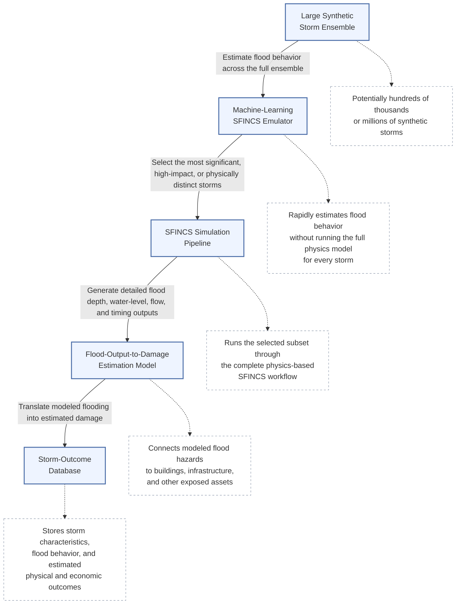
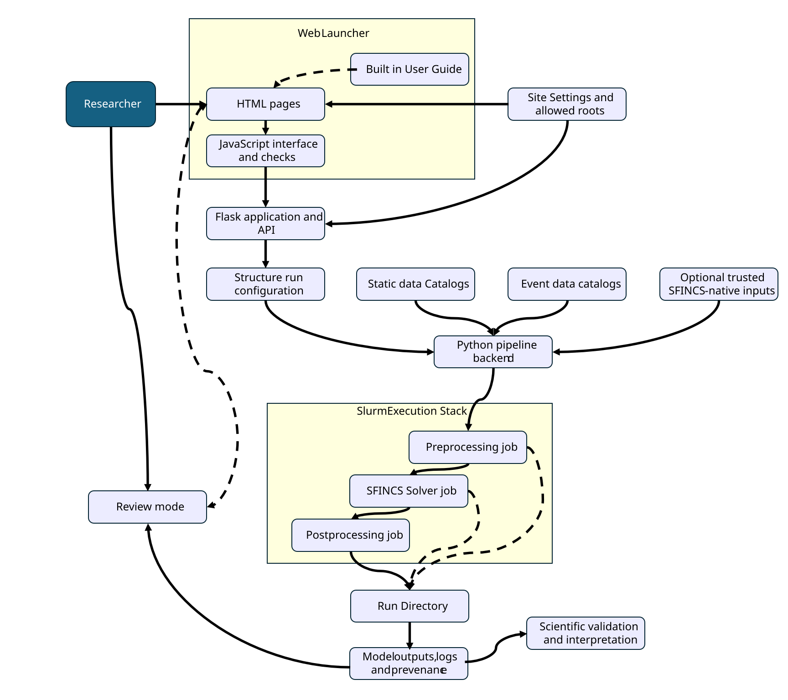

# Physics-Based Flood Simulation Pipeline

A web-based research pipeline for configuring, running, reviewing, and
validating physics-based flood simulations with SFINCS on Linux-based
high-performance computing systems.

> **Development status:** A working Version 1 of the main SFINCS workflow is
> currently available. Manual Mode, Override Mode, and Review Mode are
> operational, but the project remains under active development. Installation
> is not yet packaged as a simple or fully portable process.

---

## Overview

This repository contains a general-purpose workflow built around the SFINCS
flood model developed by Deltares. The system combines four main parts:

1. A browser-based web launcher for configuring simulations.
2. A Python backend for validating configurations and preparing runs.
3. A Slurm job stack for preprocessing, simulation, and postprocessing.
4. A Review system for reading model outputs and creating diagnostics.

The web launcher is one component of a broader research effort. Its purpose is
to make large numbers of SFINCS simulations easier to configure, submit,
organize, inspect, and compare without requiring a researcher to manually build
every input file or Slurm script.

The pipeline is being developed on a shared Linux computing cluster, but its
design is intended to be general enough for deployment in another Linux project
space with the required software, data, and scheduler configuration.

---

## Research Purpose

The broader research goal is to create a database connecting possible storms
to their potential physical and economic outcomes for a selected study area.

A future end-to-end workflow could begin with a very large synthetic storm
ensemble, potentially containing hundreds of thousands or millions of storms.
Running a full physics-based flood simulation for every storm would be too
computationally expensive. Instead, the proposed workflow is:

1. Generate or obtain a large synthetic storm ensemble.
2. Use a machine-learning SFINCS emulator to estimate the flood behavior of
   the full ensemble.
3. Select a smaller group of storms that are especially significant,
   high-impact, or physically distinct.
4. Run that selected group through the full SFINCS modeling pipeline.
5. Convert the resulting flood outputs into estimated damage using a separate
   flood-output-to-damage model.
6. Store the storm characteristics, flood behavior, and estimated damage in a
   searchable storm-outcome database.

The completed database could then be used to compare an observed or forecast
storm against a large range of possible scenarios and outcomes.



This repository currently focuses on the full SFINCS simulation and review
portion of that larger workflow. The launcher can also be used independently
for ordinary SFINCS research runs that are unrelated to the proposed
storm-outcome database.

---

## System architecture

The pipeline is organized into four connected subsystems:

1. Web Launcher
2. Python Backend
3. Slurm Execution Stack
4. Run Review and Scientific Validation

[](docs/assets/architecture/system_overview.svg)

The diagram can be opened directly for a full-resolution view.

See the [architecture overview](docs/architecture/overview.md) for an expanded
explanation of the four subsystems.

The run configuration acts as the main contract between the web interface and
the backend. It records the selected inputs, model settings, run identity,
computing resources, paths, and enabled pipeline stages.

A normal full run follows this sequence:

```text
Web launcher
    → configuration and preflight checks
    → run-directory creation
    → preprocessing job
    → SFINCS solver job
    → postprocessing job
    → Review and validation
```

The Slurm jobs normally use dependency rules so that each stage begins only
after the previous stage completes successfully.

---

## Main Components

### Web Launcher

The web launcher provides the researcher-facing interface. It is built from
HTML, JavaScript, CSS, and a Python Flask application.

Its responsibilities include:

- collecting model and run settings;
- browsing available project and data paths;
- detecting selected model inputs;
- building structured run configurations;
- running configuration and geometry checks;
- requesting backend actions;
- displaying run and Review information;
- providing user-facing guidance for the available modes.

The launcher also contains a built-in **SFINCS Web Launcher Guide**. The guide
is designed to explain the purpose and normal use of each front-facing launcher
mode without requiring a user to read the backend source code.

The Manual and Override guide sections currently contain the most complete
first-pass documentation. The introductory, Batch, Guided, and Comparison
sections remain under active development, and the guide will continue to change
alongside the launcher.

The launcher is intended to reduce repetitive setup work, but it does not
replace the backend or the SFINCS model. Its main output is a validated
description of what the backend should build and run.

### Python Pipeline Backend

The Python backend translates a configuration into a reproducible model run.

Its responsibilities include:

- validating configuration values;
- resolving static and event data inputs;
- creating the run-directory structure;
- writing a permanent copy of the run configuration;
- preparing or assembling SFINCS input files;
- generating Slurm scripts;
- submitting jobs with the correct dependencies;
- recording logs, status, and provenance;
- preparing postprocessing and Review products.

The backend is also responsible for separating reusable source data from
run-specific generated files. Each run should contain enough configuration and
provenance information to determine how it was produced.

### Slurm Execution Stack

The computational work is carried out through a Slurm job stack.

A typical full run contains three stages:

| Stage | Purpose |
|---|---|
| Preprocessing | Builds or assembles the SFINCS model inputs |
| SFINCS | Runs the physics-based flood simulation |
| Postprocessing | Creates derived outputs, summaries, and diagnostics |

The stages are submitted with dependencies so that a failed preprocessing job
does not automatically launch a solver job using incomplete inputs.

The exact CPUs, memory, wall time, scheduler account, and software environment
are configurable for the computing system where the pipeline is deployed.

### Review Mode

Review Mode reads an existing run directory after or during execution.

Depending on the available run products, Review Mode can provide:

- configuration and provenance summaries;
- job and completion status;
- model-domain maps;
- maximum water-level and flood-depth maps;
- observed-versus-modeled gauge comparisons;
- cross-section and discharge products;
- flood animations;
- output-file inspection;
- warnings and basic consistency checks.

Some Review products are read directly from existing model files. Others are
created through additional local or Slurm-backed processing jobs.

Review status is intentionally treated as several separate layers:

```text
scheduler state
filesystem products
status metadata
backend API response
browser rendering
```

A completed scheduler job does not automatically prove that every expected
product exists or that the simulation is scientifically valid.

---

## Launcher Modes

The current launcher contains several modes with different levels of maturity.

| Mode | Current status | Purpose |
|---|---|---|
| Manual | Version 1 operational | Builds a SFINCS run from selected source data and model settings |
| Override | Version 1 operational | Reuses selected SFINCS-native inputs while regenerating other run components |
| Review | Version 1 operational and under active development | Reads completed runs and produces diagnostic and validation products |
| Compare | In development | Compares outputs and settings across multiple runs |
| Batch | Not yet complete | Intended to generate and submit groups of related runs |
| Guided | Not yet complete | Intended to provide a more structured beginner-oriented setup process |

Manual, Override, and Review are currently the primary user-facing modes.

---

## Manual and Override Workflows

### Manual Mode

Manual Mode is intended for building a model from selected source datasets and
configuration choices.

Depending on the setup, preprocessing may:

- read terrain, roughness, infiltration, precipitation, and boundary data;
- construct a model grid and mask;
- generate SFINCS-native input files;
- add observation points and cross sections;
- prepare the final solver configuration.

This mode gives the pipeline more responsibility for building the model.

### Override Mode

Override Mode is intended for workflows where trusted SFINCS-native inputs
already exist.

A researcher may reuse selected files such as:

- elevation and mask files;
- index and subgrid files;
- roughness or infiltration files;
- structures;
- other approved static model products.

Dynamic event inputs can still be generated from the selected event data
instead of being copied from an older run.

This makes Override Mode useful for repeated simulations on a common model
domain while changing storm forcing, boundary conditions, observations, or
runtime settings.

---

## Current Working Area: Harris County, Texas

Harris County, Texas, is the current development, testing, and validation area
for the pipeline. It provides a large and technically challenging flood-modeling
case with coastal boundaries, riverine flooding, intense rainfall, tropical
cyclones, urban drainage, reservoirs, and an extensive observation network.

Harris County is not intended to be a permanent limitation of the software.
The current work is being used to develop and test methods that can later be
adapted to another region with its own model grid, terrain, forcing data,
observation network, and computing setup.

### Static and Event Data Catalogs

The pipeline organizes model inputs into two broad kinds of data catalogs.

| Catalog type | Meaning | Typical contents |
|---|---|---|
| **Static catalog** | Data that describe the study area and can be reused across many storms | Terrain and topobathymetry, model grid and mask, roughness, infiltration properties, subgrid data, structures, open-boundary geometry, and other region-specific model inputs |
| **Event catalog** | Data and metadata that describe one individual storm or flood simulation | Precipitation, water-level boundaries, wind and pressure where needed, simulation timing, observation time series, validation points, cross sections, and event-specific provenance |

This separation allows the same model domain to be reused across many events.
A new storm generally needs a new event catalog, but it does not necessarily
require rebuilding every static model input.

The catalogs also separate long-term source data from the smaller files that
are actively consumed by a specific model run. This makes it possible to
preserve raw observations and provenance while still creating standardized,
event-specific inputs for the pipeline.

### Fourteen-Event Development Set

The current Harris County development set contains fourteen historical events
covering tropical cyclones, major urban floods, and other heavy-rainfall
periods:

| Event | Working identifier |
|---|---|
| Hurricane Ike, 2008 | `ike_2008` |
| April 2009 flood | `flood_2009_04` |
| January 2012 flood | `flood_2012_01` |
| July 2012 heavy rainfall | `heavy_rain_2012_07` |
| August 2014 heavy rainfall | `heavy_rain_2014_08` |
| Memorial Day flood, 2015 | `memorial_2015` |
| Halloween flood, 2015 | `halloween_2015` |
| Tax Day flood, 2016 | `tax_day_2016` |
| Memorial Day flood, 2016 | `memorial_2016` |
| Hurricane Harvey, 2017 | `harvey_2017_mrms` |
| May 2019 flood | `flood_2019_05` |
| Tropical Storm Imelda, 2019 | `imelda_2019` |
| April–May 2024 heavy rainfall | `heavy_rain_2024_04_05` |
| Hurricane Beryl, 2024 | `beryl_2024` |

For each event, the research workflow has required more than simply locating a
rainfall file. Event preparation has included:

- defining a consistent simulation window;
- assembling precipitation forcing;
- preparing coastal and inland water-level boundary conditions;
- adding wind and pressure forcing where appropriate;
- checking units, timestamps, station identity, and vertical datum;
- preparing observation-point and cross-section geometry;
- creating event-specific validation time series;
- preserving source information and intermediate products;
- checking that the launcher and backend consume the intended active files.

During this process, several older water-level boundary products were found to
contain inconsistent station ordering, modeled locations, or datum handling.
The active event catalogs have since been standardized around three modeled
water-level boundaries:

1. Eagle Point;
2. Morgan's Point / Barbours Cut;
3. Lake Houston / the San Jacinto River near Sheldon.

Manchester is retained where useful as an interior observation or reference
location, but it is no longer used as an active open-boundary forcing location.

### Observation and Gauge Preparation

Historical gauge data required a separate data-development workflow.

A master USGS archive was assembled to preserve available water-level and
discharge records across the Harris County model area. The inventory contains
89 candidate gauges and includes both modern and legacy records where usable.
Because some station records changed vertical datum or reporting conventions
over time, the archive was processed using date-aware datum information rather
than assuming that the current station metadata applies unchanged to every
historical event.

The validation workflow then:

1. gathered and merged the available raw gauge records;
2. preserved an immutable pre-datum version of the archive;
3. applied documented station- and date-specific vertical adjustments;
4. measured observation coverage over each event window;
5. promoted gauges with at least approximately 95 percent hourly coverage;
6. created event-specific validation time-series products;
7. created one common model-observation geometry for the full event set.

The current common validation geometry contains:

```text
59 point-observation locations
29 cross-section or line-observation definitions
```

The geometry is common across events so that outputs can be compared
consistently. The actual observed time series remain event-specific: a station
may exist in the model geometry while having no usable observations during a
particular historical event.

This distinction is important:

```text
model observation geometry
    !=
available observed data for every event
```

A missing historical record should be reported as unavailable rather than
silently filled or treated as a zero observation.

### Current Run and Validation Status

A fresh SFINCS solver run now exists for all fourteen events using the current
catalog family.

In the latest automated Review status snapshot:

```text
all 14 runs completed and awaiting validation
```

The next consolidated run audit is intended to verify, across all fourteen
events:

- generated boundary locations and ordering;
- generated water-level series and time coverage;
- placement of boundary cells on the model mask;
- wind and pressure settings for the intended events;
- the 59 point observations and 29 cross sections;
- NetCDF dimensions, variables, and time axes;
- postprocessing completion;
- Review and gauge-validation products.

### Current Scientific Findings

Earlier multi-event validation showed that modeled and observed peak water
levels often have very high correlation. This suggests that the model captures
a large part of the spatial ordering of water-surface elevation across the
study area.

However, the same comparisons also identified a frequent positive bias: the
modeled peak water level is often higher than the observed peak. In many events,
the fitted slope remains near one while the intercept is positive, which
resembles an event-wide or additive model-high offset.

The bias generally remains after removing the worst individual gauges, so it
cannot be explained only by one or two obvious outliers. At the same time,
water-surface-elevation correlation may partly reflect the common background
terrain-elevation signal in both the observed and modeled values. Additional
depth-relative-to-ground diagnostics are therefore being developed.

These findings are still being investigated. Possible contributors include:

- model physics or calibration;
- terrain and topobathymetry;
- boundary forcing;
- rainfall or infiltration assumptions;
- observation datum and station history;
- differences between point observations and model grid cells;
- peak timing and hydrograph shape;
- the distinction between water-surface elevation and local flood depth.

The current fourteen-event rerun family incorporates major corrections to the
boundary and validation-data setup. Its scientific performance must be
evaluated separately rather than assumed from the earlier run family.

### Role of the Harris County Work

The Harris County application currently serves three related purposes:

1. It supports research into historical flood behavior and SFINCS model
   performance.
2. It provides a realistic test environment for the launcher, backend, Slurm,
   Review, and validation systems.
3. It develops the simulation workflow that could later support the larger
   synthetic-storm and storm-outcome database project.

---

## Development Status

The central Version 1 workflow is working:

```text
configure
    → validate
    → preprocess
    → run SFINCS
    → postprocess
    → review
```

Current strengths include:

- browser-based Manual and Override configuration;
- reusable Python backend logic;
- Slurm dependency-stack generation;
- support for SFINCS execution through a Linux computing environment;
- organized run directories and stored configurations;
- static and event catalog integration;
- maps, animations, and gauge-based Review products;
- historical-event validation workflows.

Major areas still under development include:

- portable installation and dependency setup;
- general configuration templates;
- full Compare Mode;
- Batch Mode;
- Guided Mode;
- broader automated testing;
- complete developer documentation;
- complete function and module documentation;
- packaging for computing systems outside the current research environment;
- continued scientific validation and bias diagnosis;
- integration with the larger synthetic-storm and damage-estimation workflow.

This should currently be treated as active research software rather than a
finished production application.

---

## Planned Repository Organization

The repository is being organized into source code, user documentation,
developer documentation, and portable examples.

```text
physics-flood-pipeline/
├── README.md
├── .gitignore
│
├── docs/
│   ├── research/
│   │   ├── overview.md
│   │   ├── current_status.md
│   │   └── validation.md
│   │
│   ├── architecture/
│   │   ├── overview.md
│   │   ├── slurm_execution.md
│   │   │
│   │   ├── python_backend/
│   │   │   ├── python_backend.md
│   │   │   ├── module_catalog.md
│   │   │   └── files/
│   │   │
│   │   ├── web_launcher/
│   │   │   ├── web_launcher.md
│   │   │   ├── page_and_api_map.md
│   │   │   └── files/
│   │   │
│   │   └── review_mode/
│   │       ├── review_mode.md
│   │       ├── product_and_status_model.md
│   │       └── files/
│   │
│   ├── usage/
│   │   ├── installation.md
│   │   ├── configuration.md
│   │   ├── running_models.md
│   │   └── reviewing_results.md
│   │
│   └── data/
│       ├── data_layout.md
│       └── catalog_structure.md
│
├── code/
├── web_launcher/
├── configs/
│   └── examples/
└── tests/
```

The architecture documents will explain how the major subsystems connect. More
detailed module and function documentation will remain close to the source code
or be generated from Python docstrings where practical.

---

## Data and Storage

Large source datasets and generated model outputs are not intended to be stored
directly in this Git repository.

A deployment will normally maintain separate locations for:

```text
pipeline source code
static model data
event forcing data
generated model runs
software environments
SFINCS executables or containers
temporary and staging products
```

The paths to these locations should be provided through site settings,
configuration files, or environment-specific setup rather than being assumed
by the portable source code.

The repository may include:

- small example configurations;
- schemas;
- metadata templates;
- documentation figures;
- small test fixtures;
- scripts for acquiring or preparing public data.

The repository should not include:

- full model datasets;
- large NetCDF forcing files;
- complete run directories;
- generated animations;
- software environments;
- container images;
- credentials;
- private or restricted data.

Detailed data-layout and provenance documentation will be added separately.

---

## Expected Computing Environment

The current pipeline is designed around a Linux-based research computing
environment.

A complete deployment is expected to require some combination of:

- Linux;
- Python;
- Slurm or an equivalent job scheduler;
- SFINCS;
- a SFINCS-compatible container or executable;
- scientific Python libraries;
- geospatial and NetCDF libraries;
- access to suitable static and event data;
- a web browser for the launcher interface.

Some workflows also depend on specialized preprocessing, mapping, animation, or
validation packages.

Exact versions and installation steps have not yet been finalized for a
portable release.

---

## Installation

> **Installation documentation is in preparation.**

The current research deployment contains multiple Python environments, model
dependencies, scheduler settings, data roots, and external software components.
These need to be audited and converted into a portable installation process
before reliable general instructions can be published.

Planned installation documentation will cover:

1. Cloning the repository.
2. Creating the required Python environments.
3. Installing or obtaining SFINCS.
4. Configuring Slurm and project resources.
5. Defining project, data, and run-output roots.
6. Preparing static and event catalogs.
7. Starting the web launcher.
8. Running a small verification case.

Until that work is complete, the repository should not be assumed to provide a
one-command installation.

---

## Documentation Plan

The root README provides only the project overview. Detailed documentation will
be divided by purpose.

### Research documentation

Will describe:

- the storm-outcome database concept;
- the current Harris County working area;
- event selection and data preparation;
- validation methods;
- current results and limitations.

### Architecture documentation

Will describe:

- the full software architecture;
- the web launcher;
- the Python backend;
- the Slurm execution stack;
- Review Mode;
- major data and control flows.

### Usage documentation

Will describe:

- installation;
- site configuration;
- preparing a run;
- Manual and Override workflows;
- submitting jobs;
- reviewing results;
- common errors.

### Developer documentation

Will describe:

- important modules and scripts;
- inputs and outputs;
- file relationships;
- API routes;
- function responsibilities;
- extension and testing practices.

The launcher also contains a built-in user guide for its front-facing modes.
That guide is intended to teach normal operation, while the repository
documentation explains the broader architecture and research workflow. Both
the launcher guide and the repository documentation remain under active
development.

---

## Reproducibility and Validation

The pipeline is designed to preserve a run configuration and related provenance
inside each run directory.

A complete scientific review should distinguish between:

1. Catalog readiness.
2. Generated model-input correctness.
3. Solver and postprocessing completion.
4. Output-file validity.
5. Agreement with observations.
6. Scientific interpretation.

Passing one layer does not automatically prove the next layer.

For example, a completed Slurm job may still require checks of:

- model geometry;
- boundary locations and ordering;
- forcing time coverage;
- vertical datum conventions;
- observation-point placement;
- cross-section definitions;
- output dimensions;
- model bias;
- timing differences;
- physical plausibility.

The validation system therefore combines automated checks with direct
inspection of run-local files and comparisons against observed records.

---

## Project Team

This project is being developed at the University of North Carolina at Chapel
Hill within the Institute for Risk Management and Insurance Innovation (IRMII).

- **Reichen Schaller** — pipeline, web launcher, data integration, and
  validation development
- **Dr. Harrison Zeff** — principal investigator
- **Dr. Antonia Sebastian** — hydrology research guidance

SFINCS is developed by Deltares and is an external modeling system used by this
pipeline.

---

## Contact

For questions about the current research implementation, contact:

**Reichen Schaller**  
University of North Carolina at Chapel Hill  
`epsilon@unc.edu`

Repository issues may also be used once the issue-tracking workflow is
established.

---

## License

A repository license has not yet been finalized.

The MIT License is currently under consideration, subject to approval by the
research group and institute. Until a license is added, users should not assume
that the repository has been released under MIT or another open-source license.