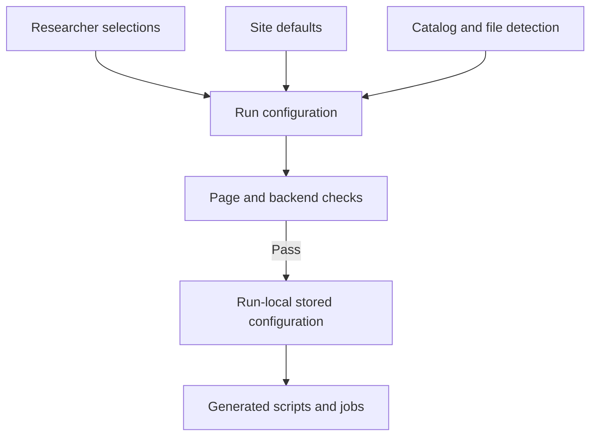
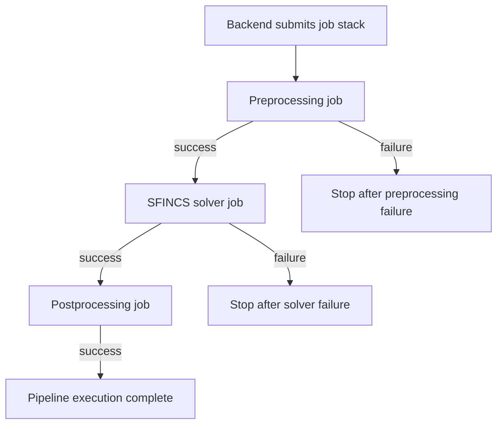
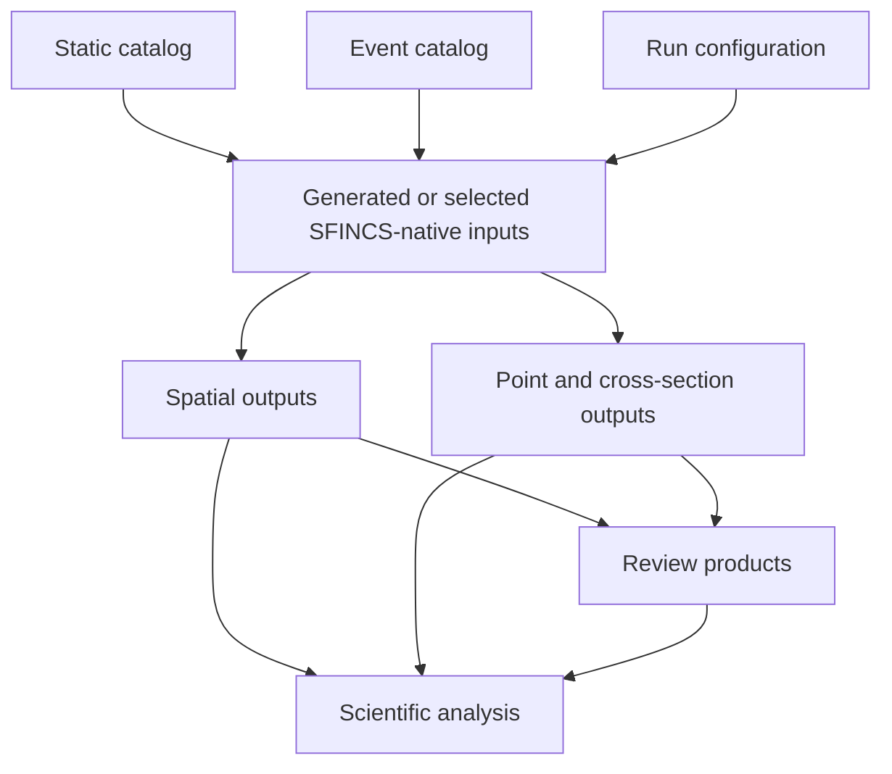
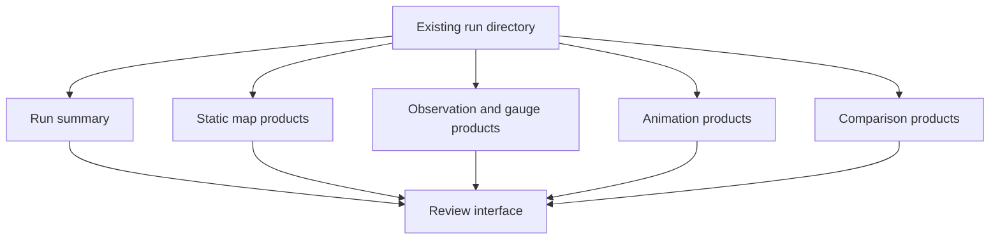
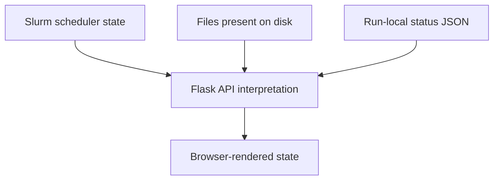

# Architecture Overview

This document describes the high-level software architecture of the
Physics-Based Flood Simulation Pipeline.

The pipeline is a configuration-driven system for preparing, running,
organizing, reviewing, and validating SFINCS flood simulations on
Linux-based computing systems. It combines a browser interface, a Python
backend, a Slurm execution stack, the external SFINCS solver, and a set of
postprocessing and Review tools.

This page focuses on how the major parts connect. Detailed explanations of
individual modules, pages, API routes, and source files are provided in the
subsystem documentation.

> [!NOTE]
> This is research software under active development. The central Version 1
> Manual, Override, Slurm, and Review workflow is operational, but several
> launcher modes, portability features, tests, and documentation sections are
> still being developed.

---

## System Purpose

Running SFINCS manually can involve many separate tasks:

- locating and checking source data;
- constructing or selecting model geometry;
- preparing event forcing;
- writing SFINCS-native inputs;
- configuring model timing and outputs;
- preparing computing resources;
- creating Slurm scripts;
- submitting jobs in the correct order;
- monitoring execution;
- locating generated products;
- producing maps, time series, animations, and validation comparisons.

The pipeline brings these tasks into one structured workflow.

Its purpose is not to replace SFINCS or hide the physics of the model. Its
purpose is to make the surrounding research workflow more reproducible,
repeatable, inspectable, and efficient.

At the highest level, the system converts a researcher’s model choices into a
stored configuration, turns that configuration into an executable run, and
then provides tools for examining the resulting files.

```text
research choices
    → run configuration
    → generated run package
    → Slurm execution
    → SFINCS outputs
    → Review and scientific validation
```

---

## System at a Glance

The architecture contains seven major parts:

1. **Web launcher interface**
2. **Flask application and API**
3. **Run configuration**
4. **Python pipeline backend**
5. **Slurm execution stack**
6. **SFINCS solver**
7. **Review and validation workflows**


The web launcher is the main user-facing layer, but it is not the modeling
engine. The Python backend and generated jobs remain responsible for building
and executing the run.

---

## Architectural Boundaries

A major goal of the design is to keep the responsibilities of each layer
separate.

| Layer | Primary responsibility |
|---|---|
| Web pages and JavaScript | Collect user choices and present results |
| Flask application | Connect browser actions to controlled backend operations |
| Run configuration | Store the complete requested run definition |
| Python backend | Validate the configuration and prepare an executable run |
| Slurm | Schedule the computational stages |
| SFINCS | Perform the physics-based flood simulation |
| Postprocessing | Create summaries and derived products |
| Review Mode | Read and present run-local products |
| Validation workflows | Evaluate scientific performance against observations |

This separation is important for both debugging and portability.

For example:

- A browser error does not necessarily mean the model files are wrong.
- A Flask error does not necessarily mean a subprocess failed.
- A completed Slurm job does not prove that the scientific setup was correct.
- A Review display problem does not necessarily mean its underlying products
  are missing.
- A valid configuration does not prove that the solver has run.
- A successful solver run does not prove that the model agrees with
  observations.

Each layer must be checked using evidence appropriate to that layer.

---

## The Run Configuration as the Central Contract

The run configuration is the main contract between the launcher and the
backend.

It records the researcher’s requested run in a machine-readable form. Depending
on the workflow, it may include:

- run and event identity;
- project, data, and output roots;
- static and event catalog paths;
- model geometry;
- simulation timing;
- precipitation and boundary forcing;
- observation points and cross sections;
- model settings;
- output intervals and variables;
- optional native SFINCS-file overrides;
- Python environment and solver information;
- Slurm resources;
- enabled pipeline stages;
- overwrite and safety settings;
- postprocessing choices.

The browser may help construct this configuration, but the backend should not
depend on hidden browser state after submission. The submitted configuration
must contain the information needed to reproduce and interpret the run.



A stored copy of the configuration belongs inside the run directory. This
creates a persistent record of what the pipeline was asked to do, even if the
launcher defaults or source catalogs later change.

### Configuration lifecycle

The normal launcher workflow separates three actions:

1. **Preflight**
2. **Build scripts**
3. **Submit**

These are related but not equivalent.

#### Preflight

Preflight validates the current configuration and checks whether the requested
run appears coherent enough to prepare.

It may inspect:

- required fields;
- file and directory existence;
- path safety;
- time ordering;
- enabled forcing;
- model geometry;
- environment and container paths;
- run-name conflicts;
- catalog compatibility.

Passing preflight means that the configuration passed the implemented checks.
It does not mean that SFINCS has run or that every scientific assumption is
correct.

#### Build scripts

Build Scripts creates the run scaffold and the scripts needed for execution.

A prepared scaffold may contain:

```text
run_config.json
scripts/
logs/
model/
postprocess/
```

At this stage, some directories may still be empty. The presence of a scaffold
does not mean that preprocessing, SFINCS, or postprocessing has completed.

#### Submit

Submit sends the generated Slurm jobs to the scheduler, normally with
dependencies between stages.

A run directory containing real model products must be treated differently from
an empty or prepared scaffold. Overwrite protection should prevent accidental
replacement of completed or partially completed scientific work.

---

## Main Runtime Components

### 1. Web Launcher

The launcher is the browser-based interface used to configure and inspect the
pipeline.

Its main responsibilities are:

- exposing configuration controls;
- displaying current site defaults;
- browsing backend-visible paths;
- detecting available catalog and native files;
- running page-level consistency checks;
- sending configurations to Flask;
- displaying backend messages;
- opening existing runs in Review Mode;
- providing an integrated user guide.

The front-facing Version 1 workflow currently centers on:

- **Manual Mode**
- **Override Mode**
- **Review Mode**

Compare Mode is under development. Batch and Guided modes are planned but are
not yet complete.

The launcher contains many convenience and safety features, but it should not
duplicate the full backend implementation. The browser collects and presents
information; the backend remains the authority for filesystem access, run
creation, and submission.

Detailed documentation:

- [Web Launcher architecture](web_launcher/web_launcher.md)
- [Page and API map](web_launcher/page_and_api_map.md)

---

### 2. Flask Application and API

The Flask application connects browser actions to the filesystem, backend
scripts, and Review products.

Typical Flask responsibilities include:

- reading and updating launcher defaults;
- providing a controlled directory browser;
- saving configurations;
- receiving preflight, build, and submit requests;
- calling backend Python processes;
- listing available runs;
- serving Review metadata and products;
- submitting Review-product jobs;
- reporting errors and process output to the browser.

Flask is a boundary layer. It should not become a second independent
implementation of the pipeline.

Where possible:

```text
browser
    → Flask route
    → shared Python backend
```

is preferred over:

```text
browser
    → Flask route containing duplicate pipeline logic
```

This reduces the risk that browser-submitted runs behave differently from
direct backend runs.

---

### 3. Python Pipeline Backend

The Python backend converts a validated configuration into a prepared and
executable run.

Its responsibilities include:

- parsing and normalizing configuration values;
- validating required inputs;
- protecting existing runs;
- resolving source and destination paths;
- creating the run directory;
- preserving the run configuration;
- generating Slurm scripts;
- preparing stage-specific commands;
- submitting jobs;
- recording job identifiers and logs;
- supporting direct and launcher-driven workflows.

The backend is divided conceptually into:

```text
configuration and validation
    → run planning
    → run-directory creation
    → script generation
    → scheduler submission
    → stage execution
```

Individual source files will be documented separately in the backend module
catalog and file-reference pages.

Detailed documentation:

- [Backend architecture](backend/backend.md)
- [Backend module catalog](backend/module_catalog.md)

---

### 4. Slurm Execution Stack

A normal full simulation uses three main Slurm stages:

```text
    → preprocessing
    → SFINCS
    → postprocessing
```

The jobs normally use `afterok` dependencies. A later stage begins only if the
previous stage completes successfully.



The stages are separated because they have different software and resource
requirements.

| Stage | Typical responsibility |
|---|---|
| Preprocessing | Build or assemble SFINCS-native inputs |
| SFINCS | Execute the numerical flood model |
| Postprocessing | Inspect outputs and create derived products |

The pipeline can configure stage-specific:

- wall time;
- memory;
- nodes;
- tasks;
- CPUs per task;
- Python environment;
- executable or container;
- scheduler directives.

Detailed documentation:

- [Slurm execution](slurm_execution.md)

---

### 5. Preprocessing

Preprocessing prepares the final SFINCS model directory.

Depending on the selected mode, it may:

- build a model using source datasets;
- assemble a model from trusted native inputs;
- combine generated and native components;
- generate rainfall forcing;
- generate water-level or discharge boundaries;
- prepare wind and pressure forcing;
- add structures;
- prepare infiltration;
- write observation points;
- write cross sections;
- validate relationships between generated files;
- write the final `sfincs.inp`.

Preprocessing is the point where the abstract run configuration becomes a
specific collection of SFINCS-native files.

Because those files directly determine the simulation, preprocessing success is
not enough by itself. Generated inputs should still be audited for their
contents, dimensions, ordering, units, and time coverage.

---

### 6. SFINCS Solver

SFINCS is the external physics-based flood model used by the pipeline.

The solver consumes the prepared native model directory and writes its output
files into the run.

Important solver products commonly include:

```text
sfincs_map.nc
sfincs_his.nc
solver logs
completion or status evidence
```

The pipeline may execute SFINCS through an Apptainer-compatible container or
another configured executable.

The architecture treats SFINCS as an external computational component:

```text
pipeline prepares model
    → SFINCS performs numerical simulation
    → pipeline reads the resulting files
```

This boundary allows the launcher and backend to evolve without modifying the
SFINCS source code.

---

### 7. Postprocessing

Postprocessing begins after the solver completes successfully.

Its responsibilities may include:

- checking required solver outputs;
- extracting summary information;
- computing derived variables;
- producing quick-look diagnostics;
- recording completion evidence;
- preparing files consumed by Review;
- writing postprocessing logs and status information.

Not every Review product must be generated during the main postprocessing job.
Some larger products, such as detailed maps or animations, may be generated
later through separate Review requests.

---

## Manual and Override Workflows

Manual and Override are two different ways of preparing the model before the
same general execution stack.

### Manual Mode

Manual Mode is the source-build workflow.

Its intended architecture is:

```text
source datasets and configuration
    → preprocessing builds the model
    → SFINCS
    → postprocessing
```

Manual Mode is protected as the Manual/HydroMT-style workflow. It should not
silently inherit native-override metadata from an Override configuration.

Typical Manual inputs may include:

- region geometry;
- terrain;
- land cover and roughness mapping;
- infiltration data;
- precipitation;
- boundary forcing;
- observation geometry;
- structures;
- model settings.

Manual Mode gives preprocessing greater responsibility for generating the
native model files.

### Override Mode

Override Mode begins with existing SFINCS-native files.

Its intended architecture is:

```text
detected native files
    → researcher selects which files are authoritative
    → remaining components are configured or generated
    → SFINCS
    → postprocessing
```

A central Override principle is:

> Detection finds possible files. Selection decides which files are used.

Override Mode may use:

- trusted static geometry from an earlier model;
- event-specific source data;
- selected native forcing files;
- generated replacements for files that are not overridden.

This permits hybrid runs. For example, static model geometry may be reused while
dynamic precipitation and water-level forcing are regenerated for a new event.

Manual and Override therefore differ primarily in how preprocessing obtains the
native SFINCS inputs. Once the final model directory exists, both can use the
same solver and postprocessing architecture.

---

## Control Flow and Data Flow

The system has two related but different flows.

### Control flow

Control flow describes which component tells another component to act.

```text
researcher
    → launcher
    → Flask
    → backend
    → Slurm
    → stage scripts
```

### Data flow

Data flow describes how scientific and configuration information moves through
the system.

```text
static and event catalogs
    → run configuration
    → generated native inputs
    → SFINCS outputs
    → Review and validation products
```



Maintaining this distinction is useful during debugging. A control-flow failure
may prevent a valid dataset from being processed, while a data-flow failure may
produce an incorrect model even though every software step executes.

---

## Data Catalogs

Source data are organized separately from generated run files.

Two broad catalog categories are used.

### Static catalogs

Static catalogs describe the model area and are intended for reuse across
multiple events.

They may contain:

- terrain and topobathymetry;
- model masks;
- roughness;
- infiltration properties;
- subgrid information;
- structures;
- region geometry;
- open-boundary geometry;
- trusted reusable native inputs.

### Event catalogs

Event catalogs describe one storm or flood simulation.

They may contain:

- precipitation;
- water-level forcing;
- discharge forcing;
- wind and atmospheric pressure;
- event timing;
- validation time series;
- observation locations;
- cross sections;
- event-specific provenance.

The separation allows many events to reuse one regional model setup without
combining all source and generated data into a single folder.

Source catalogs should normally be treated as inputs. Run-specific generated
files belong in the run directory, not back inside the active source catalog.

---

## Run Directory

The run directory is the central record of one prepared or executed
simulation.

A conceptual run layout is:

```text
<run_name>/
├── run_config.json
├── scripts/
├── logs/
├── model/
│   ├── sfincs.inp
│   ├── native model inputs
│   ├── sfincs_map.nc
│   └── sfincs_his.nc
├── postprocess/
└── review/
    ├── maps/
    ├── animations/
    ├── obs_gauges/
    └── jobs/
```

The exact contents depend on the selected stages and products.

The run directory serves several purposes:

- execution workspace;
- provenance record;
- output archive;
- debugging location;
- Review data source;
- scientific-analysis source.

### Scaffold versus completed run

The existence of the folder alone does not establish run status.

A directory may be:

1. a saved configuration;
2. a prepared script scaffold;
3. a submitted run;
4. an actively running simulation;
5. a solver-completed run;
6. a fully postprocessed run;
7. a run with additional Review products.

Status checks should inspect actual evidence rather than relying only on folder
existence.

---

## Review Mode

Review Mode is a separate workflow built around existing run directories.

It does not rerun SFINCS merely to display a result. It reads current products
and, when requested, may create additional diagnostic products.

Review functions may include:

- run discovery;
- configuration summaries;
- static maps;
- maximum-depth and water-level products;
- gauge and observation comparisons;
- cross-section products;
- animations;
- file inspection;
- warnings;
- job and completion status.

Some products can be read directly from completed model files. Others require a
separate local or Slurm-backed builder.



Detailed documentation:

- [Review Mode architecture](review_mode/review_mode.md)
- [Review product and status model](review_mode/product_and_status_model.md)

---

## Review Status Is Layered

Review work revealed that there is no single universal “status” value.

At least five layers may be involved:

1. **Scheduler state**
2. **Filesystem products**
3. **Status metadata**
4. **Backend API response**
5. **Browser state**



These layers can temporarily disagree.

Examples include:

- Slurm has finished, but status JSON still says submitted.
- Products exist, but the browser has cached an older manifest.
- The API says ready, but JavaScript renders a false running state.
- The solver finished, but postprocessing did not.
- The browser cannot play a valid video because of a browser codec issue.

For this reason, product existence and backend-generated metadata are generally
stronger evidence about a Review product than the text currently visible in the
browser.

The preferred diagnostic order is:

```text
scheduler
    → filesystem
    → status metadata
    → API response
    → frontend rendering
```

---

## Review Is Not the Same as Scientific Validation

Review helps a researcher inspect a run, but it does not automatically establish
that the run is scientifically correct.

A useful distinction is:

```text
catalog readiness
    → generated-input correctness
    → solver completion
    → postprocessing completion
    → output validity
    → scientific validation
```

Each is a separate milestone.

For example, a completed run may still require checks of:

- boundary location and ordering;
- forcing time coverage;
- units and vertical datum;
- model-mask placement;
- atmospheric forcing switches;
- observation geometry;
- NetCDF dimensions;
- water-level bias;
- timing differences;
- physical plausibility.

The architecture therefore supports both automated Review products and separate
scientific validation scripts.

---

## Site Settings and Portability

Machine-specific paths are separated from the main page and backend logic.

A deployment may need to define:

| Setting category | Purpose |
|---|---|
| Project root | Pipeline code and project scripts |
| Data root | Static, event, and processed source data |
| Run root | Generated simulation directories |
| Python environment | Backend and scientific dependencies |
| Mapping environment | Optional map-generation dependencies |
| SFINCS executable or container | Numerical solver |
| Allowed browse roots | Filesystem locations visible through the launcher |
| Temporary root | Staging or scratch products |

The current research deployment uses different storage roots for code, data,
runs, and temporary work. The architecture should not require another
installation to reproduce those exact paths.

Site-specific values belong in a settings layer. Active HTML, JavaScript, and
Python logic should refer to named settings rather than embedding one
researcher’s absolute paths.

Portable path design should prefer:

- settings for machine-level roots;
- relative paths for files stored beside their manifests;
- runtime detection where appropriate;
- stored run-local paths for provenance;
- explicit errors when a required setting is missing.

A stale path should not silently override a valid file merely because it came
from an older manifest or saved configuration.

---

## Software Environments

Different pipeline tasks may require different software environments.

Conceptually, a deployment may separate:

- the Flask/web environment;
- the scientific preprocessing environment;
- the mapping environment;
- the SFINCS solver container or executable;
- external tools such as `ffmpeg`.

This separation prevents every dependency from being forced into one large
environment.

It also means that failures should be assigned to the correct layer. A missing
mapping package is different from a missing solver binary, and a browser video
decoder problem is different from a failed animation encoder.

Exact installation and environment specifications will be documented
separately after the current research environments are audited for portability.

---

## Safety and Reproducibility Principles

The current architecture follows several general principles.

### Configuration before execution

The requested run should be visible and reviewable before jobs are submitted.

### Source data separate from generated runs

Static and event catalogs are inputs. Generated model files and outputs belong
inside the run directory.

### Machine-specific settings in one layer

Paths and executables should not be scattered as hardcoded values throughout
the interface and backend.

### Preflight does not equal completion

A passing configuration check is only one stage of the workflow.

### Preserve run provenance

The stored configuration, scripts, logs, and outputs should remain connected to
the run that produced them.

### Protect existing scientific products

An existing completed run should not be silently replaced because a folder name
was reused.

### Prefer read-only inspection

Status checks, Review loading, and scientific audits should be read-only unless
a user explicitly requests a rebuild or modification.

### Separate software status from scientific validity

Successful execution and successful validation are different outcomes.

---

## Current Architecture Maturity

The current Version 1 architecture supports the main path:

```text
Manual or Override configuration
    → backend preflight
    → run and script creation
    → Slurm submission
    → preprocessing
    → SFINCS
    → postprocessing
    → Review
```

The architecture has also been exercised with a multi-event historical flood
workflow.

Current development priorities include:

- documenting individual modules and files;
- consolidating portable installation instructions;
- expanding automated tests;
- completing Compare Mode;
- building Batch Mode;
- building Guided Mode;
- improving Review status handling;
- auditing generated inputs across runs;
- continuing scientific validation;
- reducing deployment-specific assumptions.

---

## Documentation Map

This overview is the entry point for the deeper architecture documentation.

### Major subsystems

- [Backend architecture](backend/backend.md)
- [Backend module catalog](backend/module_catalog.md)
- [Web Launcher architecture](web_launcher/web_launcher.md)
- [Page and API map](web_launcher/page_and_api_map.md)
- [Slurm execution](slurm_execution.md)
- [Review Mode architecture](review_mode/review_mode.md)
- [Review product and status model](review_mode/product_and_status_model.md)

### Repository entry point

- [Project README](../../README.md)

The subsystem pages explain why each major part exists. The `files/`
directories will contain more detailed pages describing the responsibilities,
inputs, outputs, calls, dependencies, and failure modes of individual source
files.