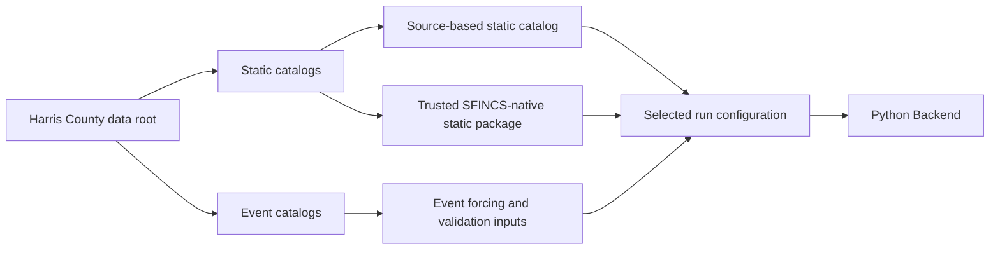
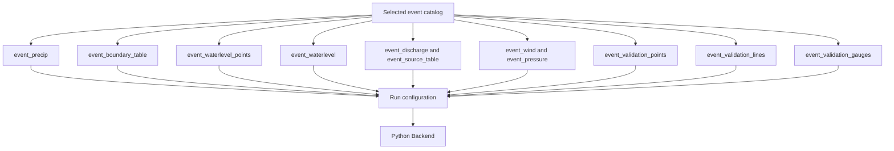

# Model Catalogs

The Model Catalogs organize the data used to construct a SFINCS run.

They sit between the project's processed source datasets and the Python
Backend. Rather than requiring users to select dozens of unrelated files for
each run, the pipeline organizes inputs into:

```text
static catalogs
    Reusable model information shared across events.

event catalogs
    Rainfall, boundaries, validation data, and other inputs tied to one event.

trusted SFINCS-native static packages
    Prebuilt model-grid files that may be reused instead of reconstructed.
```

The catalogs describe the available model inputs. The run configuration selects
which catalog packages and products the Python Backend should use.

> **Documentation status**
>
> This page describes the current catalog architecture and active data contract.
> Detailed dataset provenance, datum processing, and event-specific scientific
> decisions remain in the project data-setup and validation documentation.

---

## Purpose

The catalog system has five main purposes:

1. Keep reusable static information separate from event-specific forcing.
2. Give the launcher and backend predictable locations for model inputs.
3. Preserve active products separately from historical and diagnostic files.
4. Allow different model-construction workflows to use the same event data.
5. Keep data selection reproducible through the frozen run configuration.

Without this layer, every model run would require manual selection of items such
as:

```text
DEM
mask
roughness
infiltration
structures
rainfall
water-level boundaries
wind and pressure
observation points
cross-section lines
validation time series
```

The catalogs package those inputs into stable, documented groups.

---

## Position in the system



The catalog layer does not execute the model.

It provides organized inputs to:

```text
run configuration
        ↓
Python Backend
        ↓
generated SFINCS model folder
        ↓
Slurm Execution Stack
```

---

## Current data roots

The active Harris County data root is:

```text
/users/e/p/epsilon/Data/Data/harris_county
```

The catalog root is:

```text
/users/e/p/epsilon/Data/Data/harris_county/catalogs
```

The two primary catalog branches are:

```text
/users/e/p/epsilon/Data/Data/harris_county/catalogs/static

/users/e/p/epsilon/Data/Data/harris_county/catalogs/events
```

Pipeline code, environments, containers, and run outputs remain under `/proj`:

```text
Pipeline:
    /proj/zefflab/projects/Flooding/pipeline

Run outputs:
    /proj/zefflab/projects/Flooding/sfincs_runs
```

This split is intentional:

```text
/users
    Large Harris County source data, processed data, and catalogs.

/proj
    Pipeline code, software environments, containers, validation code, and runs.
```

Do not globally replace `/proj` paths with `/users` paths. Only the active data
and catalog roots moved to `/users`.

---

# Catalog architecture

The current catalog tree begins with:

```text
catalogs/
├── static/
│   ├── harris_county/
│   ├── harris_county_ppp/
│   ├── harris_county_ppp_latest/
│   └── _quarantine_outside_detected_sources/
└── events/
    ├── ike_2008/
    ├── flood_2009_04/
    ├── flood_2012_01/
    ├── heavy_rain_2012_07/
    ├── heavy_rain_2014_08/
    ├── memorial_2015/
    ├── halloween_2015/
    ├── tax_day_2016/
    ├── memorial_2016/
    ├── harvey_2017_mrms/
    ├── flood_2019_05/
    ├── imelda_2019/
    ├── heavy_rain_2024_04_05/
    └── beryl_2024/
```

The static packages do not all have the same role.

```text
harris_county
    Source-based static catalog used for HydroMT-SFINCS model construction.

harris_county_ppp_latest
    Current trusted SFINCS-native static authority for the Override/Hybrid
    workflow.

harris_county_ppp
    Older and more expansive native/reference package retained for history,
    comparison, and selected supporting products.

_quarantine_outside_detected_sources
    Quarantined material that should not be treated as active model input.
```

---

# Static catalogs

Static catalogs contain model information that can be reused across multiple
historical events.

Typical static information includes:

```text
model region
terrain and bathymetry
model grid
active model mask
roughness
land cover
infiltration
curve number
subgrid information
levees
thin dams
weirs
drainage structures
open-boundary outlines
static observation geometry
vertical-datum notes
```

Static information normally changes less frequently than rainfall or event
boundary forcing.

---

## Source-based static catalog

The source-based Harris County static catalog is:

```text
/users/e/p/epsilon/Data/Data/harris_county/catalogs/static/harris_county
```

Its current top-level structure includes:

```text
harris_county/
├── bathy/
├── boundary_points_static/
├── curve_number/
├── dem/
├── grid_template/
├── infiltration/
├── landcover/
├── manning_reclass_table/
├── mask/
├── obs_lines_static/
├── obs_points_static/
├── open_boundary_outlines/
├── region_geom/
├── roughness/
├── scs_infiltration/
├── source_points_static/
├── static_metadata/
├── structures_drainage/
├── structures_levees/
├── structures_thin_dams/
├── structures_weirs/
├── subgrid/
├── topobathy/
├── vertical_datum_notes/
├── _audit/
├── _manifests/
└── _notes/
```

This catalog provides the source datasets needed for a HydroMT-SFINCS model
build.

A Manual-style run may use these inputs to construct or derive:

```text
model geometry
elevation
mask
roughness
infiltration
structures
subgrid information
open-boundary geometry
```

The source catalog is not itself a completed SFINCS model folder. The
preprocessing stage interprets the selected source datasets and writes the
corresponding SFINCS input files into the run directory.

---

## Trusted SFINCS-native static package

The current trusted native static package is:

```text
/users/e/p/epsilon/Data/Data/harris_county/catalogs/static/
harris_county_ppp_latest
```

Its active top-level model files are:

```text
sfincs.dep
sfincs.ind
sfincs.manning
sfincs.msk
sfincs.scs
sfincs.thd
sfincs_subgrid.nc
```

Supporting folders include:

```text
gis/
subgrid/
```

These files are already in formats expected by SFINCS.

The package is used by the current Override/Hybrid workflow to avoid rebuilding
approved static model components for every event.

The exact trusted grid geometry is:

```text
mmax     = 996
nmax     = 1011
x0       = 212000
y0       = 3261300
dx       = 100
dy       = 100
rotation = 0
epsg     = 32615
```

The current imported native mask is authoritative. The canonical event
water-level boundary points already fall on cells marked as `msk=2`.

For the current Override family:

```text
native depfile     = enabled
native mskfile     = enabled
native indexfile   = enabled
native subgrid     = enabled
native manningfile = enabled
native scsfile     = enabled
native thdfile     = enabled
```

Dynamic water-level boundary files are not copied from the native package:

```text
native bndfile = disabled
native bzsfile = disabled
```

Instead, the selected event catalog generates the active BND and BZS products.

This distinction is central to the current architecture:

```text
Trusted native package:
    reusable static model structure

Selected event catalog:
    event-specific dynamic forcing
```

---

## Earlier `harris_county_ppp` package

The older native package is:

```text
/users/e/p/epsilon/Data/Data/harris_county/catalogs/static/
harris_county_ppp
```

It currently contains a wider native-model set, including:

```text
sfincs.bnd
sfincs.crs
sfincs.dep
sfincs.ind
sfincs.manning
sfincs.msk
sfincs.obs
sfincs.sbg
sfincs.scs
sfincs.src
sfincs.thd
```

It also includes:

```text
figs/
gis/
subgrid/
template_audit/
hydromt.log
```

This package is useful for lineage, comparison, and selected reference
materials, but it is not the current static authority for the fresh
Override/Hybrid event family.

The active Override static authority is `harris_county_ppp_latest`.

---

## Quarantined static material

The static root also contains:

```text
_quarantine_outside_detected_sources/
```

This is not an active catalog package.

Quarantine folders may preserve:

```text
duplicate products
superseded products
files moved out of active discovery
audit evidence
source-lineage records
```

Files stored there should not be selected merely because they exist under the
general static root.

---

# Event catalogs

An event catalog contains the inputs associated with one historical flood,
storm, or rainfall period.

Each run selects one event catalog.

The current target set contains 14 events:

```text
ike_2008
flood_2009_04
flood_2012_01
heavy_rain_2012_07
heavy_rain_2014_08
memorial_2015
halloween_2015
tax_day_2016
memorial_2016
harvey_2017_mrms
flood_2019_05
imelda_2019
heavy_rain_2024_04_05
beryl_2024
```

The current architecture audit found all 14 expected event directories.

---

## Event catalog structure

Each current event directory contains the same folder structure:

```text
<event>/
├── event_boundary_table/
├── event_precip/
├── event_validation_gauges/
├── event_validation_lines/
├── event_validation_points/
├── event_waterlevel/
├── event_waterlevel_points/
├── event_discharge/
├── event_source_table/
├── event_wind/
└── event_pressure/
```

The folders exist consistently across the event set, but not every folder
contains an active file for every event.

This allows the launcher and backend to use predictable paths while still
supporting event-specific forcing combinations.

---

## Event catalog execution map



The diagram shows possible inputs. A run does not necessarily enable every
branch.

---

# Event product roles

## `event_precip`

Contains event precipitation forcing.

Current active catalogs have one top-level precipitation product per event.

Depending on the event and processing history, precipitation may come from
sources such as:

```text
MRMS
AORC
event-specific processed rainfall products
```

The selected precipitation file must cover the model time window and be
spatially compatible with the model grid.

A rainfall file existing in the catalog does not prove it was projected,
referenced, or written correctly into a run. Generated rainfall inputs remain a
preprocessing audit item.

---

## `event_boundary_table`

Contains the event's active water-level boundary station definition or mapping
table.

It records the identities and order of the boundary series used by the event.

The current active three-station order is:

```text
1. 8771013 — Eagle Point
2. 8770613 — Morgan's Point / Barbours Cut
3. 08072050 — Lake Houston / San Jacinto near Sheldon
```

Boundary order is load-bearing because it must remain aligned across:

```text
boundary table
boundary coordinates
water-level CSV columns
generated sfincs.bnd rows
generated sfincs.bzs series
```

---

## `event_waterlevel_points`

Contains the modeled boundary coordinates used to create `sfincs.bnd`.

The canonical modeled coordinates are:

```text
8771013 — Eagle Point
    x = 306350.0
    y = 3268250.0

8770613 — Morgan's Point / Barbours Cut
    x = 308450.0
    y = 3285050.0

08072050 — Lake Houston / San Jacinto near Sheldon
    x = 297850.0
    y = 3306950.0
```

These are modeled forcing locations.

They are not necessarily the physical coordinates of the monitoring
instruments. A station may be shifted to an appropriate active open-boundary
cell in the model.

---

## `event_waterlevel`

Contains the event-specific water-level time series.

All 14 current active event files use the canonical column contract:

```text
time,8771013,8770613,08072050
```

This means:

```text
first active series:
    Eagle Point

second active series:
    Morgan's Point

third active series:
    Lake Houston
```

Manchester station `8770777` is not an active water-level boundary.

It may remain in observation, reference, provenance, or `_misc` products, but it
must not appear in:

```text
active event boundary tables
active event water-level forcing
generated sfincs.bnd
generated sfincs.bzs
```

The catalog repair standardized station identity, order, and coordinate
conventions while preserving each event's own hydrographs, time axis, and
accepted gap fills.

---

## `event_discharge`

Contains discharge-boundary time series when the event uses a discharge
boundary.

The folder exists for all current events, but most currently have no active
top-level discharge file.

Harvey is the current event with active discharge products.

The normal 13-event Override family uses:

```text
use_discharge_boundary = false
```

A folder existing in the event catalog does not mean the corresponding forcing
is enabled in every run.

---

## `event_source_table`

Contains the point definitions or source mapping needed to accompany discharge
forcing.

Like `event_discharge`, the folder exists for all events but normally contains
active products only when the event requires that forcing.

Harvey currently contains an active source-table product.

---

## `event_wind` and `event_pressure`

Contain event atmospheric forcing.

The current tropical-cyclone events are:

```text
ike_2008
imelda_2019
beryl_2024
```

For those events:

```text
use_wind     = true
use_pressure = true
baro         = 1
```

Their event catalogs contain active top-level wind and pressure products.

For the other 11 events:

```text
use_wind     = false
use_pressure = false
baro         = 0
```

The wind and pressure folders still exist for consistency, but they do not
contain active top-level forcing files.

---

## `event_validation_points`

Contains model observation-point geometry.

The current universal active geometry contains:

```text
59 observation points per event
```

These points are written into a fresh run as:

```text
model/sfincs.obs
```

Changing the event catalog point file does not alter an existing run's
`sfincs.obs` or `sfincs_his.nc`.

The run must be rebuilt and rerun for the updated point geometry to appear in
model output.

---

## `event_validation_lines`

Contains line or cross-section definitions used for validation.

The current common active geometry contains:

```text
29 line or cross-section definitions per event
```

These are written into a fresh run as:

```text
model/sfincs.crs
```

Some event catalogs retain the common filename:

```text
harvey_obs_lines_REVIEWED_PLUS_AUTO_CUSTOM.crs
```

The filename does not mean the file is incorrectly assigned to another event.
Its location in the selected event catalog and its reviewed common content are
the relevant authority.

---

## `event_validation_gauges`

Contains observed time-series products used to compare model output against
measured conditions.

This folder is different from `event_validation_points`.

```text
event_validation_points
    Defines where SFINCS should produce modeled observation output.

event_validation_gauges
    Contains measured or processed observations used after the run for
    comparison.
```

The current event validation-gauge products were rebuilt from the
datum-adjusted USGS master archive and promoted for the current validation
workflow.

The presence of an observed gauge file does not guarantee complete coverage for
every station throughout the full event window. Coverage and source gaps must
still be considered during scientific interpretation.

---

# Static versus dynamic authority

The current Hybrid architecture combines two authorities:

```text
Static authority:
    harris_county_ppp_latest

Dynamic event authority:
    the selected event catalog
```

Conceptually:

```text
harris_county_ppp_latest
    ├── grid
    ├── elevation
    ├── mask
    ├── index
    ├── roughness
    ├── infiltration
    ├── thin dams
    └── subgrid

selected event catalog
    ├── rainfall
    ├── water-level boundary geometry
    ├── water-level time series
    ├── optional atmosphere
    ├── optional discharge
    ├── observation points
    ├── validation lines
    └── observed validation gauges
```

The Python Backend combines the selected static and event inputs into one run
directory.

---

# Catalog selection by run type

## Manual / HydroMT-SFINCS build

A Manual-style source build normally uses:

```text
static/harris_county
+
events/<selected_event>
```

The preprocessing stage derives the model grid and input files from the selected
source datasets.

For the current Harvey Manual workflow, this includes source products such as:

```text
region geometry
DEM and topobathymetry
active mask
land cover
Manning reclassification
curve number
thin dams
open-boundary outline
event rainfall
event water level
event discharge
validation points
validation lines
```

---

## Override / Hybrid build

The current Override workflow normally uses:

```text
static/harris_county_ppp_latest
+
events/<selected_event>
```

The trusted static model package is imported, while dynamic forcing and
validation inputs are generated from the event catalog.

This allows the pipeline to reuse an approved static grid while still changing:

```text
event rainfall
boundary hydrographs
wind and pressure
runtime
validation observations
```

---

# Active files and `_misc`

The catalog convention distinguishes active products from preserved history.

```text
Top-level files
    Active products intended for launcher/backend discovery.

_misc/
    Backups, proposals, previous active versions, diagnostics, and provenance.
```

Example:

```text
event_waterlevel/
├── active_waterlevel_file.csv
└── _misc/
    ├── previous version
    ├── proposed repair
    └── audit products
```

The backend should normally discover the top-level active file and ignore
`_misc`.

This rule prevents old or proposed products from competing with the current
approved input.

The same principle applies to static packages where `_misc` exists.

---

# Stable filenames and authoritative content

Some active filenames were retained after their contents were repaired.

For example, a historical filename may still contain labels such as:

```text
main3
main4
Harvey
```

Those labels do not necessarily describe the current station count or event
ownership.

The architecture rule is:

```text
active file contents and active catalog location are authoritative
```

Do not infer the current boundary structure solely from a historical filename.

---

# Catalog manifests and portability

Catalog manifests may describe:

```text
recommended input files
grid templates
lineage
default configuration values
source products
```

Portable manifests should prefer relative paths when the referenced file lives
beside or below the manifest.

For example, the active open-boundary manifest uses:

```json
{
  "default_open_boundary_outline_path":
    "harris_manual_open_boundary_reviewed_v002.gpkg"
}
```

The loader resolves that filename relative to the manifest directory.

This is preferred over embedding:

```text
/users/e/p/epsilon/...
```

or:

```text
/proj/zefflab/...
```

inside a portable catalog manifest.

The catalog audit also found some absolute `/proj/.../Data` strings in:

```text
quarantine manifests
mask lineage records
audit summaries
```

Those values preserve historical source or lineage information. They are not
automatically active runtime dependencies.

Runtime authority should be evaluated in this order:

```text
current run configuration
active top-level catalog file
active portable manifest
launcher Settings
backend catalog resolution
historical lineage and provenance records
```

Do not mass-edit provenance simply because an old storage path appears in it.

---

# Catalog lifecycle

A catalog product moves through a lifecycle such as:

```text
source data
    ↓
processing and audit
    ↓
proposed catalog product
    ↓
review
    ↓
promotion to active top-level file
    ↓
selection in a run configuration
    ↓
preprocessing
    ↓
generated model input
    ↓
SFINCS output
    ↓
Review and scientific validation
```

Each stage has a different authority.

For example:

```text
event catalog file
    Describes the currently approved source input.

model/sfincs.bnd
    Describes what was generated for one particular run.

sfincs_his.nc
    Describes what SFINCS actually wrote for that run.

validation output
    Describes how the run compared with observations.
```

Updating one layer does not automatically rewrite the later layers.

---

# Catalog changes do not modify existing runs

A catalog edit affects future model builds.

It does not retroactively change:

```text
<existing_run>/run_config.json
<existing_run>/model/sfincs.obs
<existing_run>/model/sfincs.crs
<existing_run>/model/sfincs.bnd
<existing_run>/model/sfincs.bzs
<existing_run>/sfincs_his.nc
<existing_run>/review/
```


To apply a catalog change:

```text
update and promote the catalog input
        ↓
create a new run
        ↓
run preprocessing
        ↓
run SFINCS
        ↓
run postprocessing
        ↓
rebuild Review and validation products
```

Historical runs should remain unchanged as records of the inputs they actually
used.

---

# Status Following Latest Catalog Audit

The current read-only architecture audit found:

```text
14 of 14 expected event catalogs exist.

Every event has:
    7 of 7 core folders
    4 of 4 optional folders

Every active event water-level CSV uses:
    time,8771013,8770613,08072050

No readable active event water-level CSV had a noncanonical header.

The source-based harris_county package exists.

The trusted harris_county_ppp_latest package contains its expected seven active
native static files.

The active open-boundary manifest uses a relative portable path.
```

The audit also confirmed that optional folder presence does not equal active
forcing presence:

```text
Harvey:
    active discharge and source-table products

Ike, Imelda, and Beryl:
    active wind and pressure products

Other events:
    those optional folders exist but contain no active top-level forcing file
```

---

# What the catalog audit does not prove

The catalog inventory does not prove that:

```text
a run selected the intended catalog
all selected time series cover the complete runtime
rainfall was projected correctly
generated BND and BZS order is correct
boundary cells are marked msk=2
generated obs and crs counts are correct
wind and pressure were enabled correctly
NetCDF output dimensions are correct
model results agree with observations
```

Those questions require generated-input and scientific validation audits.

Catalog readiness, run completion, and scientific validation are separate
milestones.

---

# Current catalog contract

The current high-level catalog contract is:

```text
Static source build:
    static/harris_county

Trusted native static build:
    static/harris_county_ppp_latest

Event selection:
    one folder under catalogs/events

Canonical water-level order:
    8771013
    8770613
    08072050

Canonical water-level CSV header:
    time,8771013,8770613,08072050

Active boundary count:
    3

Manchester 8770777:
    excluded from active boundary forcing

Universal validation geometry:
    59 points
    29 lines

Tropical-cyclone atmospheric forcing:
    ike_2008
    imelda_2019
    beryl_2024

Active-file convention:
    top-level file is active
    _misc is provenance
```

---

# Current limitations and pending documentation

The following catalog documentation can be expanded later:

```text
individual static dataset provenance
exact active filename for every event product
event-by-event forcing coverage
precipitation source and processing history
USGS datum-adjusted validation-gauge construction
NOAA boundary datum conversions
static-grid construction history
trusted native package creation and audit history
catalog detector implementation
file-level catalog contracts
```

Possible later pages include:

```text
static_catalogs.md
event_catalogs.md
trusted_native_inputs.md
catalog_contracts.md
```

This main page should remain the architectural overview rather than becoming a
complete scientific-data lineage report.

---

# Related documentation

- [System architecture](../overview.md)
- [Python Backend](../python_backend/python_backend.md)
- [Slurm Execution](../slurm_execution.md)
- [Web Launcher](../web_launcher/web_launcher.md)
- [Review Mode](../review_mode/review_mode.md)
- [Review product and status model](../review_mode/product_and_status_model.md)