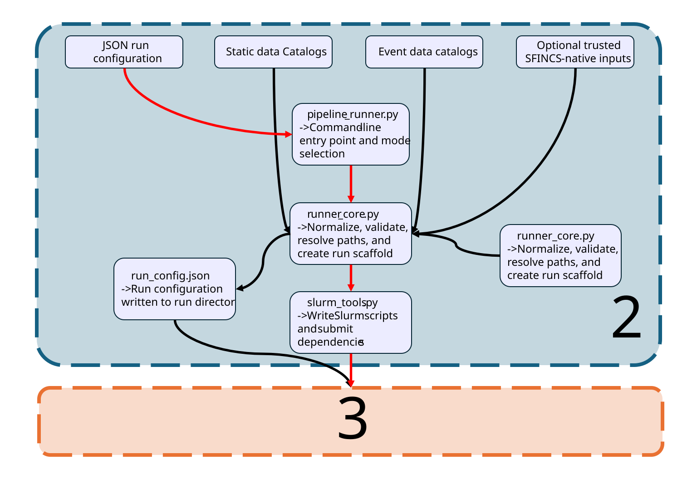

# Python Backend

The Python backend turns a structured run configuration into a reproducible
SFINCS model run.

It sits between the Web Launcher and the Longleaf Slurm execution system. The
Web Launcher collects settings and produces a JSON configuration, while the
backend validates that configuration, prepares a run directory, writes the
Slurm job scripts, and submits the requested workflow.

The backend is also usable directly from the command line. The Web Launcher is
therefore a user interface for the backend rather than a separate
implementation of the model-building logic.

> **Documentation status**
>
> This page describes the current backend architecture at the module and
> workflow level. Function-level pages will be added under
> `python_backend/files/` after each source file has been audited.

---

## Purpose

The backend has five main responsibilities:

1. Interpret and validate a structured run configuration.
2. Resolve paths, modes, forcing selections, and run identity.
3. Create a reproducible run-directory scaffold.
4. Write and submit the requested Slurm workflow.
5. Preserve configuration, scripts, logs, model files, and outputs together.

The backend does not decide whether a model result is scientifically correct.
It prepares and executes the requested workflow. Scientific validation remains
a separate downstream process.

---

## Position in the system

```text
Web Launcher and Flask API
            |
            v
Structured JSON configuration
            |
            v
Python backend
            |
            +-- schema and defaults
            +-- validation and path resolution
            +-- run-directory setup
            +-- Slurm script generation
            +-- Slurm submission
            |
            v
Preprocessing -> SFINCS -> Postprocessing
            |
            v
Run files, logs, outputs, and provenance
```

The backend can be entered through either:

```text
Web Launcher
    The browser submits a structured configuration through the Flask
    application.

Command line
    A user runs pipeline_runner.py directly with a JSON config file.
```

Both entry paths should reach the same backend behavior. The Web Launcher
should not duplicate validation, run-directory, or Slurm-writing logic that
already belongs in the Python backend.

---

## Python Backend execution map

The Python Backend is region 2 in the system architecture. It begins with a
JSON run configuration and the selected data catalogs, then validates and
prepares the run before handing the generated job scripts to the Slurm
Execution Stack.

[](../../assets/architecture/python_backend.svg)

The diagram focuses only on the normal model-run path:

```text
JSON run configuration
        ↓
pipeline_runner.py
        ↓
runner_core.py and config_schema.py
        ↓
frozen run_config.json
        ↓
slurm_tools.py
        ↓
three-stage Slurm execution stack

The central execution path is:

```text
pipeline_runner.py
        |
        +-- runner_core.py
        |       |
        |       +-- config_schema.py
        |       +-- validation
        |       +-- path resolution
        |       +-- run setup
        |
        +-- slurm_tools.py
                |
                +-- preprocessing script
                +-- SFINCS script
                +-- postprocessing script
                +-- sbatch submission
```

The Slurm scripts then execute:

```text
preprocess_stage.py
        |
        v
SFINCS container
        |
        v
postprocess_stage.py
```

---

## Current active core modules

The current runner implementation is centered on these files:

```text
code/config_schema.py
code/runner_core.py
code/slurm_tools.py
code/pipeline_runner.py
```

The active stage machinery is:

```text
code/preprocess_stage.py
code/postprocess_stage.py
code/shared_utils.py
```


---

# Core runner modules

## `pipeline_runner.py`

`pipeline_runner.py` is the command-line entry point for the backend.

Its main responsibilities are:

```text
parse command-line arguments
load the requested JSON configuration
apply command-line overrides
select the runner mode
call backend validation and setup logic
request Slurm-script generation
request Slurm submission when appropriate
print run paths, logs, and submitted job IDs
```

Supported command structure:

```bash
python code/pipeline_runner.py \
  --config /path/to/config.json \
  --mode preflight
```

```bash
python code/pipeline_runner.py \
  --config /path/to/config.json \
  --mode build_scripts
```

```bash
python code/pipeline_runner.py \
  --config /path/to/config.json \
  --mode submit
```

The runner also supports repeated command-line overrides through:

```text
--set KEY=VALUE
```

For example:

```bash
python code/pipeline_runner.py \
  --config /path/to/config.json \
  --mode preflight \
  --set run_series=test_002
```

`pipeline_runner.py` should remain a relatively thin orchestration layer. It
should not contain a second copy of configuration validation or low-level Slurm
formatting.

---

## `config_schema.py`

`config_schema.py` defines the backend's known configuration structure.

Its responsibilities include:

```text
default configuration values
known required and optional keys
expected value types
boolean, integer, float, string, list, and dictionary classifications
path-like key classifications
valid mode values
unknown-key detection
schema warning behavior
strict-schema validation behavior
```

The schema must support both current launcher-generated configurations and
older valid stage configurations.

A successful run configuration may contain many more stage-specific settings
than the small default configuration. For that reason, the backend distinguishes
between:

```text
known optional stage keys
truly unknown keys
values with the wrong expected type
```

The schema can operate in a warning-oriented mode or a stricter failure mode,
depending on the requested settings.

The schema is a central contract shared conceptually by:

```text
the Web Launcher
runner validation
saved configuration files
frozen run_config.json files
documentation and help text
```

Machine-specific path values should not be hardcoded into the schema. Those
values come from the launcher Settings layer or the submitted configuration.

---

## `runner_core.py`

`runner_core.py` contains the main non-Slurm backend logic.

Its responsibilities include:

```text
applying configuration defaults
normalizing configuration values
schema-hardening checks
mode-aware validation
path resolution
forcing-combination checks
run-name and run-path construction
output-root checks
container and executable checks
run-directory safety checks
run scaffold creation
writing the frozen run_config.json
printing or returning resolved run paths
```

### Mode-aware validation

Validation must account for the selected preprocessing mode.

For example:

```text
hydromt_build
    Requires the data needed to construct a model through HydroMT-SFINCS.

hybrid
    Uses trusted native/static SFINCS inputs and adds event-specific forcing and
    runtime files.

native or override-oriented paths
    Use selected trusted SFINCS-native inputs where explicitly enabled.
```

The backend should not require HydroMT build inputs for a Hybrid run that is
intentionally using trusted native static files.

### Run-directory safety

The backend distinguishes between:

```text
a build-scripts scaffold
a run that has actually started or produced model output
```

A scaffold created by `build_scripts` may contain:

```text
run_config.json
saved or launcher configuration copies
scripts/
empty logs/
empty model/
empty postprocess/
```

That scaffold should not automatically block a later Submit action.

Real run evidence may include:

```text
nonempty stage logs
generated model input files
SFINCS output files
postprocess products
job identifiers
completion markers
```

A real run should not be overwritten unless overwrite behavior was explicitly
enabled and reviewed.

---

## `slurm_tools.py`

`slurm_tools.py` owns Slurm-specific formatting and submission behavior.

Its responsibilities include:

```text
writing the preprocessing Slurm script
writing the SFINCS solver Slurm script
writing the postprocessing Slurm script
assigning stage-specific resource requests
writing stage-specific log paths
submitting scripts through sbatch
creating afterok dependencies
recording submitted job IDs
returning job information to pipeline_runner.py
```

The expected dependency chain is:

```text
preprocessing
      |
      | afterok
      v
SFINCS
      |
      | afterok
      v
postprocessing
```

Script writing and submission remain conceptually separate so the backend can
support both:

```text
build_scripts
submit
```

Detailed execution behavior is documented in
[Slurm Execution](../slurm_execution.md).

---

# Stage modules

## `preprocess_stage.py`

`preprocess_stage.py` is the largest model-input construction stage.

Depending on the configuration, it may:

```text
build a model through HydroMT-SFINCS
copy selected trusted SFINCS-native inputs
combine native static inputs with event-specific forcing
resolve static and event catalog inputs
write or patch sfincs.inp
write rainfall forcing
write water-level boundary forcing
write wind and pressure forcing
write observation points
write cross-section definitions
write infiltration and structure inputs
validate generated file references
write preprocessing audits and provenance
```

### HydroMT build mode

In `hydromt_build`, preprocessing constructs the model from source datasets and
catalog definitions.

This mode is used for Manual-style runs where HydroMT-SFINCS is responsible for
assembling the model.

### Hybrid mode

In `hybrid`, preprocessing combines:

```text
trusted static SFINCS inputs
+
event-specific dynamic inputs
```

For the current Harris County Override workflow, trusted static inputs commonly
include:

```text
sfincs.dep
sfincs.msk
sfincs.ind
sfincs_subgrid.nc
sfincs.manning
sfincs.scs
sfincs.thd
```

Dynamic event products are generated from event catalogs rather than blindly
copied from stale native inputs.

Current boundary policy is:

```text
native bndfile override = false
native bzsfile override = false
```

This allows the event catalog to generate the active water-level boundary
geometry and time series.

### Geometry authority

When trusted native static grid files are used, the declared `sfincs.inp`
geometry must match those files.

For the current Harris County PPP static source, the intended geometry is:

```text
mmax     = 996
nmax     = 1011
x0       = 212000
y0       = 3261300
dx       = 100
dy       = 100
rotation = 0
epsg     = 32615
```

The backend contains safeguards intended to prevent stale advanced
configuration geometry from being written over a trusted native static grid.

### Rainfall-grid handling

Hybrid event rainfall may begin in geographic longitude/latitude coordinates,
while the SFINCS model grid uses projected coordinates.

The preprocessing stage must ensure that rainfall written for a projected model:

```text
uses the model CRS
uses projected x and y coordinates
overlaps the model extent
is referenced correctly by sfincs.inp
```

A positive rainfall source file is not enough. The forcing must spatially land
on the SFINCS model grid.


---

## SFINCS solver container

The solver itself is not implemented in Python.

The current production container is:

```text
/proj/zefflab/projects/Flooding/pipeline/containers/
sfincs-v2.3.0-mt-Faber-Release.sif
```

The generated solver Slurm job:

```text
loads Apptainer
enters the run's model directory
binds the model directory into the container
sets OpenMP thread variables
runs SFINCS
writes outputs back into the run directory
```

Typical outputs include:

```text
model/sfincs.log
model/sfincs_map.nc
model/sfincs_his.nc
```

The container boundary is important:

```text
Python prepares the model.
SFINCS performs the numerical simulation.
Python reads and postprocesses the resulting outputs.
```

---

## `postprocess_stage.py`

`postprocess_stage.py` reads completed SFINCS output and produces standard
derived products.

Its responsibilities may include:

```text
reading sfincs_map.nc and sfincs_his.nc
creating maximum-depth and water-level summaries
creating raster or image products
writing run summaries
writing quality-control information
preparing outputs used by later Review workflows
```

Postprocessing is not the same as Review Mode.

```text
Postprocessing
    Standard pipeline stage executed after the solver.

Review Mode
    A user-facing system that inspects runs and may create additional maps,
    animations, observation comparisons, and status products.
```

A valid SFINCS solver output can exist even when postprocessing fails. In that
case, the run may be recognized as `sfincs-completed` rather than fully
`completed`.

---

## `shared_utils.py`

`shared_utils.py` contains utility behavior shared by stage scripts.

Shared utilities may include:

```text
path helpers
configuration access helpers
logging helpers
filesystem helpers
time conversion
small reusable data-handling functions
```

It should contain reusable operations rather than the main control flow for a
run.

---

# Supporting and diagnostic modules

The production `code/` folder also contains supporting utilities that are not
part of the main submission chain.

Examples include:

```text
check_sfincs_run.py
compare_sfincs_netcdf_numeric.py
Review product builders
Review Slurm submitters
map and animation preparation tools
comparison-job utilities
run-audit utilities
```

These files should be recorded in
[the module catalog](module_catalog.md), but they should not all be drawn as
part of the central preprocessing–solver–postprocessing chain.

The module catalog should classify each file as one of:

```text
core runner
model stage
shared utility
Review utility
comparison utility
validation or audit utility
test tool
legacy or superseded
uncertain pending audit
```

---

# Configuration lifecycle

A normal submitted configuration moves through the following lifecycle.

## 1. User-editable configuration

The Web Launcher or a saved JSON file supplies settings such as:

```text
event identity
run series and run name
preprocessing mode
catalog paths
native static sources
forcing selections
model runtime
output settings
Slurm resources
container and executable paths
postprocessing options
```

## 2. Command-line overrides

When the CLI is used, `--set KEY=VALUE` can alter selected values before the
backend proceeds.

## 3. Defaults and normalization

The backend applies defaults and normalizes values into the forms expected by
validation and execution.

## 4. Validation

The backend checks:

```text
recognized modes
required paths
path existence
forcing consistency
container existence
Python executable existence
stage-script existence
run-name safety
output-root safety
Slurm-resource sanity
overwrite behavior
mode-specific requirements
```

## 5. Frozen run configuration

For build or submission modes, the resolved configuration is written into the
run directory as:

```text
run_config.json
```

This frozen file is the authoritative record of what that run was asked to use.

Current launcher defaults may change later. Historical runs should therefore be
interpreted through their run-local `run_config.json`, generated model files,
scripts, and logs.

## 6. Script generation

The backend writes the three stage scripts under the run directory.

## 7. Submission

In Submit mode, the backend submits the scripts with `afterok` dependencies and
records their Slurm job IDs.

## 8. Stage execution

Longleaf compute nodes execute preprocessing, SFINCS, and postprocessing.

## 9. Run inspection and validation

Review Mode and separate scientific validation workflows inspect the resulting
run.

---

# Backend modes

## Preflight

```text
--mode preflight
```

Preflight:

```text
loads and resolves the config
runs backend validation
prints resolved paths and settings
does not submit jobs
does not create a normal production run
```

Preflight is a configuration-readiness check. It is not a scientific model
validation.

## Build scripts

```text
--mode build_scripts
```

Build-scripts mode:

```text
validates the config
creates a run scaffold
writes frozen run_config.json
writes the Slurm scripts
does not submit them
```

This provides an inspection point before scheduler submission.

## Submit

```text
--mode submit
```

Submit mode:

```text
validates the config
creates or reuses an allowable scaffold
writes the frozen config
writes the Slurm scripts
submits the dependent job chain
records job IDs and log paths
```

---

# Path authority and portability

The current deployment intentionally separates data storage from pipeline
execution.

```text
Active Harris County data and catalogs:
    /users/e/p/epsilon/Data/Data/harris_county

Pipeline code, environments, containers, and shared project files:
    /proj/zefflab/projects/Flooding/pipeline

Run output:
    /proj/zefflab/projects/Flooding/sfincs_runs
```

Do not perform a broad `/proj` to `/users` replacement.

Examples of data paths that belong under `/users`:

```text
event catalogs
static catalogs
processed gauge archives
rainfall products
boundary forcing sources
validation inputs
```

Examples of paths that remain under `/proj`:

```text
pipeline code
Python environments
SFINCS containers
Validation code
run directories
Slurm scripts and logs
```

Machine-specific defaults should come from the launcher Settings system rather
than being scattered as hardcoded values through the backend.

Portable catalog manifests should use relative paths when the referenced asset
lives beside the manifest.

---

# Run-directory ownership

The backend creates and writes the core run structure.

A normal run may contain:

```text
<run>/
├── run_config.json
├── job_ids.txt
├── scripts/
├── logs/
├── model/
├── postprocess/
└── review/
```

Ownership by subsystem is approximately:

```text
runner_core.py
    run identity
    scaffold
    frozen configuration

slurm_tools.py
    Slurm scripts
    submitted job IDs
    scheduler-facing log paths

preprocess_stage.py
    generated model inputs
    preprocessing audits and provenance

SFINCS
    solver logs and NetCDF output

postprocess_stage.py
    standard derived products

Review Mode
    review/maps
    review/animations
    review/obs_gauges
    review/jobs
```

The run directory is the primary unit of reproducibility. Its configuration,
scripts, logs, model inputs, and outputs should remain together.

---

# Validation and status boundaries

The backend must keep several milestones distinct.

```text
Configuration reviewed
    The requested settings and paths appear coherent.

Preflight passed
    Backend validation found no blocking configuration problem.

Scripts built
    The run scaffold and Slurm scripts were written.

Jobs submitted
    Slurm accepted the requested workflow.

Job completed
    The scheduler reports successful process completion.

Pipeline completed
    Expected preprocessing, solver, and postprocessing evidence exists.

Generated inputs audited
    Model files were checked for the intended geometry and forcing.

Scientific validation passed
    Model outputs were compared with appropriate observations and judged
    scientifically acceptable.
```

These milestones are not interchangeable.

For example, a `completed` Review label does not by itself prove:

```text
correct BND station order
correct BZS column order
correct rainfall projection
correct wind and pressure forcing
correct observation geometry
correct NetCDF dimensions
agreement with observed flooding
```

---

# Current backend safety rules

## Do not duplicate backend logic in the launcher

The launcher should collect settings and call the backend. It should not become
a second independent implementation of:

```text
schema validation
path resolution
run-directory setup
Slurm script generation
submission dependencies
```

## Do not overwrite runs casually

Existing model or output artifacts should block reuse unless overwrite was
explicitly requested and reviewed.

## Keep scripts and configuration with the run

Generated scripts and the frozen config are provenance, not temporary clutter.

## Use explicit executable paths

Python stage scripts should use the configured Python executable rather than
assuming that an interactive conda environment will remain active inside a
Slurm job.

## Keep heavy work off login nodes

Login nodes should be used for:

```text
configuration
preflight
script generation
submission
small text inspections
lightweight status checks
```

Heavy model construction, simulation, NetCDF processing, and rendering belong
on compute nodes.

## Keep active-run audits read-only

When jobs may still be running:

```text
use squeue and scontrol
inspect file existence, size, and modification time
avoid modifying run files
avoid cancelling unrelated jobs
avoid opening large live NetCDF files unless required
```

---

# Testing and implementation confidence

The current core backend has passed:

```text
preflight success tests
expected preflight failure tests
build-scripts tests
existing-run-folder safety tests
schema warning tests
strict-schema failure tests
Slurm script-generation checks
a complete preprocessing–SFINCS–postprocessing submit test
```

A prior Harvey Hybrid runner test completed the full three-stage stack and
matched the important physical outputs of the trusted reference workflow.

That supports the current backend architecture as a working foundation.

It does not prove that every optional physics branch or every future deployment
combination has been fully tested.

---

# Current limitations and pending documentation

The following work remains:

```text
copy and inventory all active source files in the repository
classify each source file in module_catalog.md
audit exact import and call relationships
create file-level pages under python_backend/files/
document public functions and important internal helpers
separate active utilities from historical or superseded scripts
document the tests that protect each module
run the consolidated generated-input audit for the current event runs
```

The architecture diagram on this page should be updated after the source audit
only when actual code relationships differ from the current high-level model.

---

# Related documentation

- [System architecture](../overview.md)
- [Slurm execution](../slurm_execution.md)
- [Python backend module catalog](module_catalog.md)
- [Web Launcher architecture](../web_launcher/web_launcher.md)
- [Review Mode architecture](../review_mode/review_mode.md)
- [Review product and status model](../review_mode/product_and_status_model.md)