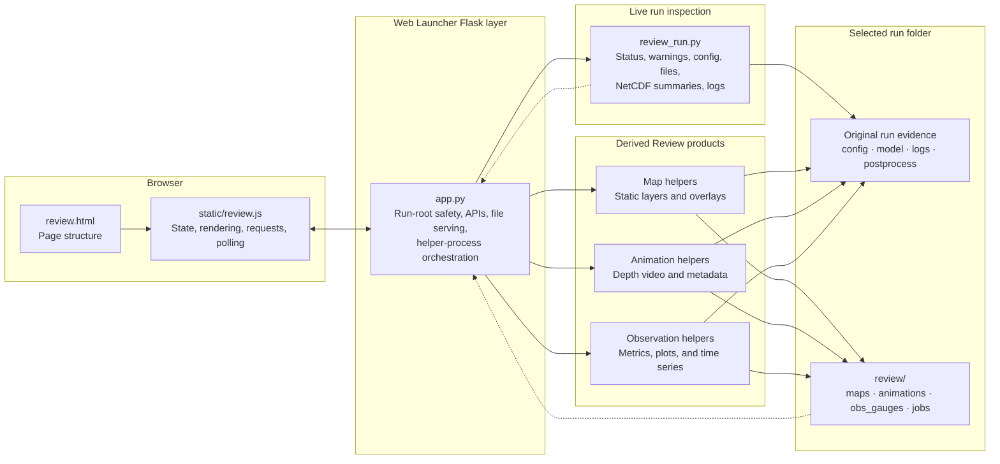

# Review Mode

## Purpose

Review Mode is the Web Launcher subsystem used to inspect an existing SFINCS run after it has been created. It brings the run configuration, stage status, warnings, native model inputs, NetCDF summaries, logs, existing artifacts, and optional derived Review products into one browser page.

Review Mode serves two related purposes:

1. **Computational review** — determine what stages ran, which expected files exist, what warnings are visible, and whether the run appears complete or partial.
2. **Scientific review support** — generate maps, animations, and observed-versus-modeled products that help a researcher evaluate the simulation.

Review Mode does not declare a model scientifically valid. A completed run or available Review product only establishes that certain computational evidence or derived products exist.

Detailed button-by-button operating instructions belong in the Web Launcher Guide. This page documents the subsystem architecture, file ownership, product generation, and status model.

---

## Scope and write boundary

The Review page describes itself as read-only because it does not rebuild the model, modify native SFINCS inputs, change solver outputs, or resubmit the main pipeline.

That description requires one qualification:

> Review Mode is read-only with respect to the original run configuration, model inputs, solver outputs, and postprocessing outputs. It may create or replace derived Review products, status files, Slurm scripts, and Review-specific logs beneath `<run>/review/`.

The protected run evidence includes files such as:

```text
run_config.json
preprocess_manifest.json
model/sfincs.inp
model/sfincs_map.nc
model/sfincs_his.nc
model/sfincs.log
postprocess/
logs/
```

Review-generated material is isolated under:

```text
<run>/review/
```

This separation lets researchers regenerate maps, animations, and validation displays without changing the simulation that produced them.

---

## Architecture overview



The browser does not read Longleaf files directly. Every run lookup, summary request, status check, submission, and artifact request passes through Flask.

---

## Source files

| File | Responsibility |
|---|---|
| `web_launcher/review.html` | Defines the Review page shell, run selector, summary panels, status areas, artifact sections, and Review-product workspace. |
| `web_launcher/static/review.js` | Owns browser state, calls Review APIs, renders summaries and products, polls jobs, displays errors, and manages map, animation, and observation controls. |
| `web_launcher/app.py` | Serves the page, resolves safe run paths, exposes Review APIs, launches helper scripts, checks Slurm, and safely serves run-local artifacts. |
| `code/review_run.py` | Performs live read-only inspection of a selected run and returns the main Review summary as JSON. |
| `code/review_prepare_maps.py` | Builds cached static map layers and optional overlays from `sfincs_map.nc` and run-local geometry. |
| `code/review_submit_maps.py` | Writes and submits the Slurm job used to generate map products. |
| `code/review_animation_info.py` | Reads `sfincs_map.nc`, estimates animation frames and duration, and inventories existing animations. |
| `code/review_prepare_animation.py` | Builds the depth animation and its metadata file. |
| `code/review_submit_animation.py` | Writes and submits the Slurm animation job. |
| `code/review_prepare_obs_gauges.py` | Matches simulation observations with validation data and builds metrics, plots, and time-series products. |
| `code/review_submit_obs_gauges.py` | Writes and submits the observation/gauge job or runs it directly when requested. |
| `web_launcher/launcher_site_defaults.json` | Supplies deployment-specific roots and Python executables through the shared Launcher Settings system. |

The Review helpers are intentionally separate from the main pipeline stages. They consume a run after preprocessing and simulation rather than becoming another required stage of every run.

---

## Entry and run discovery

The page is served at:

```text
/review
```

The configured Launcher Settings `runRoot` is the only normal discovery root. Review Mode does not recursively search the entire filesystem.

The run-list request:

1. resolves the configured run root;
2. inspects each immediate child directory;
3. skips directory names beginning with `.` or `_`;
4. assigns a quick status from a small set of file checks;
5. records the directory modification time; and
6. returns runs with the most recently modified first.

Skipping names beginning with `_` prevents internal roots such as comparison-job and report directories from appearing as normal SFINCS runs.

Run selection is name-based rather than arbitrary-path-based. Flask rejects names containing path separators, `.` or `..`, and confirms that the resolved directory remains beneath the configured run root.

---

## Review page layout

After a run is selected, the page presents several levels of information.

### Headline and warning count

The page shows the selected run name, resolved path, current detailed status, and the number of warnings returned by `review_run.py`.

### Warning panel

Warnings are sorted approximately by severity:

```text
critical
major
minor
info
```

Warnings explain the observed problem, why it matters, and, where available, a suggested next step. Examples include a missing `run_config.json`, missing `sfincs.inp`, unreadable NetCDF output, missing files referenced by `sfincs.inp`, or suspicious configuration semantics.

### Stage lights

The preprocessing, SFINCS, and postprocessing stages are summarized separately. Each stage reports failure evidence and completion evidence rather than relying on one overall label.

### Configuration and input review

The page displays an ordered summary of important configuration groups and preserves access to the full configuration. It also parses selected `sfincs.inp` values, including runtime, output intervals, CRS settings, and file pointers.

### Native and NetCDF checks

`review_run.py` performs lightweight inspections of selected native files and summarizes `sfincs_map.nc` and `sfincs_his.nc` through the backend SFINCS Python environment. This keeps `xarray` and `numpy` out of the lighter Flask environment.

### Logs and artifacts

The summary identifies known files, discovers other images and text artifacts, and returns selected log tails. The page can then request individual run-local files through Flask.

### Review products

The product workspace currently contains three supported tools:

```text
1. Toggleable static maps
2. Observation / gauge products
3. Flood-depth animation
```

---

## Live run summary

Loading a run calls `review_run.py` through the configured backend Python interpreter. The script builds the summary at request time.

The main checks include:

- presence and readability of `run_config.json`;
- presence and parsing of `model/sfincs.inp`;
- stage failure markers;
- preprocessing, SFINCS, and postprocessing completion evidence;
- existence of files referenced by `sfincs.inp`;
- selected `sfincs.scs` and `sfincs.dep` checks;
- runtime and output-interval semantics;
- NetCDF dimensions, variables, and readability;
- discharge-like configuration paths and CSV headers;
- known run files and additional artifacts; and
- selected log excerpts.

The Web Launcher summary route does not use `review_run.py --write-json`, so the ordinary page load does not persist `review/review_summary.json`. The summary remains a live interpretation of the current run folder.

---

## Product families

## Static maps

Static map products are built primarily from:

```text
model/sfincs_map.nc
```

The minimum expected map layers are:

| Layer | Meaning |
|---|---|
| `max_depth` | Maximum modeled water depth above the local bed or ground. |
| `max_water_level` | Maximum modeled water-surface elevation relative to the model vertical datum. |

The map builder may also create optional products when the required sources are available, including:

- satellite background;
- model-domain overlays;
- observation-point overlay;
- observation-line overlay;
- observation/gauge context map; and
- water-level or flow error surfaces after observation metrics exist.

The browser stacks compatible PNG products in a common map frame. Users can toggle the satellite background, model layer, observation points, observation lines, and other available overlays without regenerating the model.

Map generation can be handled in two ways:

```text
Submit job
    writes a Review-map Slurm script and submits it

Run locally
    runs the map builder inside the current Web Launcher desktop session
```

Slurm is preferred for normal use because map generation may require substantial memory and external basemap access. The local option is useful for testing but consumes resources assigned to the browser session.

The map helper uses the `sfincs_contextily` environment when available because satellite and map rendering require packages not needed by the basic Flask process.

### Map completion evidence

The principal files are:

```text
review/maps/map_status.json
review/maps/layers_manifest.json
review/maps/map_cache.npz
review/maps/*.png
```

A usable `layers_manifest.json` containing at least one layer is the primary completion evidence when a Slurm job has left the queue.

---

## Flood-depth animation

The animation workflow reads:

```text
model/sfincs_map.nc
```

The current animation field is derived as:

```text
depth(t) = max(zs(t) - zb, 0)
```

The source NetCDF must therefore contain:

```text
zs(time, n, m)
zb(n, m)
```

Before submission, `review_animation_info.py` reports:

- source time count;
- detected time dimension and labels;
- event duration;
- native output spacing;
- selected frame count;
- estimated video duration;
- existing animations; and
- the latest available animation.

Users control:

```text
hours per frame
frames per second
```

The API requires positive values and limits Review animation playback to at most 30 frames per second.

Animation generation is submitted to Slurm from the Review page. The current submitter requests:

```text
2 hours
16 GB memory
4 CPUs
```

Each completed animation is stored with a timestamped MP4 and a matching JSON metadata file. Multiple animation settings can therefore coexist in one run.

### Animation completion evidence

The principal files are:

```text
review/animations/animation_status.json
review/animations/animation_depth_*.mp4
review/animations/animation_depth_*.json
```

If a job disappears from `squeue`, Review considers the product ready when matching metadata and video files exist. Otherwise, it reads the latest Review-animation logs and reports failure.

The current version animates modeled depth. A rainfall heatmap overlay is a planned extension rather than a current product.

---

## Observation and gauge products

The observation workflow compares run-local SFINCS history output with an event validation dataset.

Primary inputs include:

```text
model/sfincs_his.nc
model observation points and cross-section lines
an event validation-gauge CSV or folder
```

The browser attempts to derive the default validation location from the run's selected event catalog, normally its `event_validation_gauges` folder. A researcher may browse to or paste a different supported validation source. Files beneath `_misc` are intentionally ignored during candidate selection.

The selected validation path is stored in browser local storage for that run so the choice can survive page refreshes without altering `run_config.json`.

The observation builder produces metrics and display artifacts for point water levels and line or cross-section flows. The current interface can show:

- overall water-level RMSE and MAE;
- overall mean-flow and peak-flow RMSE;
- matched and unmatched counts;
- point-gauge metric cards;
- cross-section or line-gauge metric cards;
- observed and simulated time-series plots;
- spatial locations and error surfaces; and
- raw metrics JSON for inspection.

Observation/gauge products can be submitted to Slurm or run directly in the current Web Launcher session.

The submitter's default Slurm request is:

```text
20 minutes
8 GB memory
2 CPUs
```

### Observation completion evidence

The core files are:

```text
review/obs_gauges/obs_gauges_status.json
review/obs_gauges/obs_gauges_manifest.json
review/obs_gauges/obs_gauges_metrics.json
```

The manifest and metrics JSON are both required before a departed Slurm job is promoted to `ready`. Additional CSV, time-series, and image products are referenced from those files.

Observation error surfaces may be incorporated into the map manifest, allowing the observation and map tools to share compatible spatial overlays.

---

## Run and product status model

Review Mode has two related but separate status systems:

1. **run status**, describing evidence present in the original run folder; and
2. **product status**, describing the lifecycle of a derived Review product.

These statuses should not be combined into one scientific pass/fail label.

### Quick run-list status

The run selector uses a deliberately inexpensive status check.

| Quick status | Evidence |
|---|---|
| `failed` | At least one of `preprocess_failed.json`, `sfincs_failed.json`, or `postprocess_failed.json` exists. |
| `completed` | Both `sfincs_map.nc` and `sfincs_his.nc` exist, and selected postprocessing evidence exists. |
| `sfincs-completed` | Both primary SFINCS NetCDF files exist, but selected postprocessing evidence is absent. |
| `preprocess-completed` | `model/sfincs.inp` exists, but primary SFINCS output evidence is not complete. |
| `scaffold-or-partial` | Run scaffolding exists, but stronger completion evidence is absent. |
| `unknown` | The folder does not match the expected run evidence. |
| `stat-error` | The directory could not be inspected during run listing. |

This status is intended to make the run selector useful without opening NetCDF files for every directory.

### Detailed run-summary status

After a run is loaded, `review_run.py` applies a more descriptive classification.

| Detailed label | Meaning |
|---|---|
| `failed` | One or more stage failure markers exist. |
| `completed` | Both primary NetCDF outputs and postprocessing completion evidence exist. |
| `sfincs-completed-postprocess-missing-or-partial` | At least one primary SFINCS output exists, but postprocessing is missing or incomplete. |
| `preprocess-completed-sfincs-missing-or-running` | `sfincs.inp` exists, but SFINCS output evidence is not yet available. |
| `scaffold-only` | Run structure exists without real model or execution artifacts. |
| `unknown-or-empty` | The directory contains little or no recognizable run evidence. |

The run-list label and detailed label may differ in wording because they serve different performance and diagnostic purposes.

### Product-level states

Maps, animations, and observation/gauge products use status JSON files under their own product directories.

| Product state | Meaning |
|---|---|
| `missing` | No status or usable product evidence exists yet. |
| `submitting` | The helper is preparing or sending a job to Slurm. |
| `submitted`, `queued`, or `pending` | A job ID exists and the work is waiting for resources. |
| `running` | Slurm reports that the job is active. |
| `running_direct` | The builder is executing in the current Web Launcher process or desktop session. |
| `ready` | The required manifest and product files exist. |
| `failed` | Generation failed or a job left Slurm without the required outputs. |
| `submit_failed` | `sbatch` returned an error during submission. |
| `sbatch_unavailable` | A job script was written, but `sbatch` was unavailable from that process. |
| `error` | A status or product file could not be parsed or another helper error occurred. |

The frontend polls active product jobs approximately every three seconds. It keeps separate timers for maps, animations, and observation products and clears inactive timers when the user switches tools or runs.

### Scheduler enrichment

The status files record the last known application state. While a job is active, Flask also queries:

```bash
squeue -h -j <job_id> -o "%T|%M|%R"
```

This adds scheduler state, elapsed time, and pending reason to the browser response.

If the job is no longer present in `squeue`, Flask does not assume success. It checks the product-specific completion evidence. If that evidence is absent, Review reports failure and returns tails from the most recent Review job logs.

---

## Run-local Review storage

A run with all current Review products may resemble:

```text
<run>/
├── run_config.json
├── preprocess_manifest.json
├── job_ids.txt
├── model/
│   ├── sfincs.inp
│   ├── sfincs_map.nc
│   ├── sfincs_his.nc
│   └── other native SFINCS files
├── logs/
├── postprocess/
│
└── review/
    ├── maps/
    │   ├── map_status.json
    │   ├── layers_manifest.json
    │   ├── map_cache.npz
    │   └── generated PNG layers and overlays
    │
    ├── animations/
    │   ├── animation_status.json
    │   ├── animation_depth_<timestamp>.mp4
    │   └── animation_depth_<timestamp>.json
    │
    ├── obs_gauges/
    │   ├── obs_gauges_status.json
    │   ├── obs_gauges_manifest.json
    │   ├── obs_gauges_metrics.json
    │   └── generated CSV, JSON, and image products
    │
    └── jobs/
        ├── review_maps_*.sbatch
        ├── review_maps_*.out
        ├── review_maps_*.err
        ├── review_animation_*.sbatch
        ├── review_animation_*.out
        ├── review_animation_*.err
        ├── review_obs_gauges_*.slurm
        ├── review_obs_gauges_*.out
        └── review_obs_gauges_*.err
```

The exact set of image and data products depends on the variables, observation geometry, validation data, and optional basemap access available for that run.

---

## Frontend state and polling

`review.js` maintains one browser state object for the selected run and its loaded products. Important state groups include:

```text
run list and selected run
loaded Review summary
active Review tool
map status and manifest
animation status and estimates
observation status, manifest, metrics, and time series
polling timers
selected validation-data path
```

Changing runs resets product state and clears polling timers. Changing tools preserves already loaded product information where practical but stops background polling for tools that are no longer active.

The browser uses cache-busting query values for generated artifacts so regenerated images and JSON files are not silently replaced by stale browser-cache copies.

Frontend rendering is evidence-driven:

```text
ready + usable manifest
    render the product

active state
    show scheduler progress and continue polling

failed state
    show error and resubmission controls

missing or unknown state
    show product prerequisites and generation controls
```

---

## Flask and helper-script handoffs

The Flask application acts as a mediator rather than performing all scientific work itself.

### Live summary

```text
review.js
    → Review summary API
    → app.py
    → configured backend Python
    → review_run.py
    → JSON response
```

### Maps

```text
review.js
    → map status or submit API
    → app.py
    → direct review_prepare_maps.py
      or review_submit_maps.py → Slurm
    → review/maps products
```

### Animation

```text
review.js
    → animation info API
    → review_animation_info.py

review.js
    → animation submit API
    → review_submit_animation.py
    → Slurm
    → review_prepare_animation.py
    → review/animations products
```

### Observations and gauges

```text
review.js
    → observation status or submit API
    → app.py
    → review_submit_obs_gauges.py
    → direct execution or Slurm
    → review_prepare_obs_gauges.py
    → review/obs_gauges products
```

This division lets the Web Launcher use a light Flask environment while handing NetCDF, numerical, map-rendering, and validation work to the environments designed for those tasks.

---

## Slurm and direct execution

Review product generation is separate from the three-stage main pipeline. Review jobs do not rerun preprocessing, SFINCS, or the normal postprocessing stage.

### Slurm execution

Slurm is the normal path for heavier Review work. Submit helpers:

- write a product-specific job script under `review/jobs/`;
- direct stdout and stderr to run-local Review logs;
- record a status before and after submission;
- store the job ID; and
- let Flask enrich that status through `squeue`.

### Direct execution

Static maps and observation/gauge products also expose a local execution option. This is useful when testing or when `sbatch` is unavailable, but it runs inside the resources assigned to the Web Launcher session.

Direct execution may keep the request open for an extended period and may consume substantial browser-session memory. It should not be treated as the preferred batch-production path. (Though if you nuke your user score with job batches it saves you queue time.)

The current animation workflow is submitted through Slurm from the Review interface.

---

## File serving and path safety

Review Mode uses two forms of file serving.

### General run artifact serving

The generic Review file endpoint accepts:

```text
run name
run-relative file path
```

Flask resolves the target and confirms that it remains beneath the selected run directory. Paths that escape the run are rejected, and missing or non-file targets are not served.

### Animation video serving

Animation video uses a dedicated endpoint that:

- resolves the requested path beneath the selected run;
- rejects paths outside the run;
- permits only `.mp4` and `.webm` suffixes;
- assigns an explicit video MIME type; and
- disables long-lived caching for regenerated products.

Run names themselves are constrained to immediate child-folder names beneath the configured run root. The browser never receives permission to request an arbitrary run path.

The observation validation picker uses the Web Launcher's shared safe directory-browser API rather than exposing unrestricted filesystem access.

---

## Product reuse and staleness

Review products are derived caches, not primary simulation evidence.

The current map builder can reuse an existing `layers_manifest.json` when a rebuild is not forced. Animation outputs are timestamped and may coexist. Observation products are normally regenerated with force enabled.

The current system does not provide a universal cryptographic link between every Review product and the exact content hash of:

```text
sfincs_map.nc
sfincs_his.nc
run_config.json
validation CSV
Review helper source
```

As a result, a product can remain present after one of its source files has changed. The safe practice is to regenerate the relevant Review product whenever the run outputs, validation source, model observation geometry, or Review-generation code changes.

A `ready` status means the expected product evidence exists. It does not prove that the product is current relative to every possible source change.

---

## Relationship to scientific validation

Review Mode is an inspection and diagnostic system. It supports scientific validation but does not replace it.

The following statements are intentionally different:

```text
The run is completed.
    expected computational evidence exists

The map product is ready.
    a usable map manifest and images exist

The observation product is ready.
    metrics and manifest files exist

The model is scientifically validated.
    the simulation has passed the project's scientific checks
    and its performance has been interpreted appropriately
```

Scientific validation still requires attention to:

- event forcing and runtime;
- boundary station identity, order, and placement;
- vertical datum harmonization;
- mask and geometry correctness;
- NetCDF point and line identities;
- observation coverage;
- quantitative error metrics;
- spatial plausibility; and
- event-to-event performance.

Review products make those checks easier to perform and communicate. They do not convert file availability into a scientific conclusion.

---

## Current limitations

The current implementation has several known architectural limitations.

### Two run-status vocabularies

The fast run list and detailed summary use different label wording. This is intentional but can be confusing if the distinction is not understood.

### Product freshness is not fully automatic

Existing product files are not universally invalidated when source NetCDF, validation data, or helper code changes.

### Scheduler history is limited

Active jobs are inspected through `squeue`. After a job leaves the queue, Review infers success or failure from run-local products and logs rather than a full accounting database.


### Animation scope is currently limited

The current animation visualizes derived flood depth. Additional fields and rainfall overlays remain future extensions.

### Observation quality remains data-dependent

The interface can only compare gauges that can be matched to run-local observations and have suitable event validation data. Unmatched or unavailable observations are reported rather than silently treated as zero-error or model failure.

### Review does not repair runs

Review identifies problems and generates diagnostics. It does not rewrite the original configuration, native model inputs, solver outputs, or postprocessing results to correct them.

---

## Related documentation

- [Architecture overview](../overview.md) places Review Mode in the complete system.
- [Web Launcher](../web_launcher/web_launcher.md) explains the browser application, shared settings, and Flask orchestration layer.
- [Page and API map](../web_launcher/page_and_api_map.md) lists the exact Review endpoints and frontend callers.
- [Python Backend](../python_backend/python_backend.md) explains model preparation and the main pipeline handoff.
- [Slurm Execution](../slurm_execution.md) explains the primary preprocessing, SFINCS, and postprocessing stack.
- [Data](../../data.md) documents validation gauges, observation geometry, event catalogs, and datum handling.
- [Current Research](../../current_research.md) explains the scientific validation state and research goals.

The Web Launcher Guide remains the operating reference for selecting runs, generating products, and using the Review interface.
