# Web Launcher Page and API Map

The SFINCS Web Launcher is divided into browser pages, shared frontend JavaScript, Flask routes in `web_launcher/app.py`, and backend Python helpers under `pipeline/code/`. This page maps those connections in more detail than the main [Web Launcher architecture page](web_launcher.md).

The goal is not to explain how a user fills out each form. The launcher Guide handles that. This page instead answers four implementation questions:

```mermaid
%%{init: {"flowchart": {"curve": "basis", "nodeSpacing": 32, "rankSpacing": 55}, "themeVariables": {"fontSize": "13px"}} }%%
flowchart TB

  %% ================= BAND 1 : PAGE SERVING =================
  subgraph B1["① Page serving  (GET → HTML)"]
    direction LR
    p_brow["browser<br/>URL / links"]
    p_root["GET / · /index.html"]
    p_man["GET /manual.html"]
    p_ovr["GET /override.html"]
    p_gde["GET /guide.html"]
    p_rev["GET /review"]
    p_cmp["GET /compare"]
    p_cmps["GET /compare/status"]
    p_cmpr["GET /compare/result"]
    p_bat["GET /batch.html · /guided.html · stub"]
    p_html["render_template /<br/>send_from_directory → HTML"]
    p_brow --> p_root --> p_html
    p_brow --> p_man --> p_html
    p_brow --> p_ovr --> p_html
    p_brow --> p_gde --> p_html
    p_brow --> p_rev --> p_html
    p_brow --> p_cmp --> p_html
    p_brow --> p_cmps --> p_html
    p_brow --> p_cmpr --> p_html
    p_brow --> p_bat --> p_html
  end

  %% ================= BAND 2 : CORE + FILESYSTEM =================
  subgraph B2["② Core launcher &amp; filesystem"]
    direction LR
    c_ld["launcher_defaults.js"]
    c_pb["path_browser.js · review.js"]
    c_save_src["manual.html · override.html"]
    c_pa["pipeline_actions.js"]
    c_defg["GET /api/launcher-defaults"]
    c_defp["POST /api/launcher-defaults"]
    c_ls["POST /api/list-directory"]
    c_savep["POST /api/save-config"]
    c_run["POST /api/run-pipeline"]
    c_health["GET /api/health"]
    c_json["launcher_site_defaults.json"]
    c_fs["sandboxed filesystem<br/>(ALLOWED_ROOTS)"]
    c_cfg["write run config JSON"]
    c_plr["subprocess<br/>code/pipeline_runner.py"]
    c_ld --> c_defg --> c_json
    c_ld --> c_defp --> c_json
    c_pb --> c_ls --> c_fs
    c_save_src --> c_savep --> c_cfg
    c_pa --> c_run --> c_plr
    c_health --> c_json
  end

  %% ================= BAND 3 : MANUAL / OVERRIDE INSPECTION =================
  subgraph B3["③ Manual / Override inspection"]
    direction LR
    i_man["manual.html"]
    i_ovr["override.html"]
    i_detd["POST /api/detect-data-catalogs<br/>· /api/detect-manual-catalogs"]
    i_dets["POST /api/detect-sfincs-files"]
    i_warn["POST /api/manual-catalog-native-warning<br/><i>(+ legacy _ dup)</i>"]
    i_geol["POST /api/manual-geometry-check-local"]
    i_geos["POST /api/manual-geometry-check-submit"]
    i_rtw["POST /api/review-runtime-window"]
    i_nsh["POST /api/review-native-shapes"]
    i_fs["sandboxed filesystem<br/>catalog / native scan"]
    i_mgc["subprocess (local) /<br/>sbatch (slurm)<br/>code/manual_geometry_check.py"]
    i_audit["in-app runtime / shape audit"]
    i_man --> i_detd --> i_fs
    i_man --> i_warn --> i_audit
    i_man --> i_geol --> i_mgc
    i_man --> i_geos --> i_mgc
    i_man --> i_rtw --> i_audit
    i_ovr --> i_detd
    i_ovr --> i_dets --> i_fs
    i_ovr --> i_nsh --> i_audit
    i_ovr --> i_rtw
  end

  %% ================= BAND 4 : COMPARE =================
  subgraph B4["④ Compare"]
    direction LR
    m_cmp["compare.html"]
    m_cmps["compare_status.html"]
    m_cmpr["compare_result.html"]
    m_csr["GET /api/compare/search-runs"]
    m_crec["POST /api/compare/recommend"]
    m_csub["POST /api/compare/submit"]
    m_csta["GET /api/compare/status"]
    m_cres["GET /api/compare/result"]
    m_cpair["GET /api/compare/pair-result"]
    m_fs["scan run folders"]
    m_cjm["subprocess _run_manager<br/>code/compare_job_manager.py"]
    m_res["read compare_result.json /<br/>pair_*_result.json"]
    m_cmp --> m_csr --> m_fs
    m_cmp --> m_crec --> m_cjm
    m_cmp --> m_csub --> m_cjm
    m_cmps --> m_csta --> m_cjm
    m_cmpr --> m_cres --> m_res
    m_cmpr --> m_cpair --> m_res
  end

  %% ================= BAND 5 : REVIEW =================
  subgraph B5["⑤ Review  (all called by review.js on review.html)"]
    direction LR
    v_js["review.js"]
    v_runs["GET /api/review/runs"]
    v_sum["GET /api/review/summary"]
    v_file["GET /api/review/file"]
    v_maps_s["GET /api/review/maps/status"]
    v_maps_p["POST /api/review/maps/submit"]
    v_ani_i["GET /api/review/animation/info"]
    v_ani_s["GET /api/review/animation/status"]
    v_ani_p["POST /api/review/animation/submit"]
    v_ani_v["GET /api/review/animation/video"]
    v_obs_s["GET /api/review/obs-gauges/status"]
    v_obs_p["POST /api/review/obs-gauges/submit"]
    v_ph["GET /api/review/timeseries · /api/review/animation<br/><i>(placeholders)</i>"]
    v_fs["scan run_root"]
    v_rr["subprocess code/review_run.py"]
    v_maps["subprocess review_prepare_maps.py<br/>(local) / review_submit_maps.py (slurm)"]
    v_ani["subprocess review_submit_animation.py<br/>review_animation_info.py"]
    v_obs["subprocess review_submit_obs_gauges.py"]
    v_sq["squeue · job-status poll"]
    v_send["send_file (mp4 / product)"]
    v_js --> v_runs --> v_fs
    v_js --> v_sum --> v_rr
    v_js --> v_file --> v_send
    v_js --> v_maps_s --> v_sq
    v_js --> v_maps_p --> v_maps
    v_js --> v_ani_i --> v_ani
    v_js --> v_ani_s --> v_sq
    v_js --> v_ani_p --> v_ani
    v_js --> v_ani_v --> v_send
    v_js --> v_obs_s --> v_sq
    v_js --> v_obs_p --> v_obs
    v_js --> v_ph
  end

  classDef caller fill:#fff4d6,stroke:#f9ab00,color:#111;
  classDef get fill:#e6f4ea,stroke:#34a853,color:#111;
  classDef post fill:#fce8e6,stroke:#ea4335,color:#111;
  classDef back fill:#f3e8fd,stroke:#a142f4,color:#111;
  classDef band fill:#fbfbfd,stroke:#c7c7cc,color:#333;

  class B1,B2,B3,B4,B5 band;
  class p_brow,c_ld,c_pb,c_save_src,c_pa,i_man,i_ovr,m_cmp,m_cmps,m_cmpr,v_js caller;
  class p_root,p_man,p_ovr,p_gde,p_rev,p_cmp,p_cmps,p_cmpr,p_bat,c_defg,c_ls,c_health,i_rtw,m_csr,m_csta,m_cres,m_cpair,v_runs,v_sum,v_file,v_maps_s,v_ani_i,v_ani_s,v_ani_v,v_obs_s,v_ph get;
  class c_defp,c_savep,c_run,i_detd,i_dets,i_warn,i_geol,i_geos,i_nsh,m_crec,m_csub,v_maps_p,v_ani_p,v_obs_p post;
  class p_html,c_json,c_fs,c_cfg,c_plr,i_fs,i_mgc,i_audit,m_fs,m_cjm,m_res,v_fs,v_rr,v_maps,v_ani,v_obs,v_sq,v_send back;
```



---

## Reading this page

The launcher uses three kinds of routes:

```text
Page routes
    Return an HTML page.

Inspection and configuration APIs
    Read Settings, browse approved paths, inspect catalogs or native files,
    review a configuration, or save JSON.

Execution APIs
    Stage a configuration and call the pipeline runner, Compare manager,
    geometry checker, or Review product helpers.
```

A successful HTTP response only proves that the requested launcher operation completed. It does not automatically prove that a SFINCS run is scientifically valid.

---

## Top-level request flow

```text
Browser page
    ↓
Page-specific inline JavaScript and/or shared static JavaScript
    ↓
HTTP request to app.py
    ↓
Path and payload validation
    ↓
One of four outcomes:
    1. JSON returned directly from app.py
    2. Configuration or status file written
    3. Backend Python helper run locally
    4. Slurm job submitted by a backend helper
```

The main execution branches are:

```text
Manual or Override
    → /api/run-pipeline
    → pipeline_runner.py
    → Python Backend and Slurm stack

Compare
    → /api/compare/*
    → compare_job_manager.py
    → comparison Slurm job

Review
    → /api/review/*
    → review_run.py or a Review product helper
    → read-only summary, local builder, or Review Slurm job

Manual geometry check
    → /api/manual-geometry-check-*
    → manual_geometry_check.py
    → local audit or independent Slurm audit
```

---

# 1. Browser page map

## 1.1 Page-route summary

| Browser URL | Source file | Primary role | Frontend logic | Main API families |
|---|---|---|---|---|
| `/` | `index.html` | Main launcher menu | Inline navigation only | None |
| `/index.html` | `index.html` | Alternate home route | Inline navigation only | None |
| `/manual.html` | `manual.html` | Build a source-based Manual configuration | Large inline script plus shared Settings, browse, action, and reset scripts | Catalog detection, runtime review, native-catalog warnings, geometry checks, save, pipeline runner |
| `/override.html` | `override.html` | Build a native or hybrid Override configuration | Large inline script plus shared Settings, browse, action, and reset scripts | Native-file detection, catalog detection, runtime review, native shape review, save, pipeline runner |
| `/batch.html` | `batch.html` | Reserved Batch page | Minimal placeholder | None |
| `/guided.html` | `guided.html` | Reserved Guided Wizard page | Minimal placeholder | None |
| `/guide.html` | `guide.html` | Launcher instructions | Inline tab and query-string routing | None |
| `/compare` | `compare.html` | Select runs and comparison settings | Inline Compare script plus path browser | Compare search, recommendation, and submit |
| `/compare/status` | `compare_status.html` | Poll a comparison job | Inline polling script | Compare status |
| `/compare/result` | `compare_result.html` | Render completed comparison outputs | Inline result-loading script | Compare result and pair-result |
| `/review` | `review.html` | Inspect an existing run and build Review products | `launcher_defaults.js` and `review.js` | Review runs, summary, files, maps, animation, obs/gauges, directory browsing |

The Flask application renders most launcher pages from the `web_launcher/` folder as templates. Compare pages are returned with `send_from_directory`, while Review is rendered through the template system.

## 1.2 `index.html`

`index.html` is the launcher navigation shell. It links to:

```text
Manual
Override
Batch
Guided Wizard
Compare
Review
Guide
```

It does not load shared launcher JavaScript or call an API. Its only responsibility is navigation.

## 1.3 `manual.html`

`manual.html` owns the source-based model configuration workflow. The file contains the visible form and most Manual-specific browser logic, including:

```text
field collection through getConfig()
Manual tab behavior
catalog detection display
catalog suggestion application
runtime-window display
native-file catalog warning display
geometry-check controls
config preview and save behavior
```

It loads the shared scripts in this order near the bottom of the page:

```text
static/launcher_defaults.js
static/config_path_browse_buttons.js
static/path_browser.js
static/pipeline_actions.js
static/page_reset.js
```

Its direct API requests are:

```text
POST /api/review-runtime-window
POST /api/manual-catalog-native-warning
POST /api/detect-data-catalogs
POST /api/manual-geometry-check-local
POST /api/manual-geometry-check-submit
POST /api/save-config
```

The shared scripts add:

```text
GET/POST /api/launcher-defaults
POST     /api/list-directory
POST     /api/run-pipeline
```

## 1.4 `override.html`

`override.html` owns native and hybrid SFINCS-file selection. Its inline logic handles:

```text
one or more source folders
recognized native-file candidates
per-file override switches
detection manifests
advanced JSON
catalog suggestions
runtime-window review
BND/BZS and SRC/DIS shape checks
config preview and save behavior
```

It loads the same shared scripts as Manual:

```text
static/launcher_defaults.js
static/config_path_browse_buttons.js
static/path_browser.js
static/pipeline_actions.js
static/page_reset.js
```

Its direct API requests are:

```text
POST /api/detect-sfincs-files
POST /api/review-runtime-window
POST /api/detect-data-catalogs
POST /api/review-native-shapes
POST /api/save-config
```

The shared scripts add:

```text
GET/POST /api/launcher-defaults
POST     /api/list-directory
POST     /api/run-pipeline
```

## 1.5 `batch.html` and `guided.html`

These files currently contain placeholder pages. They have active page routes but no workflow API of their own.

Their presence in the file tree should not be interpreted as a completed Batch or Guided backend.

## 1.6 `guide.html`

`guide.html` contains the user-facing launcher instructions. Its inline JavaScript handles top-level guide tabs and Manual subtabs through query parameters such as:

```text
guide.html?tab=manual
guide.html?tab=override
guide.html?tab=manual&manualTab=forcing
```

The Guide does not call Flask APIs, change Settings, save configurations, or run backend helpers.

## 1.7 Compare pages

Compare is split into three pages because submission, polling, and result display are separate states.

```text
compare.html
    Select runs, choose a comparison level, request recommended resources,
    and submit the comparison.

compare_status.html
    Poll compare_status.json through the status API.

compare_result.html
    Load compare_result.json and individual pair result files.
```

The pages share state through the comparison job directory passed in the URL.

## 1.8 `review.html`

`review.html` is the visible Review shell. Most Review behavior lives in:

```text
static/review.js
```

The page also loads:

```text
static/launcher_defaults.js
```

`review.js` owns run selection, summary rendering, safe artifact URLs, cached map controls, animation controls, obs/gauge controls, product status polling, and Review-specific path browsing.

The scientific meaning of Review products is documented separately in [Review Mode](../review_mode/review_mode.md). This page only maps their web and API ownership.

---

# 2. Shared frontend JavaScript

| File | Loaded by | Responsibility | API ownership |
|---|---|---|---|
| `static/launcher_defaults.js` | Manual, Override, Review | Settings gear, Settings modal, server defaults, browser fallback, change event | `GET/POST /api/launcher-defaults` |
| `static/path_browser.js` | Manual, Override, Compare | Reusable path-browser modal and selected-path insertion | `POST /api/list-directory` |
| `static/config_path_browse_buttons.js` | Manual, Override | Adds Browse controls to path-like configuration fields and chooses appropriate starting roots | Uses `path_browser.js` rather than calling Flask directly |
| `static/pipeline_actions.js` | Manual, Override | Shared Preflight, Build Scripts, and Submit behavior | `POST /api/run-pipeline` |
| `static/page_reset.js` | Manual, Override | Resets page state without backend work | None |
| `static/review.js` | Review | Run list, summary, artifact display, Review product submit/status controls, Review browsing | `/api/review/*` and `/api/list-directory` |

## 2.1 Settings event contract

`launcher_defaults.js` exposes a browser API through:

```javascript
window.LauncherDefaults
```

When server defaults are loaded or changed, it dispatches:

```text
launcher-defaults-changed
```

Manual, Override, Review, and browse controls can respond without implementing their own Settings storage.

## 2.2 Page configuration contract

`pipeline_actions.js` expects the active page to expose a global configuration collector:

```javascript
getConfig()
```

It calls `getConfig()`, wraps the result with a requested action mode, and sends:

```json
{
  "mode": "preflight | build_scripts | submit",
  "config": {}
}
```

This is a load-bearing contract. If the page's `getConfig()` is missing or returns only a small partial object, `app.py` rejects the request before the pipeline runner is called.

---

# 3. Flask ownership in `app.py`

`app.py` contains all current page routes and HTTP APIs. Its responsibilities include:

```text
serving HTML and static assets
reading and writing launcher_site_defaults.json
constructing approved browse roots
resolving and validating filesystem paths
scanning catalogs and native SFINCS source folders
performing lightweight configuration checks
staging timestamped JSON configurations
calling named backend helpers
capturing stdout and stderr
submitting specific Slurm jobs
reading status and result JSON
serving files only from approved run or job folders
```

`app.py` does not replace:

```text
pipeline_runner.py
runner_core.py
slurm_tools.py
compare_job_manager.py
Review product builders
scientific validation tools
```

The Flask layer is a mediator between browser state and those backend owners.

---

# 4. Settings, path safety, and common response behavior

## 4.1 Settings file

The deployment-level source of truth is:

```text
web_launcher/launcher_site_defaults.json
```

Current supported keys are:

```text
dataRoot
catalogRoot
eventCatalogRoot
nativeSfincsRoot
overrideSourceRoot
runRoot
projectRoot
condaEnvPath
condaPython
contextilyPython
sfincsContainerPath
browseAllowedRoots
```

`app.py` uses these values to resolve the pipeline bundle, run root, executable paths, and permitted browse roots. Required backend paths intentionally fail clearly when blank rather than silently falling back to an obsolete deployment path.

## 4.2 Approved roots

The server begins with a small built-in root set and expands it using configured Settings. `safe_resolve()` and related helpers enforce this boundary before listing, scanning, saving, or executing against a path.

This affects:

```text
path browsing
catalog detection
native-file detection
run output roots
saved configurations
Compare run discovery
Review run and artifact access
```

## 4.3 Error shape

Most endpoints return JSON containing either:

```json
{
  "ok": true
}
```

or:

```json
{
  "ok": false,
  "error": "..."
}
```

Compare routes commonly use:

```json
{
  "status": "error",
  "message": "..."
}
```

Frontend callers therefore check both the HTTP status and the route-specific success field.

---

# 5. Shared infrastructure APIs

## 5.1 Launcher Settings

### `GET /api/launcher-defaults`

**Called by:** `static/launcher_defaults.js`

**Purpose:** Read the deployment Settings file.

**Backend behavior:**

```text
_read_launcher_site_defaults()
    → reads launcher_site_defaults.json
    → merges only recognized keys
    → returns blank built-in defaults for missing keys
```

**Response includes:**

```text
ok
defaults
defaults_path
```

### `POST /api/launcher-defaults`

**Called by:** `static/launcher_defaults.js`

**Request:**

```json
{
  "defaults": {
    "runRoot": "...",
    "projectRoot": "..."
  }
}
```

The endpoint also accepts the defaults object directly for compatibility.

**Backend behavior:**

```text
validate object shape
keep recognized nonblank keys
write a temporary JSON file
atomically replace launcher_site_defaults.json
reread and return the stored values
```

A request with an empty defaults object resets the server file to an empty configured state.

## 5.2 Path browser

### `POST /api/list-directory`

**Called by:** `static/path_browser.js` and Review browsing controls.

**Request:**

```json
{
  "path": "/absolute/approved/path"
}
```

**Behavior:**

```text
blank path
    → return approved starting roots

file path
    → list its parent directory

directory path
    → return safe directory listing

outside approved roots
    → reject
```

**Response includes:**

```text
path
parent
entries
file/directory flags
file sizes where available
```

## 5.3 Health check

### `GET /api/health`

**Purpose:** Small diagnostic endpoint confirming that Flask is running and showing the effective path-safety roots.

**Response includes:**

```text
ok
app_dir
allowed_roots
```

The normal pages do not depend on this endpoint for initialization.

---

# 6. Configuration detection and review APIs

## 6.1 Data-catalog detection

### `POST /api/detect-data-catalogs`

### `POST /api/detect-manual-catalogs`

Both routes point to the same Flask function.

**Called by:** Manual and Override use `/api/detect-data-catalogs`.

**Request:**

```json
{
  "config": {}
}
```

**Server owner:**

```text
detect_data_catalogs_from_config(config)
```

**Purpose:** Inspect selected data catalogs, identify known static and event products, resolve manifest-backed products, and propose configuration values.

**Response includes:**

```text
catalogs
suggested_config
warnings
other detector details
```

The browser can display suggestions without applying them, or explicitly apply selected suggestions to page fields.

`/api/detect-manual-catalogs` is a route alias retained for compatibility. Current Manual and Override code use the shared `/api/detect-data-catalogs` spelling.

## 6.2 Manual native-file catalog warning

### `POST /api/manual-catalog-native-warning`

**Called by:** `manual.html`

**Request:**

```json
{
  "config": {}
}
```

**Purpose:** Scan selected Manual catalogs for native or reference SFINCS artifacts that should not silently enter a source-build workflow.

The scan recognizes exceptions for approved Manual inputs, including selected validation geometry. It also skips provenance and audit folders such as `_misc` and `_audit_reports`.

**Response includes:**

```text
findings[].path
findings[].reason
findings[].allowed
```

The scan is capped to avoid unbounded browser requests.

### `POST /api/manual_catalog_native_warning`

This underscore route is an older compatibility implementation. It accepts catalog and mask values directly rather than the current `{config: ...}` wrapper.

Current `manual.html` does not call it. New frontend work should use:

```text
/api/manual-catalog-native-warning
```

## 6.3 Runtime-window review

### `POST /api/review-runtime-window`

**Called by:** Manual and Override.

**Request:**

```json
{
  "config": {}
}
```

**Purpose:** Compare requested `tref`, `tstart`, and `tstop` against the effective event-catalog runtime window.

**Server owner:**

```text
_review_runtime_check_from_config(config)
```

**Response includes an audit with:**

```text
requested times
effective times
normalized comparisons
mismatches
severity
UI color
message and reason
```

A mismatch is displayed as a major warning because it can change the physical duration of the event being simulated. This is a review check, not a silent rewrite of the requested times.

## 6.4 Native SFINCS file detection

### `POST /api/detect-sfincs-files`

**Called by:** `override.html`

**Request:**

```json
{
  "source_paths": [
    "/approved/source/folder/a",
    "/approved/source/folder/b"
  ]
}
```

The older singular field remains accepted:

```json
{
  "source_path": "/approved/source/folder"
}
```

**Purpose:** Scan one or more approved folders for recognized native SFINCS filenames and aliases.

Recognition is driven by the `SFINCS_FILE_CANDIDATES` table in `app.py`, which classifies files as:

```text
static
event
other or rare
```

**Response includes:**

```text
recognized entries by override key
source paths
detection metadata
warnings or unrecognized material
```

Override stores the returned paths in its detection manifest and lets the user decide which recognized products are active overrides.

## 6.5 Native geometry/forcing shape review

### `POST /api/review-native-shapes`

**Called by:** `override.html`

**Request:**

```json
{
  "config": {
    "sfincs_file_overrides": {},
    "override_detection_manifest": {}
  }
}
```

**Purpose:** Perform narrow compatibility checks on selected native file pairs.

Current checks are:

```text
sfincs.bnd geometry rows
    versus
sfincs.bzs forcing value columns

sfincs.src geometry rows
    versus
sfincs.dis forcing value columns
```

Possible check states are:

```text
good
warn
bad
```

The endpoint intentionally does not perform a complete scientific or binary-format audit. If neither pair is selected, it returns a warning that the native shape check was skipped.

---

# 7. Manual geometry-check APIs

The Manual geometry check is separate from the normal pipeline action chain. It stages a preflight-only configuration and runs:

```text
pipeline/code/manual_geometry_check.py
```

The helper receives:

```text
--config <staged JSON>
--json-out <audit JSON>
```

Geometry-check files are stored under launcher-owned folders rather than inside the real run directory. This prevents a diagnostic folder from making an otherwise unused run name look like an existing generated run.

## 7.1 Local geometry check

### `POST /api/manual-geometry-check-local`

**Called by:** `manual.html`

**Request:**

```json
{
  "config": {}
}
```

**Flow:**

```text
stage preflight-only config
    ↓
run manual_geometry_check.py in configured projectRoot
    ↓
wait for completion in the launcher process
    ↓
write stdout and stderr logs
    ↓
return audit JSON and process metadata
```

**Timeout:** 1,800 seconds.

**Response includes:**

```text
return code
command
working directory
staged config path
audit path
stdout/stderr log paths
stdout/stderr text
audit object when readable
```

## 7.2 Slurm geometry check

### `POST /api/manual-geometry-check-submit`

**Called by:** `manual.html`

**Flow:**

```text
stage preflight-only config
    ↓
write an independent geometry-check sbatch script
    ↓
submit with sbatch
    ↓
parse job ID
    ↓
write a geometry-check status JSON
```

Default geometry-check resources are defined in `app.py`:

```text
--time=00:30:00
--nodes=1
--ntasks=1
--cpus-per-task=4
--mem=64G
```

Optional account, partition, QoS, mail, and extra Slurm directives can be inherited from the Manual configuration.

**Response includes:**

```text
job ID
submission return code
sbatch stdout/stderr
staged config path
audit path
sbatch script path
status path
stdout/stderr log paths
```

## 7.3 Geometry-check storage

For run name `<run_name>`, launcher-owned geometry files are written under:

```text
<output_root>/_launcher_configs/
    <run_name>_<timestamp>_geometry_check_<local|slurm>.json

<output_root>/_launcher_logs/<run_name>/geometry_check/
    <timestamp>_manual_geometry_check_audit.json
    <timestamp>_manual_geometry_check_<local|slurm>.out
    <timestamp>_manual_geometry_check_<local|slurm>.err
    <timestamp>_manual_geometry_check.sbatch
    <timestamp>_manual_geometry_check_status.json
```

Not every file is used in both local and Slurm mode.

---

# 8. Configuration saving and pipeline actions

## 8.1 Save configuration

### `POST /api/save-config`

**Called directly by:** Manual and Override.

**Request:**

```json
{
  "config": {},
  "confirm_update": false
}
```

**Purpose:** Save the visible page configuration as:

```text
<output_root>/<run_name>/run_config.json
```

**Safety behavior:**

```text
validate run_name
validate output_root through safe path resolution
inspect the destination run folder
if run_config.json already exists and confirm_update is false:
    return HTTP 409 with needs_confirmation=true
otherwise:
    create the run folder if needed
    write formatted JSON
```

Saving a configuration does not run backend validation, write Slurm scripts, or submit a job. It can also create a run folder before a real run exists.

## 8.2 Shared pipeline action endpoint

### `POST /api/run-pipeline`

**Called by:** `static/pipeline_actions.js` on Manual and Override.

**Request:**

```json
{
  "mode": "preflight | build_scripts | submit",
  "config": {}
}
```

The Flask action names map to pipeline modes as follows:

| Browser action | Request mode | Staged `pipeline_mode` | Runner behavior |
|---|---|---|---|
| Preflight | `preflight` | `preflight_only` | Validate and print summary; do not create run scripts or submit |
| Build Scripts | `build_scripts` | `build_scripts_only` | Prepare run folders, freeze config, and write Slurm scripts |
| Submit | `submit` | `submit_slurm_chain` | Build the run and submit the dependency chain |

### Flask-side validation

Before calling the backend, `app.py` checks:

```text
config is a nonempty JSON object
config contains enough keys to look like a real Manual or Override payload
run_name, output_root, project_root, pipeline_mode, and preprocess_mode exist
required values are nonblank
backend Python and SFINCS container values are present
mode is allowed
run_name uses safe characters
output_root is inside an approved root
existing real run artifacts are not overwritten unintentionally
```

These checks catch broken page wiring and obvious unsafe requests. They do not replace `pipeline_runner.py` validation.

### Staging and backend handoff

The route writes a timestamped launcher copy:

```text
<output_root>/_launcher_configs/
    <run_name>_<timestamp>_<mode>.json
```

It then calls:

```bash
<configured condaPython> \
  <projectRoot>/code/pipeline_runner.py \
  --config <staged JSON> \
  --mode <preflight|build_scripts|submit>
```

`pipeline_runner.py` owns:

```text
loading JSON
applying defaults and overrides
resolving runtime paths
setting the backend mode
full configuration validation
preparing the run scaffold
freezing run_config.json
writing Slurm scripts
submitting the dependency chain
writing submitted job IDs
```

### Launcher logs

The Flask wrapper captures backend output under:

```text
<output_root>/_launcher_logs/<run_name>/
    <timestamp>_<mode>.out
    <timestamp>_<mode>.err
```

The API response includes the command, return code, staged configuration path, working directory, stdout, stderr, and log paths.

---

# 9. Compare page and API lifecycle

Compare uses:

```text
pipeline/code/compare_job_manager.py
```

`app.py` invokes the manager as a separate command-line program and expects JSON on standard output. The manager, not Flask, owns resource recommendations, Slurm-script construction, submission, job status files, pair comparisons, and final comparison assembly.

## 9.1 Run search

### `GET /api/compare/search-runs`

**Called by:** `compare.html`

**Query parameters:**

```text
q       optional name or path search text
root    optional custom approved search root
```

**Behavior:**

```text
search configured run root by default
accept an approved direct run path
accept an approved custom root from Browse
skip underscore-prefixed diagnostic directories
identify SFINCS-like folders from model/ or sfincs.inp evidence
return up to 80 matches ordered by modification time
```

Each result includes a name, absolute path, and short summary of recognizable files.

## 9.2 Resource recommendation

### `POST /api/compare/recommend`

**Called by:** `compare.html`

**Request:**

```json
{
  "level": "quick | standard | full",
  "runs": ["/run/a", "/run/b"]
}
```

**Backend call:**

```bash
compare_job_manager.py recommend --level <level> --runs <runs...>
```

The response provides recommended memory, CPUs, wall time, chunk size, and explanatory notes based on comparison level and run count.

## 9.3 Comparison submission

### `POST /api/compare/submit`

**Called by:** `compare.html`

**Request:**

```json
{
  "level": "quick | standard | full",
  "runs": ["/run/a", "/run/b"],
  "mem": "optional override",
  "cpus": "optional override",
  "time": "optional override"
}
```

**Backend call:**

```bash
compare_job_manager.py submit \
  --level <level> \
  --runs <runs...> \
  [--mem ...] [--cpus ...] [--time ...]
```

The first selected run is the baseline. The manager compares it against each additional run.

**Persistent job root:**

```text
<runRoot>/_compare_jobs/
    compare_<level>_<baseline>_<timestamp>/
```

The job folder contains products such as:

```text
compare_job.sl
compare_status.json
submit_preview.json
submit_result.json
pair_###_result.json
pair_###_stderr.log
pair_###_time.log
compare_result.json
```

## 9.4 Status polling

### `GET /api/compare/status`

**Called by:** `compare_status.html`

**Query parameter:**

```text
job_dir
```

**Backend call:**

```bash
compare_job_manager.py status --job-dir <job_dir>
```

The manager reads `compare_status.json` and reports whether `compare_result.json` exists.

## 9.5 Final result

### `GET /api/compare/result`

**Called by:** `compare_result.html`

**Query parameter:**

```text
job_dir
```

The route validates that the job directory is inside the configured Compare root and returns:

```text
compare_result.json
```

## 9.6 Individual pair result

### `GET /api/compare/pair-result`

**Called by:** `compare_result.html`

**Query parameters:**

```text
job_dir
file
```

Only simple filenames matching this pattern are accepted:

```text
pair_*_result.json
```

The route prevents path traversal and serves only a result file inside the approved comparison job directory.

---

# 10. Review page and API lifecycle

Review begins with an existing run folder. It does not create the original SFINCS run.

The Review API uses the configured `runRoot` and rejects run paths that escape it. Review products are stored inside the selected run so the run remains a self-contained record of what was inspected or generated.

## 10.1 Run discovery

### `GET /api/review/runs`

**Called by:** `static/review.js`

**Purpose:** List visible run directories under configured `runRoot`.

**Behavior:**

```text
sort by modification time
skip hidden and underscore-prefixed diagnostic directories
assign a quick file-based status
return path and UTC modification time
```

The quick status is a navigation aid. It is not a scientific validation verdict.

## 10.2 Read-only run summary

### `GET /api/review/summary`

**Called by:** `static/review.js`

**Query parameter:**

```text
run
```

**Backend call:**

```bash
<configured condaPython> \
  <projectRoot>/code/review_run.py \
  <run_directory>
```

`review_run.py` performs a read-only inspection and returns JSON on standard output. Flask returns that object as:

```json
{
  "ok": true,
  "review": {}
}
```

## 10.3 Safe run artifact serving

### `GET /api/review/file`

**Called by:** `static/review.js`

**Query parameters:**

```text
run
rel
```

The route resolves:

```text
<run_directory>/<rel>
```

and serves it only when the final path remains inside the selected run directory and points to an existing file.

This endpoint supports text, JSON, images, and other Review artifacts without exposing arbitrary cluster paths.

---

# 11. Review static-map APIs

Static map products are owned by:

```text
review_prepare_maps.py
review_submit_maps.py
```

Products live under:

```text
<run>/review/maps/
```

## 11.1 Map status

### `GET /api/review/maps/status`

**Called by:** `static/review.js`

**Query parameter:**

```text
run
```

The endpoint reads:

```text
review/maps/map_status.json
review/maps/layers_manifest.json
```

If a submitted job is still recorded as active, the route checks `squeue`. If the job has left the queue, it looks for a usable manifest and then checks Review job logs before labeling the operation ready or failed.

**Response includes:**

```text
status
manifest
has_manifest
scheduler fields when applicable
```

## 11.2 Map submission

### `POST /api/review/maps/submit`

**Called by:** `static/review.js`

**Request:**

```json
{
  "run": "run_name",
  "force": false,
  "direct": false
}
```

### Normal Slurm path

```text
app.py
    → review_submit_maps.py
    → Slurm
    → review_prepare_maps.py
    → review/maps products
```

### Direct path

When `direct=true`, `app.py` runs `review_prepare_maps.py` in the launcher session using configured `contextilyPython`, falling back to the current Flask Python only if that configured executable does not exist.

Direct mode writes `map_status.json` before and after the local process. It is useful for controlled diagnostics but keeps a long-running map builder attached to the web-app session.

---

# 12. Review animation APIs

The current animation implementation uses the specific route family:

```text
/api/review/animation/info
/api/review/animation/status
/api/review/animation/submit
/api/review/animation/video
```

This should not be confused with the older generic `/api/review/animation` placeholder described later.

Animation products live under:

```text
<run>/review/animations/
```

## 12.1 Animation planning information

### `GET /api/review/animation/info`

**Called by:** `static/review.js`

**Query parameters:**

```text
run
hours_per_frame
fps
```

Both numeric values must be greater than zero.

**Backend call:**

```bash
review_animation_info.py \
  <run> \
  --hours-per-frame <value> \
  --fps <value>
```

The helper estimates or reports animation frame and timing information before submission.

## 12.2 Animation submission

### `POST /api/review/animation/submit`

**Called by:** `static/review.js`

**Request fields include:**

```text
run
hours_per_frame
fps
force
```

**Backend call:**

```bash
review_submit_animation.py \
  <run> \
  --hours-per-frame <value> \
  --fps <value> \
  [--force]
```

The helper writes and submits the Review animation Slurm job.

## 12.3 Animation status

### `GET /api/review/animation/status`

**Called by:** `static/review.js`

The route reads `animation_status.json`, checks `squeue` when a job ID is active, and inspects generated metadata, MP4 files, and Review job logs when the job leaves the queue.

The response can distinguish:

```text
missing
submitted
running
ready
failed
```

and includes available animation metadata and video information.

## 12.4 Video serving

### `GET /api/review/animation/video`

**Called by:** `static/review.js`

The route serves an approved MP4 from the selected run after verifying that:

```text
the run is safe
the requested path stays inside the run
the file exists
the suffix is .mp4
```

---

# 13. Review observation and gauge APIs

Obs/gauge products are submitted through:

```text
review_submit_obs_gauges.py
```

The submission helper may either submit its builder to Slurm or run it directly, depending on request options.

Products live under:

```text
<run>/review/obs_gauges/
```

## 13.1 Obs/gauge submission

### `POST /api/review/obs-gauges/submit`

**Called by:** `static/review.js`

**Request fields:**

```text
run
validation_csv optional
direct optional
```

The Flask route always includes `--force` when calling the submission helper and adds:

```text
--validation-csv <path>
--direct
```

when requested.

## 13.2 Obs/gauge status

### `GET /api/review/obs-gauges/status`

**Called by:** `static/review.js`

The route reads:

```text
review/obs_gauges/obs_gauges_status.json
review/obs_gauges/obs_gauges_manifest.json
review/obs_gauges/obs_gauges_metrics.json
```

When a Slurm job is active, it checks `squeue`. If the job has left the queue, it requires both a manifest and metrics to mark the product ready; otherwise it checks Review job logs and returns a failure explanation.

---

# 14. Placeholder and compatibility endpoints

## 14.1 `GET /api/review/timeseries`

This route returns HTTP `501` with `implemented=false`.

It is an older placeholder for a separate Review timeseries API. Current Review gauge and artifact behavior should not be inferred from this route.

## 14.2 `GET /api/review/animation`

This route also returns HTTP `501` with `implemented=false`.

The current animation workflow is implemented under:

```text
/api/review/animation/info
/api/review/animation/status
/api/review/animation/submit
/api/review/animation/video
```

The generic placeholder remains in `app.py` but is not the endpoint used by the current Review page.

## 14.3 Route aliases and duplicate spellings

Current compatibility cases include:

```text
/api/detect-data-catalogs
/api/detect-manual-catalogs
    Same Flask function.

/api/manual-catalog-native-warning
    Current Manual frontend route.

/api/manual_catalog_native_warning
    Older underscore compatibility route with a different payload shape.
```

New frontend work should use the routes already used by the active pages rather than adding another spelling.

---

# 15. Persistent files and ownership

| File or folder | Written by | Purpose |
|---|---|---|
| `web_launcher/launcher_site_defaults.json` | Settings API | Deployment path and executable authority |
| `<output_root>/_launcher_configs/*.json` | `app.py` | Timestamped action and geometry-check configurations sent to backend helpers |
| `<output_root>/_launcher_logs/<run>/*.out` | `app.py` | Captured pipeline-runner stdout |
| `<output_root>/_launcher_logs/<run>/*.err` | `app.py` | Captured pipeline-runner stderr |
| `<output_root>/_launcher_logs/<run>/geometry_check/` | Geometry-check routes and helper | Audit JSON, sbatch script, status, stdout, stderr |
| `<output_root>/<run>/run_config.json` | Save API or Python Backend | User-saved or backend-frozen run configuration; ownership depends on workflow stage |
| `<runRoot>/_compare_jobs/<job>/` | `compare_job_manager.py` | Compare request, Slurm script, status, pair results, final result |
| `<run>/review/maps/` | Review map helpers | Map status, layer manifest, cached map products |
| `<run>/review/animations/` | Review animation helpers | Animation status, metadata, MP4 products |
| `<run>/review/obs_gauges/` | Obs/gauge helpers | Status, manifest, metrics, figures and related products |
| `<run>/review/jobs/` | Review submission helpers and Slurm | Review stdout and stderr logs |

The same filename can have different authority depending on where it lives. For example:

```text
_launcher_configs/*.json
    Launcher staging copy used for one request.

<run>/run_config.json written by Save
    User-visible saved page configuration.

<run>/run_config.json frozen by pipeline_runner.py
    Backend-resolved configuration associated with the built run.
```

---

# 16. End-to-end workflow traces

## 16.1 Manual catalog review

```text
manual.html getConfig()
    ↓
POST /api/detect-data-catalogs
    ↓
detect_data_catalogs_from_config()
    ↓
recognized catalogs + suggested_config + warnings
    ↓
manual.html renders findings
    ↓
optional explicit application of suggestions
    ↓
POST /api/manual-catalog-native-warning
    ↓
Manual source-catalog contamination warning display
```

## 16.2 Override source detection

```text
Override source folders
    ↓
POST /api/detect-sfincs-files
    ↓
SFINCS_FILE_CANDIDATES scan
    ↓
recognized native files and paths
    ↓
override_detection_manifest in page state
    ↓
user chooses active sfincs_file_overrides
    ↓
POST /api/review-native-shapes
    ↓
BND/BZS and SRC/DIS count checks
```

## 16.3 Preflight, build, and submit

```text
Manual or Override getConfig()
    ↓
static/pipeline_actions.js
    ↓
POST /api/run-pipeline
    ↓
Flask payload, path, name, and overwrite guards
    ↓
timestamped _launcher_configs JSON
    ↓
pipeline_runner.py
    ↓
runner_core.py + config_schema.py
    ↓
preflight only
or
frozen run configuration + Slurm scripts
or
submitted preprocessing → SFINCS → postprocessing chain
```

## 16.4 Compare lifecycle

```text
compare.html
    ↓
search-runs
    ↓
recommend
    ↓
submit
    ↓
compare_job_manager.py
    ↓
_compare_jobs/<job>/compare_job.sl
    ↓
Slurm pair comparisons
    ↓
compare_status.html polls status
    ↓
compare_result.html loads final and pair JSON
```

## 16.5 Review lifecycle

```text
review.html + review.js
    ↓
GET /api/review/runs
    ↓
select run
    ↓
GET /api/review/summary
    ↓
review_run.py read-only summary
    ↓
optional product branch:
    maps | animation | obs/gauges
    ↓
submit API
    ↓
Review helper or Slurm job
    ↓
status API polls JSON + scheduler + logs
    ↓
/api/review/file or animation/video serves approved artifacts
```

---

# 17. Safety boundaries

The API map is easier to understand when its safety boundaries are explicit.

## Browser is not trusted as a filesystem authority

A page can suggest an absolute path, but `app.py` resolves it against approved roots before listing, scanning, saving, or serving it.

## Run names are restricted

Normal run names use only:

```text
letters
numbers
underscores
hyphens
periods
```

This prevents a run name from becoming a path expression.

## Existing generated runs are protected

Build and Submit reject a destination that already contains real run artifacts unless overwrite behavior is intentionally enabled.

## Compare results remain inside the Compare root

Job directories must remain under:

```text
<runRoot>/_compare_jobs
```

Pair-result filenames are restricted to a simple expected pattern.

## Review files remain inside the selected run

`/api/review/file` and the animation video route resolve the final path and reject traversal outside the run directory.

## Long operations have specific owners

```text
normal model work
    pipeline_runner.py and Slurm

comparison work
    compare_job_manager.py and Slurm

Review products
    dedicated Review helper and usually Slurm

local geometry or direct Review mode
    attached to the launcher process with explicit timeouts
```

This keeps `app.py` from becoming the implementation of every scientific operation.

---

# 18. Current limitations and maintenance notes

## Large physical files

`manual.html`, `override.html`, `review.js`, and `app.py` remain large files. Their conceptual responsibilities are separated in this documentation, but the source has not yet been divided into one module per responsibility.

## Inline page logic

Manual, Override, Compare, and Guide still keep substantial JavaScript inline. Shared features should be extracted only when the same behavior is genuinely reused or when a page becomes too difficult to maintain safely.

## Compatibility routes

Several aliases and placeholders remain from earlier implementation stages. They should not be removed merely for tidiness until current pages, saved links, and external scripts are checked.

## Review status versus scientific validity

Review and Compare APIs report operational state and generated products. A `ready`, `completed`, or successful HTTP status does not prove scientific agreement with observations.

## Settings are deployment authority

Machine-level roots and executable paths belong in `launcher_site_defaults.json`, not as new hardcoded frontend or Flask fallbacks.

## Backend helpers remain the source of truth

When route behavior and backend behavior disagree, the correct fix is normally to repair the handoff or backend contract rather than reproduce backend logic inside JavaScript.

---

# 19. Related documentation

- [Web Launcher](web_launcher.md) explains the subsystem architecture and file ownership at a higher level.
- [Python Backend](../python_backend/python_backend.md) explains what happens after `pipeline_runner.py` receives a staged configuration.
- [Slurm Execution](../slurm_execution.md) explains the normal three-stage model job chain.
- [Model Catalogs](../model_catalogs/model_catalogs.md) explains the source data that Manual and Override detect.
- [Review Mode](../review_mode/review_mode.md) explains Review product meaning, status interpretation, and validation boundaries.
