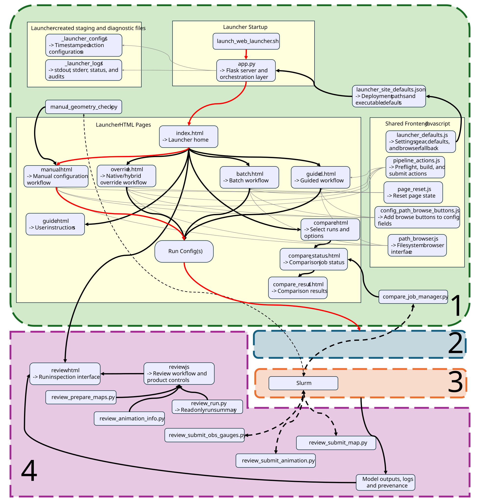
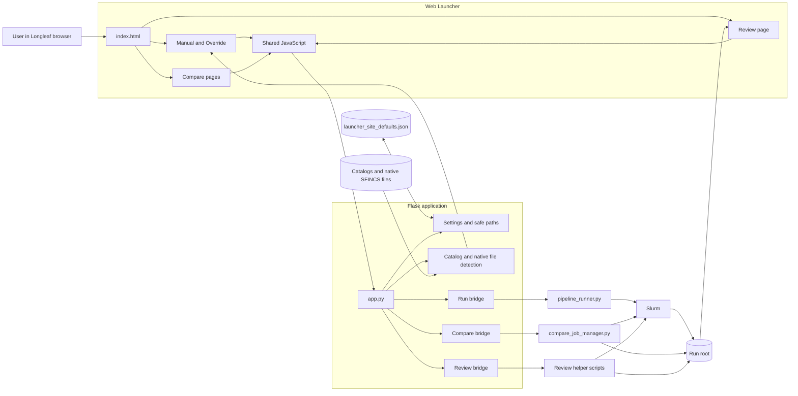

# Web Launcher

The SFINCS Web Launcher is the browser-facing control layer for the flood-modeling pipeline. It helps a user assemble or inspect a run configuration, browse approved Longleaf paths, check selected inputs, save a JSON configuration, and hand the requested action to the existing Python backend.

The launcher does **not** replace the pipeline runner, construct the full SFINCS model by itself, or decide whether a completed simulation is scientifically valid. Its main responsibility is orchestration: it connects browser pages to safe Flask endpoints, translates page state into backend inputs, and presents the results returned by the pipeline, Compare, and Review tools.

[](../../assets/architecture/web_launcher.svg)

> The diagram above is intended to show component ownership and handoffs. The Mermaid draft later on this page can be used as a structural starting point when rebuilding the final SVG in PowerPoint.

---

## Position in the full system

The Web Launcher is the first region of the larger pipeline architecture.

```text
User in browser
    ↓
Web Launcher pages and shared JavaScript
    ↓
Flask application in web_launcher/app.py
    ↓
Python Backend, Compare helpers, or Review helpers
    ↓
Slurm jobs and/or existing run folders
```

The launcher connects to several neighboring subsystems:

- [Model Catalogs](../model_catalogs/model_catalogs.md) provide the source data and event-specific inputs that Manual and Override modes inspect.
- [Python Backend](../python_backend/python_backend.md) validates the completed JSON configuration, freezes the run configuration, and creates the run scaffold.
- [Slurm Execution](../slurm_execution.md) runs preprocessing, SFINCS, and postprocessing after the backend submits the dependency chain.
- [Review Mode](../review_mode/review_mode.md) explains the products and status model used after a run exists.

The separate launcher guide explains how a person uses the interface. This page instead explains which files make the interface function and how those files communicate.

---

## Architectural principle

The launcher follows a simple separation of responsibility:

```text
HTML page
    owns visible fields and page-specific behavior

Shared JavaScript
    owns reusable browser behavior such as Settings, path browsing,
    pipeline action buttons, and page reset

app.py
    owns safe HTTP routes, path validation, staging, subprocess calls,
    and structured responses

Backend helper
    owns the actual pipeline, comparison, or Review operation

Run directory
    owns frozen configuration, scripts, logs, model files, outputs,
    and generated Review products
```

This separation matters because the browser is not treated as the scientific or execution authority. A page can assemble a configuration and perform useful early checks, but the Python backend remains responsible for the deeper configuration validation and run construction.

---

## Runtime entry point

The launcher is started by:

```text
web_launcher/launch_web_launcher.sh
```

The shell script performs four small tasks:

1. changes into the active `web_launcher/` folder;
2. activates the dedicated `web_launcher` Python environment;
3. reads `WEB_LAUNCHER_PORT`, defaulting to port `5000`;
4. starts `app.py` and prints the loopback URL for the current Open OnDemand desktop session.

The Flask server listens on `127.0.0.1` by default. The intended deployment is therefore cluster-local: the user opens the launcher from a browser inside the same Longleaf desktop session rather than exposing the app as a public web service.

`app.py` configures Flask with both its template and static roots inside the same launcher folder:

```text
web_launcher/
├── app.py
├── *.html
└── static/
```

The HTML pages are rendered through Flask, while JavaScript files under `static/` are served through Flask's static-file support.

---

## Active runtime file map

The active launcher is built from the following files.

```text
web_launcher/
├── app.py
├── launch_web_launcher.sh
├── launcher_site_defaults.json
│
├── index.html
├── manual.html
├── override.html
├── batch.html
├── guided.html
├── guide.html
├── compare.html
├── compare_status.html
├── compare_result.html
├── review.html
│
└── static/
    ├── launcher_defaults.js
    ├── path_browser.js
    ├── config_path_browse_buttons.js
    ├── pipeline_actions.js
    ├── page_reset.js
    └── review.js
```

The live folder also contains recovery reports, audit reports, and historical repair material. Those files are useful for maintenance and provenance, but they are not part of the normal runtime path shown above.

Most Manual and Override page behavior is currently implemented in large inline JavaScript blocks inside the HTML files. Shared behavior was moved into reusable files only where multiple pages needed the same feature. This means the architectural boundaries are clearer than the physical file boundaries: `manual.html`, `override.html`, and `app.py` each still contain several distinct responsibilities.

---

## Page and route map

| User-facing area | Main page | Shared JavaScript | Main backend path |
|---|---|---|---|
| Home | `index.html` | none | Flask page route only |
| Manual Mode | `manual.html` | Settings, browse helpers, pipeline actions, reset | catalog detection, runtime review, geometry checks, save, runner |
| Override Mode | `override.html` | Settings, browse helpers, pipeline actions, reset | native-file detection, catalog detection, shape review, save, runner |
| Batch | `batch.html` | none | placeholder only |
| Guided Wizard | `guided.html` | none | placeholder only |
| Guide | `guide.html` | inline tab routing | page route only |
| Compare | `compare.html`, `compare_status.html`, `compare_result.html` | path browser plus inline Compare logic | `compare_job_manager.py` |
| Review | `review.html` | `launcher_defaults.js`, `review.js` | `review_run.py` and Review product helpers |

### Home page

`index.html` is the navigation shell. It links to Manual, Override, Batch, Guided, Compare, Review, and the Guide. It does not call an API or preserve workflow state.

The page currently labels Manual, Override, Compare, and Review as working V1 features. Batch and Guided remain placeholders.

### Guide page

`guide.html` is a tabbed, user-facing explanation of launcher modes. Its JavaScript handles query-string routing such as:

```text
guide.html?tab=manual
guide.html?tab=override
guide.html?tab=manual&manualTab=forcing
```

The Guide is part of the launcher file tree but not part of run execution. It does not call `app.py` APIs or alter a run configuration.

---

## Shared Settings and path authority

The launcher has a shared Settings layer composed of:

```text
launcher_site_defaults.json
    ↕
/api/launcher-defaults
    ↕
static/launcher_defaults.js
    ↕
Manual, Override, Review, and path-browse controls
```

### `launcher_site_defaults.json`

This JSON file stores deployment-specific roots and executable paths outside the page source. Current setting keys include:

```text
dataRoot
catalogRoot
eventCatalogRoot
nativeSfincsRoot
overrideSourceRoot
runRoot
projectRoot
condaEnvPath
condaPython
contextilyPython
sfincsContainerPath
browseAllowedRoots
```

The file distinguishes several types of authority:

- data and catalog roots tell pages where input browsing should begin;
- `runRoot` identifies the run-output area used by normal runs, Compare, and Review;
- `projectRoot` identifies the pipeline bundle containing backend scripts;
- Python and container settings identify the runtime environments used by backend helpers;
- `browseAllowedRoots` extends the set of filesystem roots that the server-side path browser may expose.

### `static/launcher_defaults.js`

This script creates the Settings gear and modal, loads server defaults, and exposes a small browser API:

```javascript
window.LauncherDefaults.get(key)
window.LauncherDefaults.getAll()
window.LauncherDefaults.save(values)
window.LauncherDefaults.reset()
window.LauncherDefaults.loadServer()
```

The normal source of truth is the server JSON file. Browser `localStorage` is retained only as a fallback when the server settings endpoint cannot be reached or written.

When settings change, the script dispatches:

```text
launcher-defaults-changed
```

Pages and browse helpers can listen for this event and refresh their displayed defaults without duplicating the Settings implementation.

### Backend use of Settings

`app.py` reads the JSON file when it needs a configured path. Important helpers include:

```text
configured_project_root_path()
configured_run_root_path()
configured_project_script_path()
configured_runner_python_path()
configured_contextily_python_path()
```

The project root, run root, and backend Python intentionally do not have hidden hardcoded fallbacks inside these helpers. If a required setting is blank, the route fails with a clear configuration error rather than silently using an old machine-specific path.

The Settings values also expand the path-safety boundary. A configured root can become an approved browse or backend-validation root, while file-like settings contribute their parent directories.

---

## Shared path-browsing layer

Path browsing is split between two frontend files and one Flask endpoint.

### `static/config_path_browse_buttons.js`

This script finds path-like fields in Manual and Override mode and adds Browse buttons automatically. It uses each field's configuration key to decide:

- whether the user should select a file or directory;
- which Settings key should supply the starting root;
- whether a selected path should be written as a scalar or a JSON list;
- whether backend paths should begin at `projectRoot`, run paths at `runRoot`, and catalog paths at the appropriate catalog root.

This keeps page HTML from needing a separately coded Browse button for every path field.

### `static/path_browser.js`

This script owns the reusable browser modal. It requests directory listings, displays visible files and folders, and writes the selected absolute path back into the target field.

Its backend call is:

```text
POST /api/list-directory
```

The modal can begin from:

1. the field's current absolute path;
2. the relevant Settings value;
3. a page-provided fallback browse start;
4. the top-level allowed roots when no start path is supplied.

### Server-side path safety

`app.py` does not return arbitrary filesystem contents. It builds an effective allowlist from:

```text
app folder
pipeline folder
user home
Settings browseAllowedRoots
parents or directories represented by other Settings paths
```

`safe_resolve()` requires an absolute path and verifies that the resolved path remains inside an allowed root. Directory listings also avoid following a symlink into an unapproved location.

This same safe-resolution layer is reused by configuration saving, source detection, and several backend routes. The browser therefore suggests a path, but the Flask server decides whether that path is permitted.

---

## Configuration assembly in the browser

Manual and Override both expose a global page function:

```javascript
window.getConfig()
```

`static/pipeline_actions.js` depends on this contract. It does not know the internal fields of either page. It only asks the active page for its completed configuration object and sends that object to Flask.

This is the most important frontend interface in the launcher:

```text
Manual or Override page state
    ↓ getConfig()
plain JSON-compatible object
    ↓
shared pipeline action buttons
```

Both pages also support loading a JSON file. Visible fields are updated directly, while some backend keys that are not rendered by the page can be preserved so that importing and resaving a configuration does not automatically erase valid backend settings.

The two modes then apply different workflow rules before returning the final object.

---

## Manual Mode architecture

`manual.html` is the source-build configuration editor. It is intended to describe a run that HydroMT-SFINCS will assemble from source catalogs and source spatial data.

### Fixed workflow contract

Manual Mode forces these values into the returned configuration:

```text
pipeline_mode = preflight_only
preprocess_mode = hydromt_build
use_sfincs_file_overrides = false
```

The page strips native Override metadata and runner-generated provenance fields when loading or rebuilding a Manual configuration. It also prevents raw advanced configuration from becoming a second authority for grid geometry.

This makes the mode boundary explicit:

```text
Manual Mode
    source data and catalogs
    → HydroMT build

Override Mode
    existing native SFINCS files
    → native or hybrid assembly
```

### Manual catalog detection

The page can send its selected catalogs to:

```text
POST /api/detect-data-catalogs
```

`app.py` inspects each selected catalog-like folder and returns:

```text
catalog descriptions
recognized roles
found active files
runtime values
suggested configuration fields
warnings
```

The detector can suggest paths for items such as:

```text
region geometry
DEM/topobathy
active mask
land cover and reclassification
structures
curve number
rainfall
wind and pressure
water-level forcing
discharge forcing
observation points and lines
open-boundary outline
runtime start and stop values
```

The page first displays the findings. Applying suggestions is a separate frontend action, so detection does not silently replace the entire configuration.

A second warning route checks whether a supposedly source-based Manual catalog looks like a native SFINCS package. This supports the mode boundary without preventing deliberate expert use.

### Manual review checks

Manual Mode contains several layers of checking:

1. browser checks validate field format, JSON parsing, run naming, dates, and obvious configuration consistency;
2. `/api/review-runtime-window` compares the intended runtime with forcing coverage detected from current paths;
3. `/api/manual-geometry-check-local` stages the current configuration and runs `manual_geometry_check.py` in the configured backend environment;
4. `/api/manual-geometry-check-submit` writes and submits a separate Slurm geometry-check job for a heavier audit.

The geometry check is separate from normal pipeline submission. It writes launcher-owned configuration, logs, status, and audit products under the launcher logging area rather than changing the source catalogs.

### Manual save and execute path

Manual Mode can either save the current configuration or pass it to the shared pipeline actions.

```text
Save configuration
    → POST /api/save-config
    → <runRoot>/<run_name>/run_config.json

Preflight / Build Scripts / Submit
    → static/pipeline_actions.js
    → POST /api/run-pipeline
    → pipeline_runner.py
```

Saving and running are intentionally separate operations. A saved JSON file is useful project state, but saving it does not prove that preflight passed or that a Slurm job was submitted.

---

## Override Mode architecture

`override.html` begins with one or more folders containing already processed SFINCS files. It detects those files, lets the user select which files should become active overrides, and combines them with the smaller set of configuration fields still needed for the new run.

### Native-file detection

The page sends selected source folders to:

```text
POST /api/detect-sfincs-files
```

`app.py` performs a bounded recursive scan using a known file-candidate table. Recognized files are grouped as:

```text
static model files
event forcing files
other or less common SFINCS files
```

The detector supports primary names and selected aliases. When `sfincs.inp` is found, the server parses simple `key=value` entries so the page can hydrate runtime, output, and advanced settings without treating the input file as an opaque blob.

The detection response records all matches rather than only the first match. The page can therefore warn about ambiguous candidates and preserve a detection manifest describing where each selected file came from.

### Smart preprocessing mode selection

Override Mode constructs its returned configuration from:

```text
base defaults
editable visible values
selected source roots
selected native file map
detection manifest
optional catalogs
lock metadata
```

The normal mode is selected from the current inputs:

```text
native files and no data catalogs
    → preprocess_mode = native_sfincs_assembly

native files plus data catalogs
    → preprocess_mode = hybrid

raster grid template requiring a source build
    → preprocess_mode = hydromt_build
       use_sfincs_file_overrides = false
```

The hybrid path is important. It allows trusted native static files to be reused while event-dependent forcing, observations, or other missing pieces are still assembled from catalogs.

### Locking and authority

Selecting a native override can make a corresponding Manual field non-authoritative. Override Mode calculates:

```text
override_locked_config_keys
override_locked_sections
override_lock_reasons
```

These values preserve why fields were disabled and help the backend or future audits understand which native file controlled a portion of the configuration.

Grid geometry receives additional synchronization. When a trusted native source establishes geometry, the page compares that authority with geometry keys in `advanced_config`, repairs differences in the returned object, and records the repair. Ordinary `getConfig()` collection does not rewrite the user's in-progress Advanced JSON text area.

### Override review checks

Override Mode combines:

- browser consistency checks;
- runtime-window review;
- catalog detection for event or missing source inputs;
- `/api/review-native-shapes` for simple BND/BZS and SRC/DIS compatibility checks.

The native-shape endpoint checks structural compatibility, not scientific correctness. For example, matching BND rows and BZS value columns can pass while station identity or hydrograph quality remains wrong.

### Override save and execute path

After mode-specific assembly, Override uses the same shared endpoints as Manual:

```text
POST /api/save-config
POST /api/run-pipeline
```

The Flask and Python backend therefore receive one normal configuration contract regardless of which page assembled it.

---

## Shared pipeline action path

`static/pipeline_actions.js` owns the three main action buttons:

```text
Preflight
Build Scripts
Submit
```

The script:

1. calls the page's `getConfig()` function;
2. sends `{mode, config}` to `/api/run-pipeline`;
3. displays the command, return code, output paths, stdout, and stderr;
4. enables Build Scripts and Submit only after a successful preflight in the current page session;
5. asks for confirmation immediately before submission.

The browser's preflight state is a convenience guard. The Flask route and backend runner still validate the request independently.

---

## Flask-to-backend run bridge

The normal run bridge is:

```text
POST /api/run-pipeline
    ↓
Flask-side payload and path guards
    ↓
staged launcher configuration
    ↓
pipeline_runner.py --config <path> --mode <mode>
    ↓
Python Backend
```

### Flask-side validation

Before launching the runner, `app.py` checks that:

- the configuration is a nonempty JSON object;
- the payload is large enough to plausibly be a Manual or Override configuration;
- core keys such as `run_name`, `output_root`, `project_root`, and `preprocess_mode` exist and are not blank;
- backend Python and container fields are present;
- the run name matches the safe naming pattern;
- output and project paths resolve inside allowed roots;
- an existing run folder will not be overwritten unintentionally.

These are fast launcher guards. The backend runner remains the deeper source of truth for configuration validity.

### Staged launcher files

For each action, `app.py` writes a timestamped configuration under:

```text
<runRoot>/_launcher_configs/
```

It writes subprocess output under:

```text
<runRoot>/_launcher_logs/<run_name>/
```

The staged file is not the final frozen configuration. It records exactly what the browser handed to the runner for one preflight, build, or submit action.

### Runner invocation

`app.py` resolves the configured Python executable and `projectRoot/code/pipeline_runner.py`, then runs:

```text
<condaPython> <projectRoot>/code/pipeline_runner.py
    --config <staged-config>
    --mode preflight|build_scripts|submit
```

The runner maps those actions to backend pipeline modes:

```text
preflight      → preflight_only
build_scripts  → build_scripts_only
submit         → submit_slurm_chain
```

`pipeline_runner.py` then owns:

```text
loading and defaulting the config
applying runtime path resolution
validating the backend contract
preparing run folders
writing the frozen run_config.json
writing Slurm scripts
submitting the dependency chain
writing job IDs
```

The Web Launcher does not duplicate that logic.

### Run-folder overwrite protection

`app.py` classifies an existing run folder before build or submit. A small scaffold containing only configuration files, scripts, or empty stage folders is treated differently from a folder containing model files, logs, NetCDF outputs, failure records, or postprocess products.

A folder with real run artifacts is protected unless the configuration explicitly authorizes overwrite. This gate prevents a browser action from casually reusing a completed or partially completed run name.

---

## Compare architecture

Compare is a separate orchestration branch. It does not pass through `pipeline_runner.py` and does not rebuild the selected runs.

```text
compare.html
    ↓
Compare Flask APIs
    ↓
compare_job_manager.py
    ↓
comparison Slurm job
    ↓
<runRoot>/_compare_jobs/<job>/
    ↓
compare_status.html and compare_result.html
```

### Run selection

`compare.html` searches within the configured run root through:

```text
GET /api/compare/search-runs
```

The endpoint returns folders that look like SFINCS runs. Users can select multiple runs, with the first selected run acting as the baseline.

### Recommendation and submission

The page asks for resource recommendations through:

```text
POST /api/compare/recommend
```

Flask invokes:

```text
compare_job_manager.py recommend
```

The manager chooses memory, CPU, time, and chunk-size recommendations from the requested comparison level and number of runs.

Submission uses:

```text
POST /api/compare/submit
    → compare_job_manager.py submit
```

The manager validates the selected run folders, creates a job directory, writes a Slurm script, submits it, and records the request and status as JSON.

The current comparison model is:

```text
baseline vs run 2
baseline vs run 3
baseline vs run 4
...
```

The comparisons run sequentially inside one Compare Slurm job rather than as a normal three-stage simulation chain.

### Status and results

`compare_status.html` polls:

```text
GET /api/compare/status
```

When the comparison completes, `compare_result.html` reads:

```text
GET /api/compare/result
GET /api/compare/pair-result
```

The result page renders pair summaries, configuration differences, byte-level file comparisons, NetCDF metadata, selected numeric metrics, and utilization information generated by the Compare helper.

Compare job folders live under:

```text
<runRoot>/_compare_jobs/
```

They are deliberately excluded from the normal Review run list.

---

## Review handoff

Review is reached from the launcher home page, but its product-generation model is large enough to document separately. The Web Launcher side of the handoff is:

```text
review.html
    ↓
static/review.js
    ↓
Review APIs in app.py
    ↓
read-only summary helper and optional product builders
    ↓
selected run folder
```

### Run discovery and quick status

`review.js` loads runs through:

```text
GET /api/review/runs
```

The endpoint lists immediate run directories under the configured `runRoot` and assigns a quick file-based status:

```text
failed
completed
sfincs-completed
preprocess-completed
scaffold-or-partial
unknown
```

These labels describe file evidence. They do not prove that the forcing, geometry, output dimensions, calibration, or scientific interpretation is correct.

### Read-only run summary

For a selected run, Review requests:

```text
GET /api/review/summary
```

`app.py` calls:

```text
review_run.py <run-folder>
```

`review_run.py` inspects configuration, stage evidence, logs, model files, postprocess products, warnings, and displayable artifacts. It is read-only by default and returns a JSON summary to the page.

Artifacts are served through:

```text
GET /api/review/file
```

The route accepts only a path relative to the selected run and verifies that the resolved target remains inside that run folder.

### Optional generated Review products

Review can also create products that did not already exist:

```text
static maps
observation/gauge validation products
animations
```

Each product family has submit and status endpoints. Flask delegates the work to dedicated helper scripts such as:

```text
review_submit_maps.py
review_prepare_maps.py
review_submit_obs_gauges.py
review_submit_animation.py
review_animation_info.py
```

Generated files, status JSON, Slurm scripts, and logs are stored under:

```text
<run>/review/
```

This keeps Review products attached to the run without mixing them into the original model input or solver output folders.

See [Review Mode](../review_mode/review_mode.md) for the product and status model beyond this launcher handoff.

---

## API families

The Flask application currently exposes the following route families.

### Core launcher and filesystem

| Endpoint | Purpose |
|---|---|
| `GET /api/health` | Report launcher health and allowed roots. |
| `GET /api/launcher-defaults` | Load server-side launcher Settings. |
| `POST /api/launcher-defaults` | Save or reset server-side launcher Settings. |
| `POST /api/list-directory` | Return a safe directory listing for the path browser. |
| `POST /api/save-config` | Save or update `<run>/run_config.json`. |
| `POST /api/run-pipeline` | Stage a configuration and invoke `pipeline_runner.py`. |

### Manual and Override inspection

| Endpoint | Purpose |
|---|---|
| `POST /api/detect-data-catalogs` | Inspect selected catalogs and return suggestions and warnings. |
| `POST /api/detect-manual-catalogs` | Compatibility alias for catalog detection. |
| `POST /api/manual-catalog-native-warning` | Warn when a Manual catalog looks like a native package. |
| `POST /api/manual_catalog_native_warning` | Older compatibility spelling of the warning route. |
| `POST /api/detect-sfincs-files` | Detect recognized native SFINCS files across source folders. |
| `POST /api/review-runtime-window` | Compare runtime fields with detected forcing coverage. |
| `POST /api/review-native-shapes` | Check basic native BND/BZS and SRC/DIS structural compatibility. |
| `POST /api/manual-geometry-check-local` | Run the Manual geometry audit in the launcher session. |
| `POST /api/manual-geometry-check-submit` | Submit the Manual geometry audit as a separate Slurm job. |

### Compare

| Endpoint | Purpose |
|---|---|
| `GET /api/compare/search-runs` | Search for selectable run folders. |
| `POST /api/compare/recommend` | Request comparison resource recommendations. |
| `POST /api/compare/submit` | Create and submit a comparison job. |
| `GET /api/compare/status` | Read comparison progress and result availability. |
| `GET /api/compare/result` | Read the completed comparison summary. |
| `GET /api/compare/pair-result` | Read one detailed baseline-pair result. |

### Review

| Endpoint | Purpose |
|---|---|
| `GET /api/review/runs` | List run folders and quick statuses. |
| `GET /api/review/summary` | Run `review_run.py` and return its JSON summary. |
| `GET /api/review/file` | Serve one approved run-relative artifact. |
| `GET /api/review/maps/status` | Read or enrich static-map generation status. |
| `POST /api/review/maps/submit` | Run or submit static-map preparation. |
| `GET /api/review/obs-gauges/status` | Read observation/gauge product status. |
| `POST /api/review/obs-gauges/submit` | Submit observation/gauge product generation. |
| `GET /api/review/animation/info` | Estimate animation frames and list existing animations. |
| `GET /api/review/animation/status` | Read animation generation status. |
| `POST /api/review/animation/submit` | Submit animation generation. |
| `GET /api/review/animation/video` | Safely serve a completed Review video. |

Some placeholder or compatibility routes remain in `app.py`. The endpoint list should therefore be read as the current implementation surface, not as a claim that every route has the same maturity.

---

## Files written by the launcher branches

The launcher writes into controlled locations rather than scattering temporary files through the source catalogs.

```text
<runRoot>/
├── _launcher_configs/
│   └── <run>_<timestamp>_<mode>.json
│
├── _launcher_logs/
│   └── <run>/
│       ├── <timestamp>_<mode>.out
│       ├── <timestamp>_<mode>.err
│       └── geometry-check products
│
├── _compare_jobs/
│   └── <compare-job>/
│       ├── compare_job.sl
│       ├── compare_status.json
│       ├── compare_result.json
│       └── pair result and log files
│
└── <run>/
    ├── run_config.json
    ├── scripts/
    ├── logs/
    ├── model/
    ├── postprocess/
    └── review/
```

The ownership distinctions are:

```text
_launcher_configs and _launcher_logs
    launcher request history and diagnostics

_compare_jobs
    separate comparison jobs and reports

<run>/run_config.json
    saved or backend-frozen run configuration

<run>/scripts, logs, model, postprocess
    normal backend and Slurm execution products

<run>/review
    products generated specifically for Review
```

---

## Safety model

The launcher is a local research tool, but it still treats browser input as untrusted.

### Filesystem controls

- paths must be absolute;
- paths must remain under an allowed root;
- directory browsing filters hidden entries and unsafe symlink targets;
- run names are restricted to letters, numbers, underscores, dashes, and periods;
- Review accepts a run folder name rather than an arbitrary run path;
- Review artifacts must resolve inside the selected run;
- Compare job paths must remain inside `_compare_jobs`;
- backend script names are reduced to a basename and resolved under `projectRoot/code`.

### Mutation controls

- saving over an existing `run_config.json` requires confirmation;
- build and submit inspect the target run directory for real run artifacts;
- overwrite requires an explicit configuration choice;
- page reset changes browser state only and does not delete a saved file or run folder;
- catalog detection and native-file detection are read-only;
- Review summary is read-only by default;
- optional Review builders write only under the selected run's `review/` folder.

### Process controls

- subprocess calls capture stdout and stderr;
- normal runner actions use mode-specific timeouts;
- geometry checks write their own config, audit, script, status, and logs;
- Slurm submission results and job IDs are returned as structured JSON;
- the browser never receives a generic shell endpoint.

These guards reduce accidental damage, but they do not replace normal cluster permissions, source control, catalog backups, or scientific review.

---

## State and source-of-truth hierarchy

Several forms of state coexist. They should not be confused.

```text
launcher_site_defaults.json
    deployment paths and executable defaults

browser page fields
    current unsaved editing state

loaded JSON plus preserved extra keys
    imported user/backend configuration state

_launcher_configs/<timestamp>.json
    exact config sent for one launcher action

<run>/run_config.json
    saved or frozen run-level configuration

Slurm scripts and job IDs
    execution plan and scheduler state

model and postprocess files
    generated run products

review/* and _compare_jobs/*
    derived inspection products
```

A page preview is not the final backend configuration. A saved configuration is not proof of preflight. A successful preflight is not proof of Slurm completion. A completed run is not proof of scientific validity.

---

## Failure boundaries

The architecture creates useful diagnostic boundaries.

### Page failure

Symptoms include missing controls, frozen placeholders, or a JavaScript syntax error. Test the page script and expected browser globals before changing backend paths.

### API or Settings failure

Symptoms include HTTP errors, missing defaults, or rejected paths. Test the endpoint directly and inspect the structured response.

### Runner bridge failure

Symptoms include a nonzero `pipeline_runner.py` return code, timeout, or launcher log error. Inspect the staged configuration and `_launcher_logs` output.

### Backend or Slurm failure

Symptoms appear in the run scaffold, stage logs, failure JSON, or scheduler state. These belong to the Python Backend or Slurm Execution layers rather than the HTML page.

### Compare or Review helper failure

These branches have their own job folders, status JSON, Slurm scripts, and logs. A failure in one derived product does not imply that the original SFINCS run failed.

### Scientific failure

A job can finish and still use the wrong forcing, boundary ordering, datum, observation geometry, or model assumptions. Scientific validation remains separate from every launcher status label.

---

## Current implementation characteristics

The current launcher is functional but still reflects incremental development.

### Working areas

```text
Manual Mode
Override Mode
Compare Runs
Review Runs
shared Settings
safe path browser
pipeline preflight/build/submit bridge
Manual geometry checks
```

### Placeholder areas

```text
Batch Generation
Guided Wizard
```

### Structural characteristics

- `app.py` contains general launcher, detection, Compare, and Review routes in one large Flask module rather than separate Flask blueprints.
- Manual and Override keep most page-specific logic inline in their HTML files.
- Compare pages also use inline JavaScript, while Review has a dedicated `static/review.js` because of its size.
- compatibility aliases and placeholder endpoints remain beside newer routes;
- Flask path selection is Settings-driven, although some standalone helper scripts still contain deployment-specific defaults for direct command-line use.

These are maintainability concerns, not immediate evidence that the current runtime flow is wrong. A later refactor could separate route groups and page logic without changing the external configuration contract.

---

## Component ownership summary

| Component | Owns | Does not own |
|---|---|---|
| HTML mode page | Visible fields, page workflow, early checks, `getConfig()` | backend validation, Slurm execution, scientific interpretation |
| Shared JavaScript | Settings UI, path browsing, action buttons, page reset | model construction |
| `app.py` | routes, safe paths, staging, subprocess bridges, structured responses | core SFINCS pipeline logic |
| `pipeline_runner.py` | config normalization, validation, frozen config, Slurm script creation and submission | browser rendering |
| `compare_job_manager.py` | comparison resource recommendation, job script, status and results | normal model execution |
| Review helpers | read-only run summary and optional derived products | changing original model results |
| Catalogs | source data and event/static input authority | launcher UI state |
| Run directory | persistent execution and output evidence | proof of scientific correctness by itself |

---

## Mermaid draft

This draft intentionally uses a small number of nodes and simple left-to-right flow. It may render directly, but its main purpose is to provide the structure for the PowerPoint-built SVG.



---

## PowerPoint rebuild notes

For the final `web_launcher.svg`, preserve the color language used by the whole-system architecture:

```text
green
    browser pages and shared frontend behavior

blue
    Flask, Settings, safe-path layer, and backend-facing APIs

orange
    pipeline runner, Compare submission, Review submission, and Slurm handoff

purple
    run folders, Compare reports, Review products, and displayed results
```

A clear PowerPoint layout would use four horizontal regions:

```text
1. User-facing pages
2. Shared browser and Flask control layer
3. Backend helper branches
4. Persistent outputs and Review feedback
```

Keep `pipeline_runner.py`, `compare_job_manager.py`, and the Review helpers as three separate outgoing branches from `app.py`. That separation is the main architectural idea the diagram should communicate.

Do not put every API endpoint or every Review helper into the SVG. The endpoint tables on this page account for those details. The diagram should remain a narrative map rather than a source-code call graph.

---

## Related source files

### Launcher runtime

```text
web_launcher/app.py
web_launcher/launch_web_launcher.sh
web_launcher/launcher_site_defaults.json
web_launcher/index.html
web_launcher/manual.html
web_launcher/override.html
web_launcher/batch.html
web_launcher/guided.html
web_launcher/guide.html
web_launcher/compare.html
web_launcher/compare_status.html
web_launcher/compare_result.html
web_launcher/review.html
web_launcher/static/launcher_defaults.js
web_launcher/static/path_browser.js
web_launcher/static/config_path_browse_buttons.js
web_launcher/static/pipeline_actions.js
web_launcher/static/page_reset.js
web_launcher/static/review.js
```

### Direct backend handoffs

```text
code/pipeline_runner.py
code/manual_geometry_check.py
code/compare_job_manager.py
code/review_run.py
code/review_prepare_maps.py
code/review_submit_maps.py
code/review_submit_obs_gauges.py
code/review_animation_info.py
code/review_submit_animation.py
```

Additional Review preparation helpers may be called by the submit scripts even when they are not invoked directly by `app.py`.

---

## Bottom line

The Web Launcher is a controlled interface around the existing flood-modeling system.

```text
It builds and inspects configuration.
It does not replace backend configuration validation.

It stages and submits actions.
It does not replace the Slurm execution stack.

It discovers and displays run evidence.
It does not turn file presence into scientific validation.

It connects Manual, Override, Compare, and Review through one local Flask app,
while preserving separate backend ownership for each workflow branch.
```
