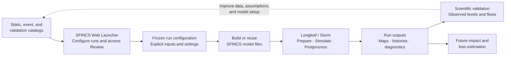

# Current Research

## Overview

This project is developing a repeatable system for simulating flood hazards and their consequences across a large range of storm events. The long-term scientific objective is a **storm-outcome database** that connects storm characteristics, flood behavior, and resulting physical and economic outcomes.

Producing that database requires more than one hydraulic model run. It requires a method that can:

- represent many historical and synthetic storms;
- generate consistent physics-based flood simulations;
- preserve the exact inputs and assumptions behind every run;
- compare model behavior with observed water levels and flows;
- update individual parts of a model without rebuilding everything unnecessarily;
- support large batches of simulations on a high-performance computing system; and
- eventually connect flood depth and inundation outputs to damage and loss estimates.

The current GitHub repository focuses on the modeling pipeline that makes those larger research goals practical. Its main contribution is not a new hydraulic solver. SFINCS is developed by Deltares, and HydroMT provides an existing framework for reproducible model construction. The contribution of this project is the system built around those tools: structured data catalogs, validated configuration handling, reusable model components, automated Longleaf and Slurm execution, browser-based run creation, working Review tools, planned run-comparison capabilities, and durable run provenance.

In other words, the project packages a complicated physics-based flood simulation workflow into a form that is easier to use, repeat, inspect, update, and extend. The Web Launcher was intended as part of that larger research system from the beginning rather than being added only after the backend was complete.

> The current implementation is centered on Harris County, Texas. The software architecture is intended to support other study areas and research questions when equivalent static, event, and validation data are provided.

---

## Research goal

The long-term goal is to estimate losses across a storm space much larger than the historical record alone can provide.

A simplified version of the intended research chain is:

```text
historical storms and observations
    ↓
validated historical SFINCS workflow
    ↓
large synthetic storm ensemble
    ↓
representative subset selected for full SFINCS simulation
    ↓
full physics-based simulations for the selected subset
    ↓
machine-learning flood emulator
    ↓
rapid inundation estimates for the larger ensemble
    ↓
damage and loss estimation
    ↓
searchable storm-outcome database
```

The conceptual ensemble may ultimately contain on the order of one million storm scenarios. Running a full hydraulic simulation for every scenario would be unnecessarily expensive. The intended strategy is therefore to run SFINCS for a smaller, carefully selected subset and use those simulations to train and test an emulator capable of estimating flood outcomes for the wider ensemble.

The project is currently considering **stochastic storm transposition** as one possible method for constructing the storm ensemble. Stochastic storm transposition can help generate additional plausible scenarios by relocating and resampling observed storms while retaining important physical structure. The final ensemble-generation method has not yet been locked. Its selection will depend on how well it represents the relevant rainfall, tropical-cyclone, coastal, and compound-flood conditions for the study area.

The storm-outcome database remains the overall research destination. This repository concentrates on the part that must work first: producing trustworthy, repeatable, and efficiently generated flood simulations.

---

## Research questions

The current work is organized around several connected questions:

1. Can a repeatable SFINCS workflow reconstruct a diverse collection of historical Harris County flood events?

2. Can those reconstructions be validated well enough to serve as trusted physics-based examples?

3. Can static model components be reused safely when only event forcing or a limited set of assumptions changes?

4. Can a complex flood model be made usable by researchers who should not need to hand-build every configuration, model folder, and Slurm script?

5. Can a smaller, strategically selected set of SFINCS simulations represent a much larger synthetic storm space?

6. Can the resulting inundation estimates be translated into useful estimates of physical damage, financial loss, and other storm outcomes?

These questions make the software architecture part of the research method. A model that is difficult to reproduce, difficult to update, or easy to configure incorrectly is not a strong basis for a large simulation ensemble.

---

## Why Harris County?

Harris County was selected as the primary testing ground because it combines several characteristics that are especially useful for this research.

The county has experienced many major rainfall, tropical-cyclone, coastal, riverine, and urban flood events. These events provide a wide range of hydrologic and hydraulic conditions rather than one isolated historical example. The area also has substantial observational and claims information associated with past storms. That combination makes Harris County well suited for testing the full research chain:

```text
storm forcing
    ↓
modeled flood behavior
    ↓
observed water levels and flows
    ↓
reported damage and claims
```

A repeated-event study area is particularly valuable for separating model behavior that is robust across storms from behavior that only appears successful for one event.

Harris County also provides a demanding technical test. The model must account for interactions among intense rainfall, river and reservoir inflows, coastal water levels, urban development, terrain, infiltration, roughness, drainage structures, and event-specific atmospheric conditions. A workflow that can manage those interacting inputs consistently is a useful foundation for later work in other domains.

The current Harris County implementation should therefore be understood as both:

- a substantive flood-risk study; and
- a proving ground for a more general simulation and loss-estimation method.

---

## Why SFINCS?

SFINCS—**Super-Fast INundation of CoastS**—is an open-source flood model developed by Deltares. It is designed as a fast, reduced-complexity model for simulating compound flooding, including combinations of coastal, riverine, and rainfall-driven processes.

SFINCS is a strong fit for this research because the project ultimately requires many simulations. A model that takes days for every scenario would severely limit historical testing, sensitivity analysis, and ensemble generation. SFINCS is designed to provide much faster flood simulation while still representing the primary physical processes needed for regional inundation studies.

For the current workflow, SFINCS can incorporate combinations of:

- terrain and bathymetry;
- active and open-boundary masks;
- spatially varying roughness;
- infiltration or curve-number information;
- subgrid elevation and conveyance information;
- precipitation;
- water-level boundary forcing;
- discharge sources;
- wind and atmospheric pressure;
- thin dams, levees, and other hydraulic structures;
- point observations; and
- cross-section or line observations.

The speed of the solver does not make the complete workflow simple. Reliable results still depend on correct data preparation, station identity, datum handling, model geometry, forcing alignment, runtime configuration, execution, and validation.

This project addresses that surrounding complexity.

---

## HydroMT and HydroMT-SFINCS

HydroMT is an open-source Python framework for constructing and analyzing geoscientific models from organized data sources. HydroMT-SFINCS connects that framework to SFINCS so a model can be built or updated from source data through a repeatable configuration.

Within this project:

```text
SFINCS
    runs the flood simulation

HydroMT
    organizes the general model-building process and data access

HydroMT-SFINCS
    translates configured spatial and forcing data into a SFINCS model

This repository
    adds catalog conventions, validation, reusable run modes,
    Longleaf execution, Slurm automation, browser controls,
    provenance, review products, and research-specific safeguards
```

The repository does not replace SFINCS or HydroMT. It makes them easier to use consistently within a larger research program.

---

## Origin of the current method

The current method grew from an existing Harris County SFINCS reference setup and related source material. That reference provided an important starting point: a model geometry, native SFINCS files, and an example of how the region had previously been represented.

The research goal was not merely to preserve one working model folder. A single reference run is difficult to expand into a large historical or synthetic study unless its assumptions, sources, and file relationships are understood and organized.

The method therefore developed around several deliberate changes:

1. **Separate static model information from event forcing.**  
   Terrain, mask, roughness, infiltration, structures, and subgrid information should not be mixed conceptually with rainfall, boundary levels, wind, pressure, and discharge for one storm.

2. **Convert source and forcing data into reusable catalogs.**  
   Each model input should have a known role, source, active version, and provenance.

3. **Support both full reconstruction and controlled reuse.**  
   Researchers should be able to rebuild a model from source-oriented data or hold trusted native geometry fixed while changing the event.

4. **Freeze every submitted run.**  
   Each run should retain its own configuration, model files, scripts, logs, job identifiers, and outputs so later catalog changes do not silently alter the scientific record.

5. **Automate Longleaf execution.**  
   Model preparation, simulation, and postprocessing should be submitted through a repeatable Slurm workflow rather than assembled manually for every run.

6. **Provide a browser-accessible interface.**  
   The Web Launcher was planned as an intended part of the larger method: a way to expose the model safely to a broader research audience while preserving explicit backend configurations and guardrails.

7. **Build review and future comparison into the workflow.**  
   A run should not end when SFINCS exits. Researchers need maps, animations, observation comparisons, status information, and access to the exact files that produced the result. Multi-run comparison remains a planned extension of the current Review system.

The current repository is the result of turning a useful regional reference model into a more general and maintainable research platform.

---

## Main contribution of this repository

The central contribution of the pipeline is making a complicated flood-simulation system practical to use repeatedly.

A conventional expert-driven workflow can require the user to:

- locate and interpret many spatial and time-series datasets;
- manually construct HydroMT or SFINCS configurations;
- know which native files may be reused;
- maintain station and boundary order;
- prepare Slurm scripts;
- track dependencies among multiple jobs;
- inspect logs and outputs in several directories;
- remember which files belong to which model version;
- rebuild expensive static products unnecessarily; and
- create validation and visualization products separately.

This repository turns those steps into a structured system.

The intended user interaction is closer to:

```text
select the study setup
    ↓
select or modify the event
    ↓
review the explicit configuration
    ↓
run preflight checks
    ↓
submit the model workflow
    ↓
monitor computational status
    ↓
review generated products
    ↓
perform scientific validation and interpretation
```

The scientific model remains complex, but the complexity is made visible and manageable rather than being hidden in undocumented folders and one-off scripts.

This is especially important for a larger audience. A browser interface cannot guarantee that every research choice is correct, but it can reduce accidental inconsistency, preserve configuration transparency, and make established workflows accessible without requiring each user to become an expert in every implementation detail.

---

## Current research workflow

The present workflow connects data preparation, browser-based configuration, backend validation, high-performance computing, and scientific review.



The feedback arrow is important. Historical-event reconstruction is not only a production exercise. Validation findings can reveal problems in event forcing, station mapping, datum handling, static geometry, or model assumptions. Those findings should feed back into the catalogs and workflow before the method is scaled to synthetic events.

---

## Historical event reconstruction

Historical events are the first major research phase because they provide forcing data and observations that can be compared with model behavior.

They serve several purposes:

- testing the model under different flood mechanisms;
- identifying errors in data preparation and configuration;
- establishing whether one static setup performs consistently across events;
- evaluating boundary and forcing assumptions;
- building a reusable validation framework;
- creating trusted examples for later emulator development; and
- establishing the catalog pattern that future historical and synthetic events will follow.

The current project plan contains 35 historical events. Fourteen event catalogs are complete for the current workflow, while 21 additional events remain next steps.

### Current complete event group

| Event group | Events |
|---|---|
| Tropical cyclones | Hurricane Ike, Hurricane Harvey, Tropical Storm Imelda, Hurricane Beryl |
| Major named urban floods | 2015 Memorial Day Flood, 2015 Halloween Flood, 2016 Tax Day Flood, 2016 Memorial Day Flood |
| Other heavy-rain and flood events | April 2009, January 2012, July 2012, August 2014, May 2019, April–May 2024 |

“Complete” means the current catalog contains the active forcing, boundary setup, runtime information, and validation inputs required by the established workflow. It does not mean that every resulting simulation has passed final scientific validation or that no catalog will ever be revised.

The remaining 21 events expand the historical record back to 1979. Their folders currently range from skeleton catalogs to partially prepared events. They will be completed after the current 14-event method and validation cycle are closed out.

The full event list, working windows, catalog structure, and data-availability information are documented in [Data Catalogs and Validation Data](data.md).

---

## Dual model-construction strategy

The pipeline supports two main ways to create a run. This is a scientific and computational design choice, not merely a user-interface preference.

### Manual Mode

Manual Mode builds a model from source-oriented static and event data through the HydroMT-SFINCS construction workflow.

This mode is appropriate when the research requires changes to:

- model extent or resolution;
- terrain or bathymetry;
- active-mask construction;
- roughness;
- infiltration;
- structures;
- subgrid assumptions;
- observation geometry; or
- other model-building choices.

Manual construction exposes how source data become native SFINCS files and is essential for extending the method to new domains.

### Override Mode

Override Mode imports trusted native SFINCS static files and combines them with selected event forcing and runtime settings.

This mode is appropriate when the research question is primarily:

> What changes when the event changes while the accepted model geometry remains fixed?

Holding static files constant improves event-to-event comparability and can save substantial preparation time.

### Why reuse matters

Some model-building steps are expensive even before the SFINCS solver begins. For the current Harris County model, generating the subgrid table can take roughly an hour. Rebuilding it for every event would add that hour repeatedly even when the terrain, mask, roughness, and subgrid assumptions have not changed.

The reusable workflow instead allows the project to:

```text
build and validate an expensive static component once
    ↓
preserve it as a trusted native input
    ↓
reuse it for runs that do not change the relevant assumptions
    ↓
regenerate only the event-dependent pieces
```

This does not mean files should be reused blindly. The configuration, preflight checks, provenance records, and generated-input review must establish that a reused file is compatible with the selected grid, mask, model version, and scientific question.

The distinction is especially important for future Batch Mode. Large batches become practical when runs can share validated static components while changing only the rainfall, boundary forcing, atmospheric forcing, runtime, or another intentionally selected variable.

The same principle also supports sensitivity studies. A researcher can hold most of the model fixed, change one part of the setup, and attribute differences more clearly than if every run were rebuilt through a separate undocumented process.

---

## Repeatability and run provenance

Every submitted run is treated as a frozen research object.

A run should preserve:

```text
run_config.json
selected catalog paths
generated or imported SFINCS inputs
HydroMT configuration and data references
Slurm scripts
job identifiers
stdout and stderr logs
SFINCS history and map outputs
postprocessing products
Review metadata
```

This allows later researchers to distinguish among:

- a change in event forcing;
- a change in static model geometry;
- a change in source data;
- a change in pipeline code;
- a change in SFINCS or HydroMT version;
- a change in computational resources; and
- a change in validation observations or metrics.

Catalogs remain updateable, but an old run should not be silently rewritten because the active catalog changes. A new or rebuilt run is required to incorporate the new input.

This provenance model is necessary for historical validation, sensitivity analysis, batch simulation, and emulator training. Without it, apparently similar simulations may represent different assumptions without making those differences visible.

---

## Validation framework

For the current research workflow, validation is organized into three broad layers.

### Input validation

Input validation asks whether the intended model was constructed.

Checks include:

```text
correct event window
correct precipitation product and coverage
correct water-level boundary stations and order
correct discharge locations
correct wind and pressure behavior
correct mask and open-boundary placement
correct observation points and lines
correct native static-file selection
correct vertical-datum treatment
```

An input error can produce a numerically successful simulation that answers the wrong question.

### Execution validation

Execution validation asks whether the computational workflow completed correctly.

Checks include:

```text
model-preparation stage completed
SFINCS stage completed
postprocessing stage completed
expected files exist
logs contain no hidden failure
NetCDF time and spatial dimensions are plausible
point and line histories were produced
Review products correspond to the current run
```

A successful Slurm status or SFINCS exit code is necessary but is not sufficient scientific evidence.

### Scientific validation

Scientific validation asks whether modeled behavior agrees acceptably with observations.

Current comparisons include or are intended to include:

```text
modeled and observed water level
peak water-level error
timing error
bias
hydrograph shape
cross-section discharge
spatial plausibility of flood depth and extent
consistency across multiple events
```

A run is therefore not considered scientifically validated merely because it finished.

---

## Observational validation data

The project maintains a reusable USGS master archive containing gauge-height and discharge records where available.

The principal USGS parameters are:

| Parameter | Role |
|---|---|
| `00065` | Gauge height / water level |
| `00060` | Discharge |

The selected validation inventory contains 89 surface-water sites. Event-specific observed records are sliced from the master archive rather than being treated as unrelated files for every event.

The current universal model validation geometry contains:

```text
59 point-observation locations
29 cross-section or line-observation locations
```

The geometry is shared broadly across the completed events, but observed coverage is event-specific. A model point may exist in every run even when no usable observation exists for one particular event. Validation scoring must therefore skip unavailable observations rather than treating missing data as model error.

Detailed gauge, datum, catalog, and source information is maintained in [Data](architecture/data.md).

---

## Water-level boundary setup

The current 14-event setup uses a common three-station boundary identity and ordering:

```text
1. Eagle Point — 8771013
2. Morgan's Point — 8770613
3. Lake Houston / San Jacinto near Sheldon — 08072050
```

Manchester station `8770777` is retained where useful as an observation or provenance source but is not part of the active forcing contract.

The common boundary structure improves repeatability across events, but each event retains its own water-level hydrographs, runtime window, and documented gap handling.

The physical station location and modeled boundary point are not necessarily the same coordinate. The observed series comes from the physical station, while the modeled point must be placed on the active open boundary of the SFINCS domain.

---

## Vertical-datum harmonization

Gauge values cannot be compared safely unless their vertical references are understood.

The validation setup has required detailed work because:

- USGS stations may use local gage datums;
- some records changed to NAVD88 on known dates;
- pre-transition values may require station-specific offsets;
- offsets can be positive or negative;
- large offsets can reflect a change from a local reference rather than a physical jump in water level;
- source metadata may be incomplete or ambiguous;
- coastal NOAA records require separate datum treatment; and
- event gaps may require a documented interpolation or regression method.

The project preserves the raw archive and creates separate datum-adjusted derivatives. This avoids overwriting the original evidence while allowing event observations to be compared on the accepted project convention.

Datum harmonization is not an administrative detail. A datum error can appear as persistent model bias and can lead to an incorrect conclusion about model performance.

The full transition table and current data conventions are documented in [Data Catalogs and Validation Data](data.md).

---

## Current status

The project has reached a point where the major Version 1 system components exist and the fourteen complete historical-event catalogs have been run through the current pipeline. The remaining work is increasingly focused on scientific closeout, performance assessment, additional event development, and scaling rather than initial software assembly.

### Operational or complete for the present phase

- SFINCS execution on UNC Longleaf;
- HydroMT-SFINCS model construction;
- containerized solver execution;
- staged Slurm preparation, simulation, and postprocessing;
- browser-based Manual and Override configuration;
- launcher settings and path controls;
- explicit configuration preview and submission;
- Review run discovery;
- static map generation;
- flood-depth animation generation;
- observation and gauge review products;
- 14 complete current event catalogs;
- common three-station boundary structure;
- reusable USGS validation archive;
- datum-adjusted water-level derivatives;
- common 59-point and 29-line validation geometry; and
- a fresh completed SFINCS run family for all 14 current events.

The fresh fourteen-event run family has completed at the scheduler and quick file-status level. This computational completion does not establish that every generated input, output, postprocessing product, or scientific comparison is correct.

### Complete at the catalog or input level

- event forcing preparation for the current 14 events;
- boundary-catalog repair;
- universal validation geometry;
- event-specific validation-gauge derivatives;
- current trusted native static package; and
- current Manual source-oriented static catalog.

These products are ready for the established workflow, but their use in a successful run does not by itself prove that every generated input or output is correct.

### Scientific work still in progress

The current closeout requires:

- one consolidated generated-input audit across all 14 fresh runs;
- confirmation of the final three-row boundary geometry and three-series forcing in every run;
- confirmation that boundary points lie on the intended open-boundary mask;
- confirmation of tropical-cyclone wind and pressure settings;
- confirmation of 59 point observations and 29 line observations in the generated models;
- inspection of `sfincs_his.nc` dimensions, identifiers, variables, and time axes;
- inspection of `sfincs_map.nc` contents and rainfall accumulation;
- confirmation that all retained postprocessing and Review products belong to the current run family;
- regenerated validation metrics and plots; and
- event-to-event interpretation of error, timing, bias, and hydrograph behavior.

The accurate current statement is:

> Validation-input and active-boundary preparation are complete for the 14-event set, and the fresh SFINCS run family has completed. Consolidated generated-input, output-file, postprocessing, and scientific validation remain in progress.

---

## Limitations and uncertainties

The current system has important limitations.

### Forcing uncertainty

Historical rainfall, water-level, wind, pressure, and discharge products differ in coverage, resolution, and uncertainty. Some events require documented gap handling or source substitutions.

### Observation coverage

Gauge records are uneven across stations and events. Validation is strongest where reliable observations exist and cannot directly assess every flooded location.

### Datum uncertainty

Although the project has constructed explicit datum-adjustment rules, metadata histories remain more certain for some gauges than others.

### Static-model assumptions

Terrain, roughness, infiltration, structures, mask placement, and subgrid representation all influence simulated flooding. Holding the static model fixed improves comparability but does not prove that the static setup is perfect.

### Boundary representation

Observed coastal or inland stations are mapped to modeled boundary locations. That representation is necessary but introduces assumptions about how station behavior applies along the model boundary.

### Historical validation does not guarantee synthetic performance

Agreement across historical events increases confidence but does not ensure that the model or a future emulator will perform equally well for every synthetic scenario, especially scenarios outside the historical range.

### Computational constraints

Resolution, subgrid complexity, event duration, output frequency, and ensemble size must be balanced against memory, runtime, storage, and scheduler limits.

### Loss modeling is downstream work

The pipeline currently concentrates on flood simulation and validation. The full claims and loss-estimation layer has not yet been completed within this repository.

---

## Damage and loss modeling

The final research product requires translating modeled hazard into consequences.

The intended downstream chain is:

```text
SFINCS flood depth and inundation
    ↓
buildings, infrastructure, and other exposed assets
    ↓
vulnerability or depth-damage relationships
    ↓
estimated physical and financial loss
    ↓
comparison with historical claims
    ↓
storm-outcome database
```

Historical claims information is one reason Harris County is a valuable test location. Claims can provide an outcome layer against which the combined hazard-and-loss method can eventually be evaluated.

The loss model must preserve uncertainty. A hydraulic simulation, exposure dataset, vulnerability relationship, and claims record each describe different parts of the outcome and may operate at different spatial and temporal scales.

The present repository provides the repeatable flood-simulation foundation that this later loss layer will require.

---

## Synthetic storm ensemble

The synthetic ensemble is a future research phase rather than an already finalized pipeline component.

The current concept is to:

1. define a plausible storm space for Harris County;
2. generate a large ensemble of storm scenarios;
3. characterize the ensemble using physically meaningful storm and forcing features;
4. select a representative subset for full SFINCS simulation;
5. use those simulations to train and test a flood emulator;
6. estimate flood outcomes for the remaining scenarios; and
7. pass the flood outcomes into the loss model.

Stochastic storm transposition is currently being considered as an ensemble-generation method. Its potential role is to expand the effective storm record by creating physically grounded alternatives based on observed storms.

Questions that remain open include:

- which source storms should be eligible for transposition;
- how rainfall fields should be relocated, rescaled, or resampled;
- how tropical-cyclone rainfall should remain connected to wind, pressure, surge, and track;
- how to represent multi-day and multi-pulse events;
- how to preserve realistic spatial and temporal correlations;
- how to define sampling weights;
- how to identify scenarios outside the historical envelope; and
- how to select the subset sent to SFINCS.

The project should not commit to one synthetic method until it can be connected consistently to the forcing and validation contract established by the historical workflow.

---

## Next steps

### Near term

- complete the consolidated 14-run generated-input and output audit;
- confirm that retained postprocessing and Review products belong to the current run family;
- regenerate validation metrics and plots from the current run family;
- document event-to-event model performance;
- finish browser smoke testing of current Review behavior; and
- complete the first full review and correction pass of the public documentation.

### Historical-event expansion

- complete the remaining 21 event catalogs;
- expand gauge and loss-data coverage where possible;
- preserve the same event-catalog and provenance contract;
- run additional historical events through the validated workflow; and
- use the expanded set to test performance across more flood mechanisms and decades.

### Batch and sensitivity research

- complete Batch Mode;
- allow controlled reuse of validated static components;
- vary one or a few assumptions at a time;
- quantify the computational savings from reuse;
- evaluate model sensitivity to forcing and static inputs; and
- establish safe submission strategies for larger Longleaf workloads.

### Synthetic ensemble

- evaluate stochastic storm transposition and alternative ensemble methods;
- define the storm-feature space;
- determine scenario-selection criteria;
- coordinate ensemble design with Longleaf resource constraints;
- generate representative SFINCS training simulations; and
- measure how well the selected simulations span the larger ensemble.

### Emulator and storm-outcome database

- define emulator inputs and flood-output targets;
- separate training, validation, and out-of-sample storms;
- quantify emulator error alongside SFINCS and data uncertainty;
- connect flood outputs to exposure and vulnerability information;
- compare estimated losses with historical claims; and
- assemble the searchable storm-outcome database.

---

## Research contribution

The project has several connected contributions.

### A reusable Harris County flood-modeling system

The work converts an existing regional SFINCS reference setup into an organized and repeatable multi-event workflow.

### A practical interface for a complex model

The Web Launcher and backend make a specialized physics-based flood model easier to configure, execute, review, and update without hiding the submitted configuration.

### Efficient reuse of model components

The Manual and Override strategies allow expensive static products to be rebuilt when necessary and reused when scientifically appropriate.

### Multi-event data and validation architecture

The project separates static, forcing, validation, administrative, and run-local authority across a growing historical-event collection.

### HPC automation and provenance

Longleaf and Slurm execution are integrated with frozen configurations, staged jobs, logs, outputs, and review products.

### Foundation for ensemble and loss research

The system is designed to support the later stochastic-storm, emulator, damage-estimation, and storm-outcome-database phases rather than treating each historical simulation as an isolated result.

The repository's main novelty is therefore best described as **an accessible, repeatable, and extensible way to use a complex physics-based flood model as part of a larger research program**.

---

## Related documentation

### Project, data, and reproducibility

- [Repository overview](../README.md)
- [Data Catalogs and Validation Data](data.md)
- [Usage and Access](usage.md)
- [SFINCS Container](sfincs_container.md)
- [Python Environments](../environments/environments.md)
- [Example Run Configurations](../configs/README.md)

### Architecture

- [Architecture Overview](architecture/overview.md)
- [Slurm Execution Stack](architecture/slurm_execution.md)
- [Python Backend](architecture/python_backend/python_backend.md)
- [Backend Module Catalog](architecture/python_backend/module_catalog.md)
- [Web Launcher](architecture/web_launcher/web_launcher.md)
- [Page and API Map](architecture/web_launcher/page_and_api_map.md)
- [Review Mode](architecture/review_mode/review_mode.md)

Detailed operating instructions and future catalog-construction guidance belong
in the SFINCS Web Launcher Guide. This page remains the public narrative of the
research goal, method, progress, validation state, limitations, and next steps.